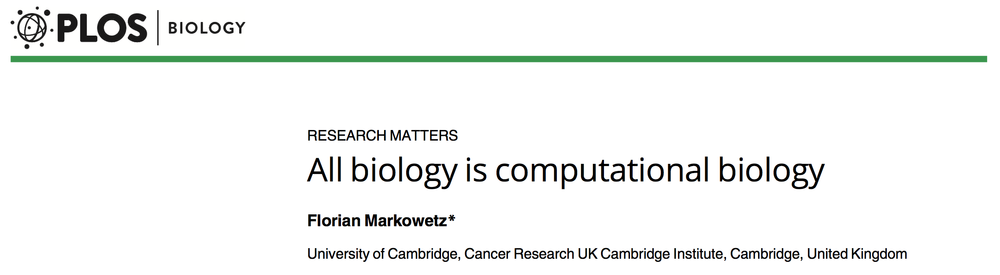

```{r xaringan-themer, include = FALSE}
library(xaringanthemer)
mono_light(
  base_color = "midnightblue",
  header_font_google = google_font("Josefin Sans"),
  text_font_google   = google_font("Montserrat", "500", "500i"),
  code_font_google   = google_font("Droid Mono"),
  link_color = "#8B1A1A", #firebrick4, "deepskyblue1"
  text_font_size = "28px",
  code_font_size = "26px"
)
```

## Computational Biology

<center></center>

&nbsp;

&nbsp;

Markowetz, Florian. "[All Biology Is Computational Biology](http://journals.plos.org/plosbiology/article?id=10.1371/journal.pbio.2002050)" _PLoS Biology_ March 9, 2017

---
## Welcome!

The primary goal of the course is to provide theory and practice of computational genomics, and empower you to conduct independent genomic analyses

- We will study the leading computational approaches for analyzing genomes starting from raw sequencing data

- The course will focus on cancer genomics and human medical applications, but the techniques will be broadly applicable

- The topics will include genomic technologies, alignment algorithms, genome assembly, gene- and miRNA expression, methylation and epigenomic analysis, single nucleotide polymorphism and copy number variant analysis, metagenomics, single-cell analysis, 3D genomics

---
## Logistics

- Course Webpage: https://bios691-cancer-bioinformatics.netlify.app/
    - Lecture notes, exercises R code, references will be posted there

- Course announcements, assignments, homework submission and grading, class video recordings
    - Blackboard, https://blackboard.vcu.edu

- Class Hours: Monday/Wednesday, 9:00 am to 10:20 am
    - Attendance is encouraged but not required. You can watch lectures later, but be mindful of homework deadlines

- Office Hours:  by appointment

---
## Virtual format

- Let's maintain a welcoming and supportive environment
    
- Video on is encouraged - it increases _your_ attention

- Ask as many questions during the class as necessary - this is what live attendance is for
    - Use Chat functionality
    - If anyone knows answers, post them there

---
## Slack

For the off-class questions/announcements, we'll use [Slack](https://slack.com/). See [Slack 101](https://slack.com/resources/slack-101) if you are new to it

- I will send invites using your VCU e-mail addresses - use them to join the [#bios691_cancer_bioinformatics channel](https://dozmorovlab.slack.com/archives/C01J4NKL1B7)

- Omit formalities, but be respectful and polite

- Questions and answers posted there will be available for everyone - answer them if you can, or I'll address them

- Direct messages are possible - use them to ask private questions or schedule a meeting

- I'll try to answer your questions asap, typically within 24 hours

---
## Prerequisites

- No formal course requirements, but basic knowledge of the following will help
    - Basic statistics knowledge: descriptive statistics, estimators, (linear) modeling (e.g., BIOS 544 or 554 courses)
    - Basic programming skills in R, familiarity with command line (e.g., BIOS 524 course)

- Hardware
    - A laptop, Mac or Linux OSs are recommended

---
## Computational resources

- We will be working within **Linux environment**
    - If you are on Windows, you may install [Windows Subsystem for Linux](https://docs.microsoft.com/en-us/windows/wsl/install-win10). Alternatively, [Cygwin](https://www.cygwin.com/). It should enable a Linux command line environment (bash) on your local machine
    - Alternatively, contact Helen Wang (huwang at vcu.edu) to get an account on our computer cluster, `merlot.bis.vcu.edu`
    - VCU Biostatistics cluster information, https://wiki.vcu.edu/display/biosit/Home

- We will program in [R](https://www.r-project.org/) and use [RStudio](https://rstudio.com/products/rstudio/download/)
    - Install R and RStudio on your machine

---
## Class Resources

- Primary Texts: We will be studying research papers and notes

- Lecture slides will contain links. Make good use of them, explore the references on your own!

- Other Resources: Google, SEQanswers, Biostars, StackOverflow

---
## Grading Policies

- Homework assignments practicing methods and tools learned in class: 50% of the total grade
    - Due two weeks after the assignment

- Final Project developing a genomics analysis: 50%
    - Pre-proposal and due dates are to be discussed

- Collaborations are allowed, no more than two per group
    - Duplicate or nearly identical homeworks will receive a score of zero

---
## Course evaluation

- At the end of the course, you will be asked to evaluate it

- Assess what you learned during the course

- Take notes on what you like in the course, what you want to be improved

- Your evaluation is anonymous


