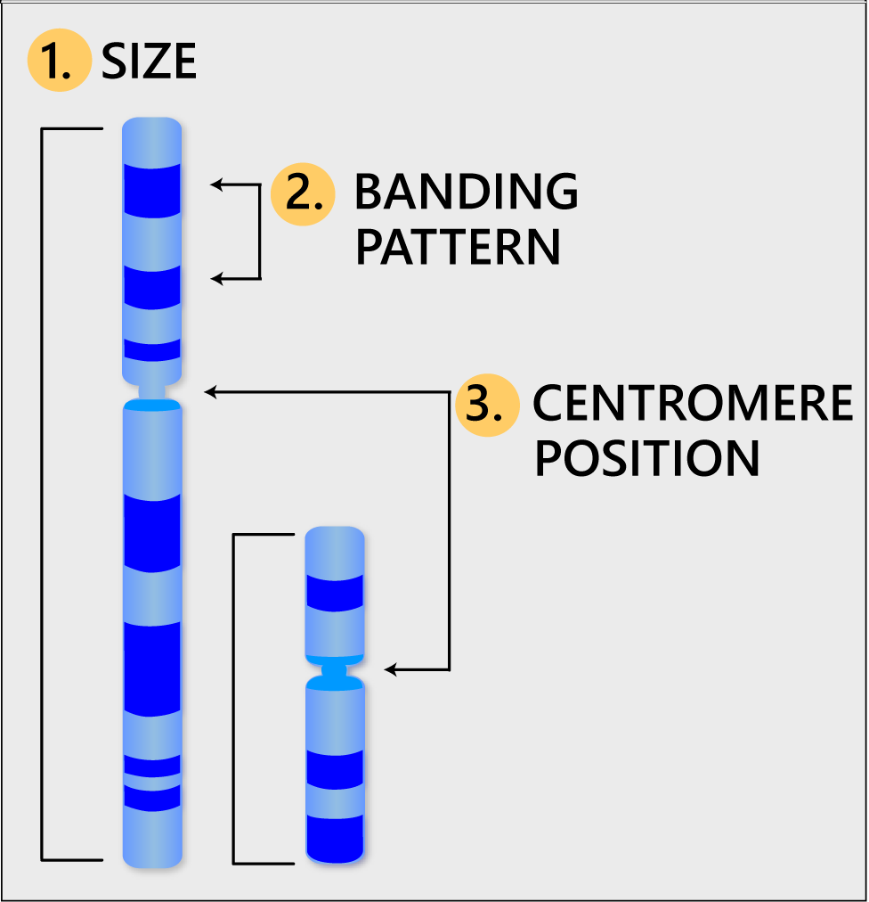
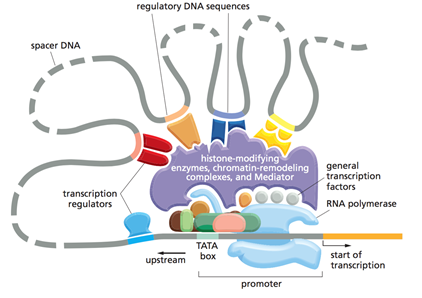

```{r xaringan-themer, include = FALSE}
library(xaringanthemer)
mono_light(
  base_color = "midnightblue",
  header_font_google = google_font("Josefin Sans"),
  text_font_google   = google_font("Montserrat", "500", "500i"),
  code_font_google   = google_font("Droid Mono"),
  link_color = "#8B1A1A", #firebrick4, "deepskyblue1"
  text_font_size = "28px",
  code_font_size = "26px"
)
```

## Phylogenetic tree


.center[  ]

Three life domains: bacteria, archaea, and eukaryota

- **Bacteria** are a type of biological cell. They constitute a large domain of prokaryotic microorganisms
- **Archaea** constitute a domain of single-celled organisms. These microorganisms lack cell nuclei and are therefore prokaryotes
- **Eukaryotes** are organisms whose cells have a nucleus enclosed within a nuclear envelope

---
## Overview

- Cells are the fundamental units of all living organisms

- Each cell is a complex system consisting of many substructures
  - **Viruses** are simplest organisms (∼ 10,000 bp. long genomes), which require a living host
  - **Prokaryotes** are simplest free-living organisms, e.g. bacteria (∼ 1,000,000 bp. long genomes)
  - **Eukaryotes** have cells which contain internal structures such as a nucleus, e.g. yeast
  - **Multi-celled organisms** involve cell specialization, requiring differential gene expression and inter-cellular signaling

[Comparing the Sizes of Microorganisms](https://imgur.com/KzG92ec), [Cell Size and Scale](https://learn.genetics.utah.edu/content/cells/scale/)

---
## Procaryotic cell


.center[  ]


---
## Eukaryotic cell


.center[  ]


---
## Differences between Prokaryotic and Eukaryotic Cells 

.center[  ]

---
## The genome: the secret of life

Your genome, along with your environment and experiences, shapes who you are   

- Height
- Hair, eye, skin color
- Broad/narrow, small/large features
- Susceptibility to disease
- Response to drug treatments
- Longevity and cognition  

Physical traits tend to be strongly genetic

.center[  ]

---
## Eukaryotic cells and the genome

.pull-left[

- Each cell contains a complete copy of an organism's genome, or blueprint for all cellular structures and activities

- The genome is distributed along chromosomes, which are made of compressed and entwined DNA

- Cells are of many different types (e.g. blood, skin, nerve cells), but all can be traced back to a single cell, the fertilized egg

]

.pull-right[

]

---
## The nucleus (eukaryotes only)

.pull-left[
- The nucleus is a sub-compartment containing the organism's DNA

- The nuclear membrane separates the nucleus from the rest of the cell (the cytoplasm)

- The entire cell is enclosed by the plasma membrane

- Embedded within this membrane is a variety of protein structures that act as channels and pumps to control cellular homeostasis
]

.pull-right[

]

---
## Discovery of chromosomes

.pull-left[
- By the mid-1800s, microscopes were powerful enough to observe the presence of unusual structures called “chromosomes” that seemed to play an important role during cell division

- It was only possible to see the chromosomes unless appropriate stains were used

- “Chromosome” comes from the Greek words = “color body”  
]

.pull-right[

]

.small[
Drawing of mitosis by Walther Flemming. Flemming, W. Zellsubstanz, Kern und Zelltheilung (F. C. W. Vogel, Leipzig, 1882).
]

---
## Chromosomes

- Chromosomes are packets of compressed and entwined DNA and are located in the nucleus

- Each chromosome carries its own unique set of genes. The specific site along a specific chromosome that a gene is located is called its genetic locus

- Haploid (one copy) human genome has 23 chromosomes, autosomes (chromosome 1-22) and one sex chromosome (X, Y)

- Human genome is diploid - comprised of a paternal and a maternal “haplotype”. Together, they form our “genotype” of 46 chromosomes

- Germ cells, sperm and egg, carry only a single copy of each chromosome and gene and are called haploid 

---
##  The basic structure of a chromosome

.pull-left[
- **Size**. This is the easiest way to tell chromosomes apart

- **Banding pattern**. The size and location of Giemsa bands make each chromosome unique

- **Centromere position**. Centromeres appear as a constriction. They have a role in the separation of chromosomes into daughter cells during cell division (mitosis and meiosis)

.small[ http://learn.genetics.utah.edu/content/basics/readchromosomes/
]
]

.pull-right[

]

---
##  Chromosome Giemsa banding (G-banding)

.center[  ]

- Heterochromatic regions, which tend to be rich with adenine and thymine (AT-rich) DNA and relatively gene-poor, stain more darkly with Giemsa and result in G-banding  

- Less condensed ("open") chromatin, which tends to be (GC-rich) and more transcriptionally active, incorporates less Giemsa stain, resulting in light bands in G-banding

.small[ https://ghr.nlm.nih.gov/chromosome/1#ideogram
]

---
##  Chromosome Giemsa banding (G-banding)

.center[  ]

- Cytogenetic bands are labeled p1, p2, p3,   q1, q2, q3, etc., counting from the centromere out toward the telomeres. At higher resolutions, sub-bands can be seen within the bands

- For example, the locus for the CFTR (cystic fibrosis) gene is 7q31.2, which indicates it is on chromosome 7, q arm, band 3, sub-band 1, and sub-sub-band 2. (Say 7,q,3,1 dot 2)

.small[ https://ghr.nlm.nih.gov/chromosome/1#ideogram
]

---
##  The role of the centromere

.center[  ]

- Centromeres are required for chromosome separation during cell division
- The centromeres are attachment points for microtubules, which are protein fibers that pull duplicate chromosomes toward opposite ends of the cell before it divides
- This ensures that each daughter cell have a full set of chromosomes
- Each chromosome has only one centromere

.small[ http://learn.genetics.utah.edu/content/basics/readchromosomes/
]

---
## Centromere positions

.center[  ]

<!-- The position of the centromere relative to the ends helps to tell chromosomes apart -->

- **Metacentric** - the centromere lies near the center of the chromosome
- **Submetacentric** - the centromere that is off-center, so that one chromosome arm is longer than the other. The short arm is designated "p" (for petite), and the long arm is designated "q" (because it follows the letter "p")
- **Acrocentric** - the centromere is very near one end

.small[ http://learn.genetics.utah.edu/content/basics/readchromosomes/
]

---
## Building blocks of DNA

.pull-left[
- The basic unit (**nucleotide**) is composed of an organic **base** attached to a deoxyribose **sugar**

- The **phosphate** group also attached to the sugar

- The **base** is one of cytosine (C), thymine (T), adenine (A), and guanine (G)
]

.pull-right[

]

---
## Bases

The information in DNA is stored as a code made up of four chemical bases: adenine (A), guanine (G), cytosine (C), and thymine (T)


.center[  ]


<!--
## Getting to know DNA: Gel electrophoresis

- In the mid-1900’s methods were developed to size separate and visualize DNA within an electrically charged gel (originally made from sugar)  
- DNA is loaded into different “lanes” at the top of the gel, and the charge is applied  
- Key idea is that smaller fragments of DNA would move faster through the gel and be towards the bottom than longer fragments that will be towards the top.  
- Allows to test for presence/absence of DNA as well as compare relative lengths of molecules  
- Will often reserve one of the lanes for a “DNA ladder” with fragments of a known size distribution  

## Getting to know DNA: Gel electrophoresis 


http://www.yourgenome.org/facts/what-is-gel-electrophoresis
-->

---
## Discovery of double helix, 1953

- James Watson and Francis Crick

.center[  ]


---
## Genomic DNA 

.center[  ]

https://www.nature.com/articles/171737a0

---
## Before the discovery

.center[  ]

---
## Genomic DNA

.pull-left[
- DNA is a **double helix**, with bases to the center (like rungs on a ladder) and sugar-phosphate units along the sides (like the sides of a twisted ladder)
- The strands are **complementary** (Watson-Crick base pairing) 
- A (purine) pairs with T (pyrimidines) C (pyrimidines) pairs with G (purine) 
- The pairs held together by hydrogen bonds. The helix is caused by the use of the hydrogen bonds between the single-strands 
]

.pull-right[

]

<!--
## Nucleic acid strand

- Strand synthesis - from 5' to 3' end: (5') TACG (3')

.center[  ](img/strand.png)

-->

---
## Base pairing

.pull-left[
- The force that holds a base pair together is a weak hydrogen bond

- Although each individual bond is weak, their cumulative effect along the strands is strong enough to bind the two strands tightly together

- As a result, DNA is chemically inert and is a stable carrier of genetic information

- **Rules of base pairing: A-T(U), C-G**
]

.pull-right[

]

<!--
## Helixes conformation 


.center[  ](img/Helixes.png)


- A: B-form: Right-handed, 3.4 nm between bases, 10 bases per turn
- B: A-form: Right-handed, 2.3 nm between bases, 11 bases per turn
- C: Z-form: Left-handed

## Helixes conformation 


.center[  ](img/Helixes2.png)


- A: B-form: Right-handed, 3.4 nm between bases, 10 bases per turn
- B: A-form: Right-handed, 2.3 nm between bases, 11 bases per turn
- C: Z-form: Left-handed
-->

---
## Eukaryotic DNA packaging 


.center[  ]

http://www.hhmi.org/biointeractive/dna-packaging 

---
## Genes

- **Genes** are discrete hereditary units located on the chromosomes

- **Genes** are segments of deoxyribonucleic acid (DNA) that contain the code for a specific protein that functions in one or more types of cells in the body

- Genes contain information used to synthesize proteins, the building blocks of cells

---
## The central dogma of molecular biology

.pull-left[
- Formulated by Francis Crick in 1956

- **DNA makes RNA and RNA makes protein**

- **Transcription** is the making of an RNA molecule off a DNA template

- **Translation** is the making of a protein off an RNA template
]

.pull-right[

]

---
## RNA vs. DNA: Single vs. double strands

.pull-left[
**RNA - ribonucleic acid**: 

1. Single strand
2. Ribose sugar
3. AUCG nucleotides

**DNA - deoxyribonucleic acid**: 

1. Double strand
2. Deoxyribose sugar
3. ATCG nucleotides
]

.pull-right[

]

.small[
https://commons.wikimedia.org/w/index.php?curid=9810855
]

---
## Nucleic acids - RNA

- **Messenger RNA (mRNA)** - carrier of genetic information

- **Transfer RNA (tRNA)** - deliver amino acids for protein synthesis

- **Ribosomal RNA (rRNA)** - central component of ribosome, protein manufacturing machinery

- **Small RNA (siRNA, miRNA, snRNA, piwiRNA)** - regulation of transcription/translation

---
## Transcription

.pull-left[
- In transcription, the DNA double helix opens along its length
- One strand of the open helix remains inactive, while the other strand acts as a template against which a complementary strand of mRNA forms 
- The sequence of bases along the mRNA strand is identical to the sequence of bases along the inactive DNA strand, except uracil (U) replaces T. Also RNA has ribose sugar instead of deoxyribose sugar. 
- RNA transcribed from 5' to 3' end
]

.pull-right[

]

---
## Gene structure in prokaryotes

Genes of related function are often organized and transcribed together under the control of a single promoter

.center[  ]


---
## Gene structure in eukaryotes

- Non-coding interruptions are known as intervening sequences or **introns**
- Coding sequences that are expressed are **exons**
- Most, but not all eukaryote genes contain introns. Although transcribed, these introns are excised (cut out) before translation

.center[  ]


---
## Intron boundaries 

- Introns always have two distinct nucleotides at either end.  
- At the 5' end the DNA nucleotides are GT [GU in the premessenger RNA (pre-mRNA)]; at the 3' end they are AG.  
- These nucleotides are part of the splicing sites.

.center[  ]

**The GT/AG mRNA processing rule is applicable for almost all eukaryotic genes**

.small[
http://www.imgt.org/IMGTeducation/Aide-memoire/_UK/splicing/
]

---
## Alternative splicing

mRNA splicing - variants of mRNA assembly


.center[  ]


- Tissue specific alternative splicing patterns of the $\alpha$-tropomyosin pre-mRNA molecule  
- Exons are blue rectangles  
- Introns are black carets

---
## Untranslated regions (UTRs)

.center[  ]

- The 5' UTR is upstream from the coding sequence
    - Within the 5' UTR is a sequence that is recognized by the ribosome which allows the ribosome to bind and initiate translation
    - The 5' UTR of Eukaryotes contains a Kozak sequence (ACCAUGG)

- The 3' UTR is found immediately following the translation stop codon
    - The 3' UTR plays a critical role in translation termination as well as post-transcriptional modification
    - Contains regulatory regions, AU-rich elements
    - Size ranges from 60 to 4,000 bases (average 800)

---
## RNA processing

.pull-left[
- The RNA transcript is extensively modified before export to the cytoplasm
- A **cap of 7-methylguanine** (m7G, a series of an unusual base) is added to the 5' end of the mRNA. Essential for binding the mRNA to the ribosome
- A **string of adenines** (as many as 200 nucleotides known as **poly-A tail**) is added to the 3' end of the mRNA after transcription. The function of a poly-A tail is not known, but it can be used to capture mRNAs
- Introns are cut out of the message and the exons are spliced together before the mRNA leaves the nucleus
]

.pull-right[

]

.small[
http://vcell.ndsu.nodak.edu/animations/mrnaprocessing/movie-flash.htm
]

<!--
## RNA strand structure

- Single stranded
- Hairpin structure


.center[  ](img/single_stranded.png)


## RNA strand structure

- Transfer RNA (tRNA) structure


.center[  ](img/single_stranded2.png)

-->

---
## Translation

.pull-left[
- In translation, the mRNA serves as a template for protein synthesis 

- Consecutive non-overlapping triplets of bases (called codons) act as the code to specify the particular amino acids

- There are $4^3=64$ possible codons but only 20 amino acids. Redundancy safeguards against transcription errors
]

.pull-right[

]

.small[
http://vcell.ndsu.nodak.edu/animations/translation/movie-flash.htm

http://sepuplhs.org/high/sgi/teachers/genetics_act16_sim.html
]

---
## Gene expression

- Each cell contains a complete copy of the organism's genome. A gene that is transcribed is said to be expressed

- Not all cells express the same genes which is why different cells perform different functions

- Even within the same cell different genes will be expressed at different times and perhaps at different levels

---
## Housekeeping genes

- **Housekeeping genes** are genes that are required for the maintenance of basal cellular functions that are essential for the existence of a cell, regardless of its specific role in the tissue or organism

- They are expected to be expressed in all cells of an organism under normal conditions, irrespective of tissue type, developmental stage, cell cycle state, or external signal

- Can be used as internal controls in gene expression studies

---
## Housekeeping genes

- Typical examples: 
  - glyceraldehyde- 3-phosphate dehydrogenase (GAPDH)
  - tubulins (beta-tubulin TUBB)
  - cyclophilin (cyclophilin A CYPA)
  - albumin (ALB)
  - actins (beta-actin ACTB)
  - 18S rRNA or 28S rRNA

3,804 housekeeping genes (and exons) defined from Human BodyMap project gene expression data http://www.tau.ac.il/~elieis/HKG/

.small[
Eisenberg, Eli, and Erez Y. Levanon. “Human Housekeeping Genes, Revisited.” Trends in Genetics: TIG 29, no. 10 (October 2013): 569–74. doi:10.1016/j.tig.2013.05.010.
]

---
## Transcription factors

.pull-left[
- Transcription factors (TFs) are proteins that bind to specific DNA sequences in the control region of each gene and determine whether or not the gene will be transcribed

- The specific stretch of nucleotide sequence to which the TFs bind, often called a sequence motif, is usually quite short, typically 5-10 nucleotides long

<!-- - Some TFs provide the RNA polymerase enzyme with access to the gene while other TFs block such access to ensure the gene is transcriptionally repressed -->

]

.pull-right[

]

---
## Human Genome Project

- Computational biology attempts to use genome sequence to ascertain function of genes

- Although genomes vary slightly from person to person, it seemed reasonable to try to establish a consensus human genome sequence

- Robert Sinsheimer, chancellor of UC Santa Cruz, proposed to sequence the human genome in 1984

- After much debate, the human genome project started in October 1990

---
## Genome sizes compared 


.center[  ]


http://www.hhmi.org/biointeractive/coding-sequences-dna 

<!--
## The advent of genomics

- In the 1860's while studying peas, Gregor Mendel observed that genetic information is passed in particulate form from an organism to its offspring.
- He found that the heritable material controlling the smoothness of peas behaved independently of the material governing plant height or flower color. He deduced there are two copies of a gene for flower color and two copies of a gene for pea shape.

.small[
Versuche uber Pflanzen-Hybriden. Verh. Naturforsch (Experiments in Plant Hybridization)
Mendel, G. (1866). Ver. Brünn 4: 3–47 (in English in 1901, J. R. Hortic. Soc. 26: 1–32).

http://www.indiana.edu/~p1013447/dictionary/mendel.htm 
]

## Mendel's theory of inheritance


.center[  ](img/Mendel.png)

## The advent of genomics

- Mendel's work implied that the entire repertoire of an organism's genetic information - its genome - is organized as a collection of discrete, separable information packets, now called genes. 
- His research implied that the genetic constitution of an organism (its genotype) could be divided into hundreds, perhaps thousands of discrete information packets
- The observable outward appearance of an organism (its phenotype) could be subdivided into a large number of discrete physical or chemical traits. 

## Genetic definitions 

- **genotype**: The genetic (alleleic) makeup of an organism with regard to an observed trait. The sum total of sequence variations (polymorphisms and mutations) present in a genome. 
- **phenotype**: The observed properties or outward appearance of a trait. 

## The first genetic map

- Mendel’s Second Law (The Law of Independent Assortment) states alleles of one gene sort into gametes independently of the alleles of another gene.
- However, Morgan and his student Sturtevant noticed that for certain traits the probability of having one trait given another was not 50/50 – those traits are genetically linked

.small[
http://www.caltech.edu/news/first-genetic-linkage-map-38798
]

## The first genetic map

- Sturtevant realized the probabilities of co-occurrences could be explained if those alleles were arranged on a linear fashion: traits that are most commonly observed together must be locates closest together
- Today genetic maps are routinely generated by measuring the rates of polymorphic markers in large populations of individuals

.small[
The Linear Arrangement of Six Sex-Linked Factors in Drosophila as shown by their mode of Association. Sturtevant, A. H. (1913) Journal of Experimental Zoology, 14: 43-59 https://www.nature.com/scitable/content/the-linear-arrangement-of-six-sex-linked-16655
]

## Genetic variations 

- Though DNA is stable, the genome is corruptible, in other words, the genetic code can be changed. 
- An allele that is present in the great majority of individuals within a species is termed **wild type** (naturally present in large numbers of apparently health organisms). 
- **Mutations** are when one allele is converted into another allele or an allele is created. The collection of alleles present in the genomes of all members of a species is the **gene pool** for the species. 

## Homo/heterozygosity

- The two copies of a gene could convey different, possibly conflicting information. The different versions of a gene is called an allele. 
- Organisms with two _identical_ alleles of a gene are **homozygous**
- Organisms with two _different_ alleles of a gene are **heterozygous**.

## Homo/heterozygosity

- When a gene is **heterozygous**, the observed phenotype encoded by one allele of a gene is **dominant** with respect to the phenotype encoded by another allele, the **recessive** one. 
- The alleles of some genes may be **co-dominant**, wherein a blend of the two alleles result in a phenotype.
- **Incomplete penetrance** is when a dominant allele is present but the phenotype is not manifested because of the actions of other genes in the organism's genome. 

## Patterns of inheritance

- Autosomal dominant 
- Autosomal recessive
- X-linked dominant
- X-linked recessive
- Mitochondrial
- Non-Medelian (e.g., imprinting) 

## Evolution

- Evolutionary change happens because of changes in genomes due to _mutations_ and _recombination_.
- _Mutations_ are rare events, sometimes single base changes, sometimes larger events.
- _Recombination_ is how your genome was constructed as a mixture of your two parents.
- Through _natural selection_, favorable changes tend to accumulate in the genome.

## Homology

- Evolution motivates _homology_ (similarity) search, because different species are assumed to have common ancestors. Thus DNA/amino acid sequences for a given protein (e.g. hemoglobin) in two species or individuals should be more similar the closer the ancestry between them.
- The genetic variation between different people is surprisingly small, perhaps only 1 in 1000 base-pairs.
- Homology searches can often detect similarities between extremely distant organisms (e.g. humans and yeast).

## Phylogenies

- _Phylogenic trees_ based on gene homologies provide an independent confirmation of those proposed by taxonomists. This is convincing evidence of evolution.
- A host of interesting computational problems arise in trying to reconstruct evolutionary history.
-->

---
## DNA alterations

.pull-left[
Changes in DNA sequence/amount alter gene and/or protein product

- One base being replaced by another (**substitution**)
- A base being excised (**deletion**)
- A base being added (**insertion**)
- A small subsequence of bases being removed and reinserted in the opposite direction (**inversion**) 
- A small subsequence of bases being removed and reinserted in a different place (**translocation**) 
]

.pull-right[

]

<!--
## Neutral mutations are "silent" 

but may alter regulatory sites 


.center[  ](img/Neutral_mutations.png)


## Germline and somatic mutations

- Transmission of a mutation from one generation to the next, by the germ cells (sperm and egg), is said to occur via the **germ** line. 
- Mutations affecting the genomes of cells everywhere else in the body, which constitute the soma, have no prospect of being transmitted to offspring and are called **somatic** mutations. 

## Chromosomal abnormalities

Chromosome disorders   
- Congenital (7 per 1000 newborns, 50% of spontaneous first trimester abortions)  
- Acquired (cancer)  

Single-gene disorders Individually rare   
- As a group affect $\sim$ 2% of population over lifespan 

Multifactorial or complex disorders   
- A result of combination of genes  
- May affect $\sim$ 60% of entire population   
-->

---
## Hallmarks of cancer 

.center[  ]

Douglas Hanahan, Robert A. Weinberg. [The Hallmarks of Cancer](http://www.sciencedirect.com/science/article/pii/S0092867400816839), Cell, 7 January 2000

---
## Biotechnologies

- The **Polymerase chain reaction (PCR)** enables one to make many copies of a particular DNA sequence anywhere in solution given only the starting/ending sequences (primers)

- Developed in 1983 by Kary Mullis, PCR allows for the amplification of DNA fragments that are flanked by known “primer” sequences

- Exquisitely sensitive and specific, it can amplify a single molecule in a sample into billions of copies with nearly perfect fidelity

- Uses naturally occurring polymerase enzymes that copy DNA by adding free nucleotides to a single-stranded template

---
## Polymerase Chain Reaction (PCR) 

.center  ]

.small[ https://www.abmgood.com/marketing/knowledge_base/polymerase_chain_reaction_introduction.php ]

---
## DNA amplification using PCR

.center[]

.small[https://www.animalgenome.org/edu/doe/pcr.html]

<!--
## Polymerase Chain Reaction (PCR)

.center[ ]

## Quantitative PCR


- Quantitation requires normalization (comparison to standard curves)
- Normalization is based on assumptions
-->

---
# Extra

---
## Karyotype

- **Cytogenetics** is the study of normal and abnormal chromosomes

- The normal configuration of chromosomes is often termed the **euploid** karyotypic state

- Euploidy implies that each of the autosomes is present in normally structured pairs and that the X and Y chromosome are present in normally structured pairs for the sex of the individual

- Deviation from the euploid karyotype - the state termed **aneuploidy** - is some alteration in the overall chromosome structure, such as loss of entire chromosomes, the presence of extra copies of chromosomes, etc.

---
## Karyotype


.center[  ]


---
## Cell cycle


.center[  ]

https://www.youtube.com/watch?v=NR0mdDJMHIQ 

---
## Three RNA polymerases

- RNA polymerase is an enzyme that produces RNA
1. RNA Pol I - transcription of ribosomal RNA (not the 5S subunit)
2. RNA Pol II - mRNA, snRNA, microRNA
3. RNA Pol III - tRNA, 5S rRNA, small RNA

---
## Three stages of transcription 


.center[  ]


http://vcell.ndsu.nodak.edu/animations/transcription/movie-flash.htm 

---
## DNA replication

- In DNA replication, DNA polymerases unwind the DNA molecule by breaking the H-bonds between bases - strands separate

- Once the polymerases have opened the molecule, an area known as the replication fork forms (always initiated at a certain set of nucleotides, the origin of replication)

- New nucleotides are placed in the fork and link to the corresponding parental nucleotide already there (A with T, C with G)

---
## DNA replication 

.center[  ]

https://www.youtube.com/watch?v=TNKWgcFPHqw 


