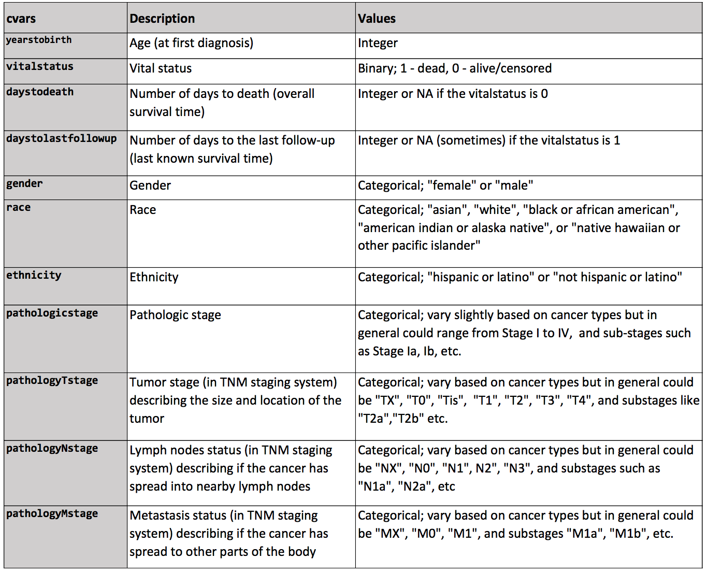
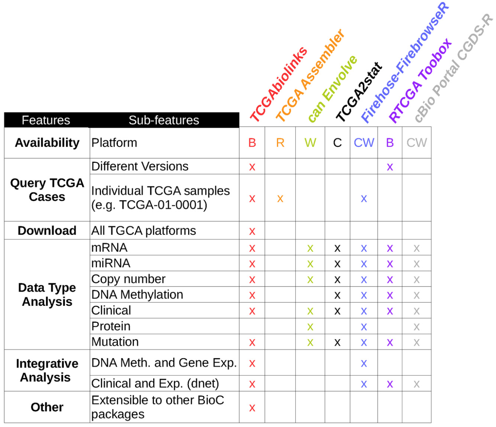

```{r xaringan-themer, include = FALSE}
library(xaringanthemer)
mono_light(
  base_color = "midnightblue",
  header_font_google = google_font("Josefin Sans"),
  text_font_google   = google_font("Montserrat", "500", "500i"),
  code_font_google   = google_font("Droid Mono"),
  link_color = "#8B1A1A", #firebrick4, "deepskyblue1"
  text_font_size = "28px",
  code_font_size = "26px"
)
```

## The Cancer Genome Atlas (TCGA)

- Started December 13, 2005, phase II in 2009, ended in 2014

- Mission - to accelerate our understanding of the molecular basis of cancer through the application of genome analysis technologies, including large-scale genome sequencing.

- Data generation
    - Clinical information about participants
    - Metadata about the samples (e.g. the weight of a sample portion, etc.)
    - Histopathology slide images from sample portions
    - Molecular information derived from the samples (e.g. mRNA/miRNA expression, protein expression, copy number, etc.)

https://cancergenome.nih.gov/

---
## TCGA by the numbers

.center[  ]

https://cancergenome.nih.gov/abouttcga

---
## Major TCGA Research Components

- **Biospecimen Core Resource (BCR)** - Collect and process tissue samples

- **Genome Sequencing Centers (GSCs)** - Use high-throughput Genome Sequencing to identify the changes in DNA sequences in cancer

- **Genome Characterization Centers (GCCs)** - Analyze genomic and epigenomic changes involved in cancer

- **Data Coordinating Center (DCC)** - The TCGA data are centrally managed at the DCC

- **Genome Data Analysis Centers (GDACs)** - These centers provide informatics tools to facilitate broader use of TCGA data

---
## TCGA Data Access Policy

- An access control policy is in place for TCGA data to ensure that personally identifiable information is kept from unauthorized users

- **Open access** - Houses data that cannot be aggregated to generate a data set unique to an individual. This tier does not require user certification for data access

- **Controlled access** - Houses individually-unique information that could potentially be used to identify an individual. This tier requires user certification for data access

---
## TCGA Controlled Access Data

Access to controlled data is available to researchers who:

- Agree to restrict their use of the information to biomedical research purposes only

- Agree with the statements within TCGA Data Use Certification (DUC)

- Have their institutions certifiably agree to the statements within TCGA DUC

- Complete the Data Access Request (DAR) form and submit it to the Data Access Committee to be a TCGA Approved User. This form is available electronically through dbGaP

https://wiki.nci.nih.gov/display/TCGA/TCGA+Home

---
## TCGA data types

.center[  ]

http://www.liuzlab.org/TCGA2STAT/DataPlatforms.pdf

---
## TCGA cancer types

.center[  ]

http://www.liuzlab.org/TCGA2STAT/CancerDataChecklist.pdf

---
## TCGA Clinical data

.center[  ]

http://www.liuzlab.org/TCGA2STAT/ClinicalVariables.pdf

---
## TCGA sample identifiers

- Each sample has a unique ID (barcode), like `TCGA-AO-A128`
- Each barcode can and should be parsed

.center[  ]

- Can be used to distinguish normal and tumor samples (Sample: Tumor types range from 01 - 09, normal types from 10 - 19 and control samples from 20 - 29)
- Not to be confused with case UUIDs, like `7eea2b6e-771f-44c0-9350-38f45c8dbe87`, which are bound to filenames

https://wiki.nci.nih.gov/display/TCGA/TCGA+barcode

---
## PAM50

- Breast cancer can be classified into 4 major intrinsic subtypes: Luminal A, Luminal B, Her2-enriched, Basal
- Subtypes are clinically relevant for drug sensitivity and long-term survival 
- Determine tumor subtype by looking at the gene expression of 50 genes

https://xenabrowser.net/datapages/?dataset=TCGA.BRCA.sampleMap/BRCA_clinicalMatrix&host=https://tcga.xenahubs.net

`genefu` R package for PAM50 classification and survival analysis. https://www.bioconductor.org/packages/release/bioc/html/genefu.html

.small[ Parker, Joel S., Michael Mullins, Maggie C. U. Cheang, Samuel Leung, David Voduc, Tammi Vickery, Sherri Davies, et al. “[Supervised Risk Predictor of Breast Cancer Based on Intrinsic Subtypes](https://doi.org/10.1200/JCO.2008.18.1370).” Journal of Clinical Oncology: Official Journal of the American Society of Clinical Oncology, (March 10, 2009) ]

---
## The Broad Institute Genome Data Analysis Center (GDAC) Firehose

- Standardized, analysis-ready TCGA datasets
    - Aggregated, version-stamped
    - Analysis-ready format / semantics

- Standardized analyses upon them
    - For vetted algorithms: GISTIC, MutSig, CNMF, ...
    - Companioned with biologist-friendly reports

http://gdac.broadinstitute.org/

---
## Firehose data access

- [fbget](https://confluence.broadinstitute.org/display/GDAC/fbget) - Python application programming interface (API) with >27 functions for Sample-level data, Firehose analyses, Standard data archives, Metadata access
    - Unix command-line access, `firehose_get`

- [FirebrowseR](https://github.com/mariodeng/FirebrowseR) - An R client for broads firehose pipeline, providing TCGA data sets

- [web-TCGA](https://github.com/mariodeng/web-TCGA) - a shiny app to access TCGA data from Firebrowse

http://firebrowse.org/

---
## NCI's Genomic Data Commons (GDC)

Launched on June 6, 2016. Provides standardized genomic and clinical data

- **[The Cancer Genome Atlas (TCGA)](https://www.cancer.gov/about-nci/organization/ccg/research/structural-genomics/tcga)**

- **[Therapeutically Applicable Research To Generate Effective Treatments (TARGET)](https://ocg.cancer.gov/programs/target)** - A comprehensive genomic approach to determine molecular changes that drive childhood cancers. (AML and Neuroblastoma)

- **[Cancer Cell Line Encyclopedia (CCLE)](https://portals.broadinstitute.org/ccle)** - Genome-wide information of ~1000 cell lines under baseline condition. Pharmacologic response profiles (IC50) and mutation status analysis

- **[Stand Up To Cancer (SU2C)](https://standuptocancer.org/)** - 50 Breast cancer cell lines. GI50 to 77 therapeutic compounds

- **[Connectivity Map](https://portals.broadinstitute.org/cmap/forceLogin.jsp)** - 4 cell lines and 1309 perturbagens at several concentrations. Gene expression change after treatment

---
## Accessing GDC
    
- The GDC Application Programming Interface (API)

- `GenomicDataCommons` - GDC access in R

https://docs.gdc.cancer.gov/API/Users_Guide/Getting_Started/#api-endpoints

https://bioconductor.org/packages/GenomicDataCommons/

---
## cBioPortal

- Rich set of tools for visualization, analysis and download of large-scale cancer genomics data sets.  
    - Mutations (OncoPrint display)
    - Mutual exclusivity of genetic events (log-odds ratio)
    - Correlations among genetic events (boxplots)
    - Survival (Kaplan-Meier plots)

- The Onco Query Language (OQL) to fine-tune queries

http://www.cbioportal.org/index.do

http://www.cbioportal.org/tutorial.jsp - short tutorials

.small[ Gao, Jianjiong, Bülent Arman Aksoy, Ugur Dogrusoz, Gideon Dresdner, Benjamin Gross, S. Onur Sumer, Yichao Sun, et al. “[Integrative Analysis of Complex Cancer Genomics and Clinical Profiles Using the CBioPortal](https://doi.org/10.1126/scisignal.2004088).” Science Signaling, (April 2, 2013) ]

---
## cBioPortal data

- REST-based web API

- `CGDS-R` package provides a basic set of functions for querying the Cancer Genomic Data Server (CGDS)

- `MATLAB CGDS Cancer Genomics Toolbox` - data access functionality in the MATLAB environment

http://www.cbioportal.org/web_api.jsp

http://www.cbioportal.org/cgds_r.jsp

https://cran.r-project.org/web/packages/cgdsr/vignettes/cgdsr.pdf

---
## R resources to access TCGA data

- `curatedTCGAData` - Curated Data From The Cancer Genome Atlas (TCGA) as MultiAssayExperiment Objects
    - MultiAssayExperiment objects integrate multiple assays (e.g. RNA-seq, copy number, mutation, microRNA, protein, and others) with clinical / pathological data. 
    - Patient IDs are matched (same number and order) across multiple assays, enabling harmonized subsetting of rows (features) and columns (patients / samples) across the entire experiment.

- `HarmonizedTCGAData` - Processed Harmonized TCGA Data of Five Selected Cancer Types

https://bioconductor.org/packages/curatedTCGAData/

https://bioconductor.org/packages/HarmonizedTCGAData/

---
## R resources to access TCGA data

- `curatedOvarianData`
    - 30 datasets, > 3K unique samples
    - survival, surgical debulking, histology...

- `curatedCRCData` (colorectal)
    - 34 datasets, ~4K unique samples
    - many annotated for MSS, gender, stage, age, N, M

- `curatedBladderData`
    - 12 datasets, ~1,200 unique samples
    - many annotated for stage, grade, OS

---
## TCGA packages

- `TCGAbiolinks` - an R package for integrative analysis of TCGA data

.center[  ]

https://bioconductor.org/packages/TCGAbiolinks/

.small[ Colaprico, Antonio, Tiago C. Silva, Catharina Olsen, Luciano Garofano, Claudia Cava, Davide Garolini, Thais S. Sabedot, et al. “[TCGAbiolinks: An R/Bioconductor Package for Integrative Analysis of TCGA Data](https://doi.org/10.1093/nar/gkv1507).” Nucleic Acids Research, (May 5, 2016) ]

---
## TCGA2STAT

.center[  ]

- Well-structured TCGA data access in R

https://CRAN.R-project.org/package=TCGA2STAT

<!--
## GDCRNATools

- Downloading, organizing, and integrative analyzing RNA data in the GDC
- Differential gene expression analysis, ceRNAs regulatory network analysis, univariate survival analysis, and functional enrichment analysis.
- Considers ceRNAs - Competing endogenous RNAs, RNA molecules that indirectly regulate other RNA transcripts by competing for the shared miRNAs.

https://github.com/Jialab-UCR/GDCRNATools

Li, Ruidong, Han Qu, Shibo Wang, Julong Wei, Le Zhang, Renyuan Ma, Jianming Lu, Jianguo Zhu, Wei-De Zhong, and Zhenyu Jia. “GDCRNATools: An R/Bioconductor Package for Integrative Analysis of LncRNA, MiRNA, and MRNA Data in GDC,” December 11, 2017. https://doi.org/10.1101/229799.

https://github.com/Jialab-UCR/GDCRNATools
-->

---
## Xena Functional Genomics Explorer

- Former UCSC Cancer Genomics Browser. Now UCSC Xena

- Includes TCGA, Cancer Cell Line Encyclopedia, the Stand Up To Cancer (SU2C) Breast Cancer data, custom datasets

- A tool to visually explore and analyze cancer genomics data and its associated clinical information.

- Gene- and genome-centric view

- Survival analysis on user-defined subgroups

https://xenabrowser.net/, https://xenabrowser.net/datapages/, http://xena.ucsc.edu/getting-started/

.small[ Cline, Melissa S., Brian Craft, Teresa Swatloski, Mary Goldman, Singer Ma, David Haussler, and Jingchun Zhu. “[Exploring TCGA Pan-Cancer Data at the UCSC Cancer Genomics Browser](https://doi.org/10.1038/srep02652).” Scientific Reports (October 2, 2013) ]

<!--
## Gitools

- A framework for analysis and visualization of multidimensional genomic data using interactive heatmaps
- User-provided and precompiled datasets: TCGA, IntOGen
- Analyses: Enrichment, Group Comparison, Mutual exclusion and co-occurrence test, Correlations, Overlaps, Combination of p-values

.center[  ]

http://www.gitools.org/
-->

---
## TCGA analysis on the cloud

- Goal - simplify centralized access to TCGA data and provide easy analysis

- Three centers were awarded to develop cloud access 
    - Institute for Systems Biology Cancer Genomics Cloud (ISB-CGC)
    - Broad Institute FireCloud
    - Seven Bridges Cancer Genomics Cloud

http://cgc.systemsbiology.net/

https://software.broadinstitute.org/firecloud/

http://www.cancergenomicscloud.org/

---
## Other resources for cancer genomics

- [IntOgen](https://www.intogen.org/search) - catalog of cancer driver mutations
- [Regulome Explorer](http://explorer.cancerregulome.org/) - exploratory analysis of integrated TCGA data
- [Oncomine research edition](https://www.oncomine.org/resource/login.html) - coexpression, differential analysis of cancer datasets, including TCGA
- [CPTAC](https://proteomics.cancer.gov/programs/cptac) - Clinical Proteomics Tumor Analysis Consortium

.small[ Gonzalez-Perez, Abel, Christian Perez-Llamas, Jordi Deu-Pons, David Tamborero, Michael P Schroeder, Alba Jene-Sanz, Alberto Santos, and Nuria Lopez-Bigas. “[IntOGen-Mutations Identifies Cancer Drivers across Tumor Types](https://doi.org/10.1038/nmeth.2642).” Nature Methods, (September 15, 2013) ]

---
## International Cancer Genome Consortium

- The International Cancer Genome Consortium (ICGC)’s Pan-Cancer Analysis of Whole Genomes (PCAWG) project aimed to categorize somatic and germline variations in both coding and non-coding regions in over 2,800 cancer patients 

- 5,789 whole genomes of tumors and matched normal tissue spanning 39 tumor types, RNA-Seq profiles were obtained from a subset of 1,284 of the donors

- Similar to other large-scale genome projects, the ICGC has a Data Coordination Center (DCC) 

http://icgc.org/, http://dcc.icgc.org/

