```{r xaringan-themer, include = FALSE}
library(xaringanthemer)
mono_light(
  base_color = "midnightblue",
  header_font_google = google_font("Josefin Sans"),
  text_font_google   = google_font("Montserrat", "500", "500i"),
  code_font_google   = google_font("Droid Mono"),
  link_color = "#8B1A1A", #firebrick4, "deepskyblue1"
  text_font_size = "28px",
  code_font_size = "26px"
)
```

## Age of OMICS

<center>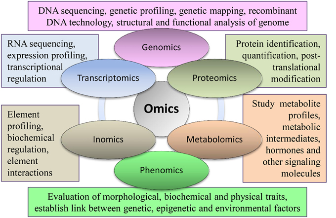</center>

<div style="font-size: small;"> 
http://journal.frontiersin.org/article/10.3389/fpls.2014.00244/full
</div>

<!--
## Genome arithmetics

- Haploid (one copy) human genome has 23 chromosomes, autosomes (chromosome 1-22) and one sex chromosome (X, Y)
- Human genome is _diploid_ - comprised of a paternal and a maternal "haplotype". Together, they form our "genotype" of 46 chromosomes

<center></center>

## Genome arithmetics

- One genome per cell, located in the nucleus - most of the time (Red blood cells lack chromosomes)  
- Mitochondria (cell powerhouses) have their own genomes - many mitochondrial genomes (Liver cells have 1000-2000 mito)
- A typical human is comprised of roughly 40 trillion human cells (excluding trillions of bacterial cells in our gut)
- If stretched out, each haploid genome would be roughly 2 meters - each cell has 4 meters of DNA (1 m = 3.28 ft)

.small[
- Human body has approximately 30 trillion human cells (excluding trillions of microbiome cells)
- Stretched haploid genome would be roughly 2 meters - each cell has 4 meters of DNA (1 m = 3.28 ft)
    - 30 trillion * 4 meters = 120 trillion meters
    - Convert to miles: $120\ trillion\ meters / 1609.34 = 7.45*10^{10}$
    - Convert to Earth-Sun distance: $7.45*10^{10} / 91.43*10^6 = 814.83$
- All DNA from a human - approximately 800 trips from Earth to Sun
]
-->

---
## Genome arithmetics

- ~3,235 billion base pairs (haploid)
- ~20,000 protein coding genes
- ~200,000 coding transcripts (isoforms of a gene that each encode a distinct protein product)

<center></center>

<div style="font-size: small;"> http://uswest.ensembl.org/Homo_sapiens/Location/Genome
</div>

<!--
## The human genome from a micro to macro scale 

<center>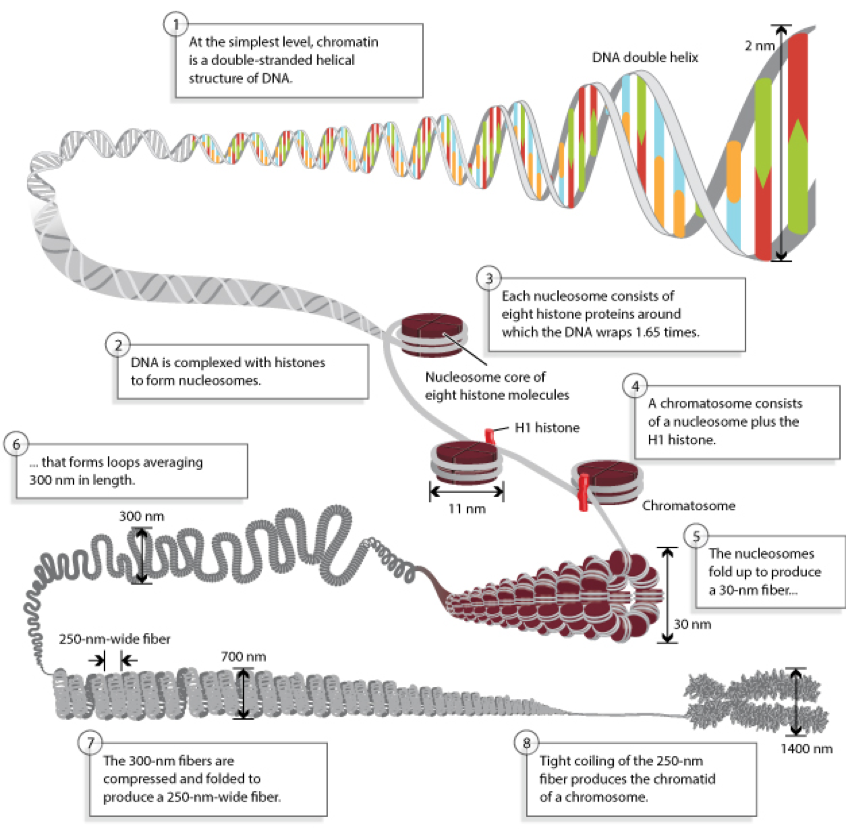</center>

##  The basic structure of a chromosome

<center></center>

- **Size**. This is the easiest way to tell chromosomes apart.
- **Banding pattern**. The size and location of Giemsa bands make each chromosome unique.
- **Centromere position**. Centromeres appear as a constriction. They have a role in the separation of chromosomes into daughter cells during cell division (mitosis and meiosis).

<div style="font-size: small;"> http://learn.genetics.utah.edu/content/basics/readchromosomes/
</div>

##  The role of the centromere

<center>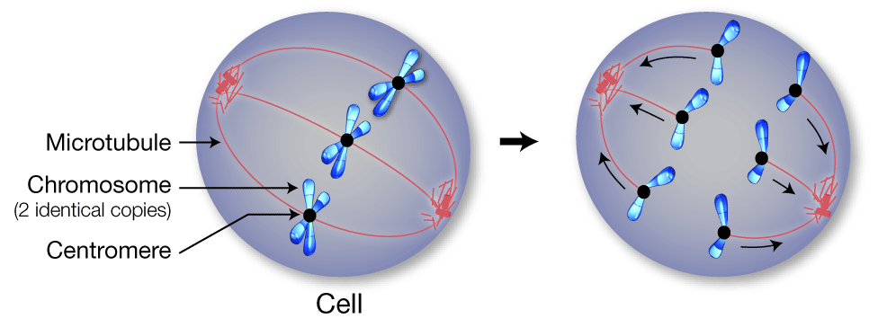</center>

- Centromeres are required for chromosome separation during cell division.
- The centromeres are attachement points for microtubules, which are protein fibers that pull duplicate chromosomes toward opposite ends of the cell before it divides. 
- This separation ensures that each daughter cell will have a full set of chromosomes.  
- Each chromosome has only one centromere.

<div style="font-size: small;"> http://learn.genetics.utah.edu/content/basics/readchromosomes/
</div>

## Centromere positions

<center></center>

The position of the centromere relative to the ends helps scientists tell chromosomes apart. Centromere position can be described as:

- **Metacentric** - the centromere lies near the center of the chromosome.
- **Submetacentric** - the centromere that is off-center, so that one chromosome arm is longer than the other. The short arm is designated "p" (for petite), and the long arm is designated "q" (because it follows the letter "p").
- **Acrocentric** - the centromere is very near one end.

<div style="font-size: small;"> http://learn.genetics.utah.edu/content/basics/readchromosomes/
</div>

##  Chromosome Giemsa banding (G-banding)

<center>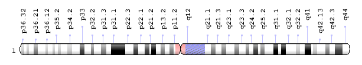</center>

- Heterochromatic regions, which tend to be rich with adenine and thymine (AT-rich) DNA and relatively gene-poor, stain more darkly with Giemsa and result in G-banding  
- Less condensed ("open") chromatin, which tends to be (GC-rich) and more transcriptionally active, incorporates less Giemsa stain, resulting in light bands in G-banding. 
- Cytogenetic bands are labeled p1, p2, p3,   q1, q2, q3, etc., counting from the centromere out toward the telomeres. At higher resolutions, sub-bands can be seen within the bands. 
- For example, the locus for the CFTR (cystic fibrosis) gene is 7q31.2, which indicates it is on chromosome 7, q arm, band 3, sub-band 1, and sub-sub-band 2. (Say 7,q,3,1 dot 2)

<div style="font-size: small;"> https://ghr.nlm.nih.gov/chromosome/1#ideogram
</div>

## Gene content

- "There appear to be about $30,000 \pm 40,000$ protein-coding genes in the human genome -- only about twice as many as in worm or fly. However, the genes are more complex, with more alternative splicing generating a larger number of protein products."  
- Over time this has evolved to an estimate of approximately 20,000 protein coding genes, which reflects roughly the number of genes in fly and worm

<center>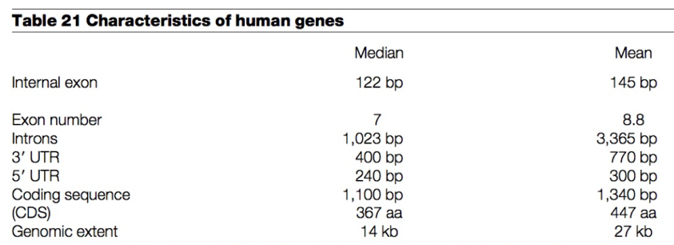</center>

<div style="font-size: small;"> http://www.nature.com/nature/journal/v409/n6822/full/409860a0.html
</div>
-->

---
## Genes are unevenly distributed on chromosomes

- Highly expressed genes positively correlated with:
    - Very short indels
    - High gene density
    - High GC content
    - High density of Short interspersed nuclear elements (SINE) repeats
    - Low density of Long interspersed nuclear elements (LINE) repeats
    - Both housekeeping and tissue-specific expression

- The opposite is true for lowly expressed genes

<div style="font-size: small;"> Versteeg, Rogier, Barbera D. C. van Schaik, Marinus F. van Batenburg, Marco Roos, Ramin Monajemi, Huib Caron, Harmen J. Bussemaker, and Antoine H. C. van Kampen. “The Human Transcriptome Map Reveals Extremes in Gene Density, Intron Length, GC Content, and Repeat Pattern for Domains of Highly and Weakly Expressed Genes.” Genome Research 13, no. 9 (September 2003): 1998–2004. https://doi.org/10.1101/gr.1649303.
</div>

---
## Genes are unevenly distributed on chromosomes

Chromosome 19 is the most gene dense chromosome in the human genome

<center></center>

---
## Half of the human genome is low complexity

Retrotransposons - fossil records of evolution

- McClintock's "jumping genes" in maize
- Retrotransposons use a "copy/paste" mechanism - transcribed to RNA and then reverse transcribed into DNA and insert
- DNA transposons use a "cut/paste" mechanism - excise themselves and insert to another place

<center>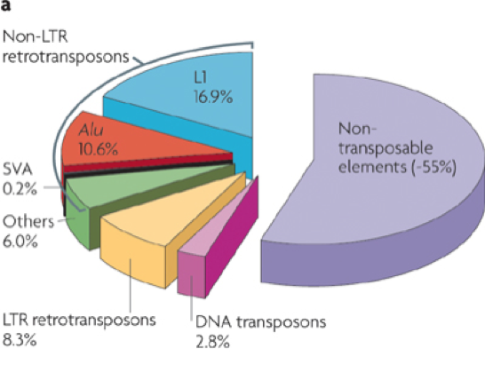</center>

<div style="font-size: small;"> https://www.ncbi.nlm.nih.gov/pubmed/19763152
</div>

<!--
## Repeats

- Repetitive DNA not driven by retrotransposition (e.g., ATATATATATATATATAT...)
- CpG islands - clusters of CG dinucleotides (The "p" represents the phosphate bond between the nucleotides on the same strand. Needed to distinguish between hydrogen bond between C and G on complementary DNA strands)

<center></center>

<div style="font-size: small;"> https://www.nature.com/nature/journal/v409/n6822/full/409860a0.html
</div>
-->

---
## Genome variability

A typical human genome differs from the reference genome at 4.1 to 5.0 million sites - Single Nucleotide Polymorphisms (SNPs)

- Over 99.9% are SNPs or short indels
- Only 1-4% are rare (frequency <0.5% in the population)
- Contains 2,100 – 2,500 structural variants, which affect more bases (~20 million bases)
- ~1,000 large deletions
- ~1,094 Alu, L1, SINE (short interspersed nuclear element), VNTR (variable number tandem repeat) insertions
- ~160 CNVs
- ~10 inversions
- ~ 4 NUMTs (nuclear mitochondrial DNA variations)

<div style="font-size: small;"> Conrad DF, Keebler JE, DePristo MA, Lindsay SJ, Zhang Y, Casals F, Idaghdour Y, Hartl CL, Torroja C, Garimella KV, Zilversmit M, Cartwright R, Rouleau GA, Daly M, Stone EA, Hurles ME, Awadalla P; 1000 Genomes Project. Variation in genome-wide mutation rates within and between human families. Nat Genet. 2011 Jun 12;43(7):712-4. doi: 10.1038/ng.862. https://www.nature.com/articles/ng.862
</div>

---
## Why sequence a reference genome?

- Determine the "complete" sequence of a human haploid genome

- Identify the sequence and location of every protein coding gene

- Use as a "map" with which to track the location and frequency of genetic variation in the human genome

- Unravel the genetic architecture of inherited and somatic human diseases

- Understand genome and species evolution

---
## DNA sequencing: Maxam-Gilbert, Sanger

.pull-left[
- Sequencing by synthesis (not degradation)

- Radioactive primers hybridize to DNA

- Polymerase + dNTPs (normal dNTPs) + ddNTP (dideoxynucleotides terminators) at low concentration

- 1 lane per base, visually interpret ladder 

.small[https://en.wikipedia.org/wiki/Maxam%E2%80%93Gilbert_sequencing

https://www.youtube.com/watch?v=bEFLBf5WEtc
]
]

.pull-right[
<center>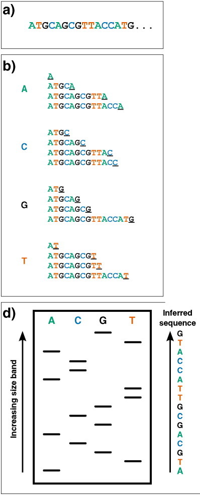</center>
]

<!--Sanger's ‘chain-termination’ sequencing. Radio- or fluorescently-labelled ddNTP nucleotides of a given type - which once incorporated, prevent further extension - are included in DNA polymerisation reactions at low concentrations (primed off a 5′ sequence, not shown). Therefore in each of the four reactions, sequence fragments are generated with 3′ truncations as a ddNTP is randomly incorporated at a particular instance of that base (underlined 3′ terminal characters).
Dideoxynucleotides (ddNTPs) lack the 3′ hydroxyl group that is required for extension of DNA chains, and therefore cannot form a bond with the 5′ phosphate of the next dNTP
-->

<!--
## Shotgun genome sequencing milestones

- 1977: Bacteriophage $\Phi X 147$ (5kb) 
- 1995: H. Influenza (1Mb);
- 1996: Yeast (12mb); 
- 2000: Drosophila (165Mb); 
- 2002: Human (3Gb)

<div style="font-size: small;"> https://en.wikipedia.org/wiki/Phi_X_174
</div>
-->

---
## How to sequence a human genome: Lee Hood automation

<center></center>

<!--
## Shotgun genome sequencing (Sanger, 1979)

1) Fragment the genome (or large Bacterial artificial chromosome (BAC) clones)
2) Clone 2-10kb fragments into plasmids; pick lots of colonies; purify DNA from each
3) Use a primer to plasmid to sequence into genomic DNA
4) Assemble the genome from overlapping "reads"

<center>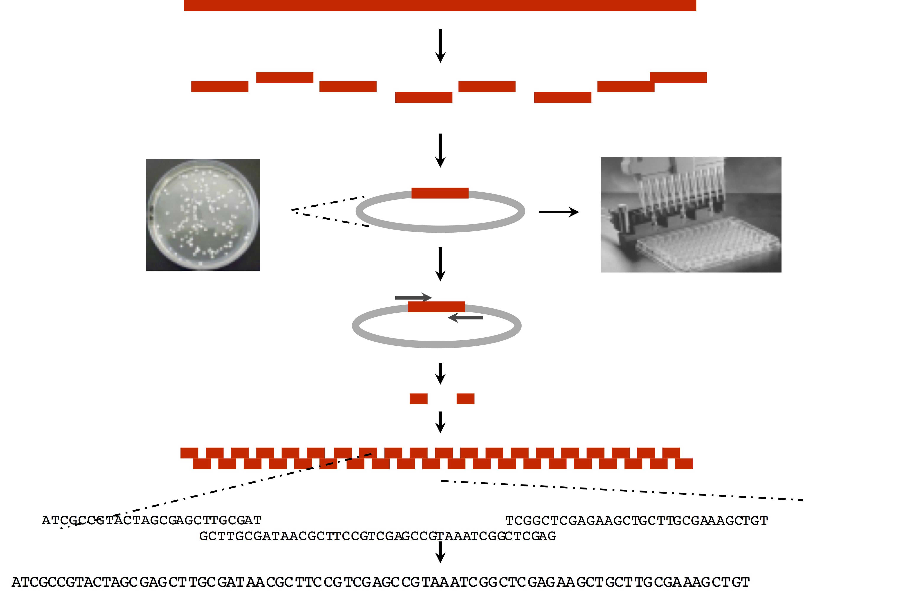</center>

## Massively Parallel DNA sequencing instruments

- All MPS platforms require a library obtained either by amplification or ligation with custom linkers (adapters)
- Each library fragment is amplified on a solid surface (either bead or flat _Si_-derived surface) with covalently attached adapters that hybridize the library adapters
- Direct step-by-step detection of the nucleotide base incorporated by each amplified library fragment set
- Hundreds of thousands to hundreds of millions of reactions detected per instrument run = "massively parallel sequencing"
- A "digital" read type that enables direct quantitative comparisons
- Shorter read lengths than capillary sequencers

## Library Construction for MPS

<center>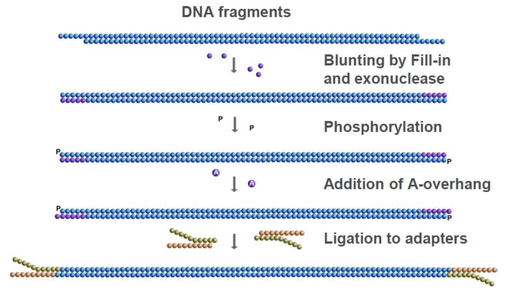</center>

- Shear high molecular weight DNA with sonication
- Enzymatic treatments to blunt ends
- Ligate synthetic DNA adapters (each with a DNA barcode), PCR amplify 
- Quantitate library
- Proceed to WGS, or do exome or specific gene hybrid capture

## PCR-related Problems in MPS

- PCR is an effective vehicle for amplifying DNA, however...
- In MPS library construction, PCR can introduce preferential amplification ("jackpotting") of certain fragments
- Duplicate reads with exact start/stop alignments
- Need to "de-duplicate" after alignment and keep only one pair
- Low input DNA amounts favor jackpotting due to lack of complexity in the fragment population

## PCR-related Problems in MPS

- PCR also introduces false positive artifacts due to substitution errors by the polymerase
- If substitution occurs in early PCR cycles, error appears as a true variant
- If substitution occurs in later cycles, error typically is drowned out by correctly copied fragments in the cluster
- Cluster formation is a type of PCR ("bridge amplification") • Introduces bias in amplifying high and low G+C fragments
- Reduced coverage at these loci is a result

## Hybrid Capture

- Hybrid capture - fragments from a whole genome library are selected by combining with probes that correspond to most (not all) human exons or gene targets.
- The probe DNAs are biotinylated, making selection from solution with streptavidin magnetic beads an effective means of purification.
- An "exome" by definition, is the exons of all genes annotated in the reference genome.
- Custom capture reagents can be synthesized to target specific loci that may be of clinical interest.
-->

## The Human Genome project: Early days

<center>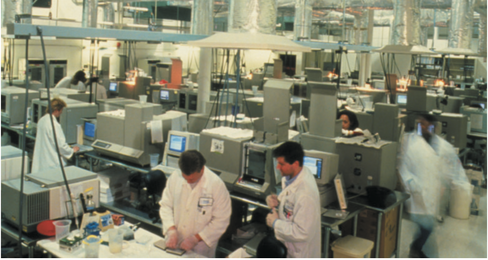</center>

<div style="font-size: small;"> Green, Eric D., James D. Watson, and Francis S. Collins. "Human Genome Project: Twenty-Five Years of Big Biology." Nature 526, no. 7571 (October 1, 2015): 29–31. doi:10.1038/526029a.
</div>

<!--
## Two shotgun-sequencing strategies

<center>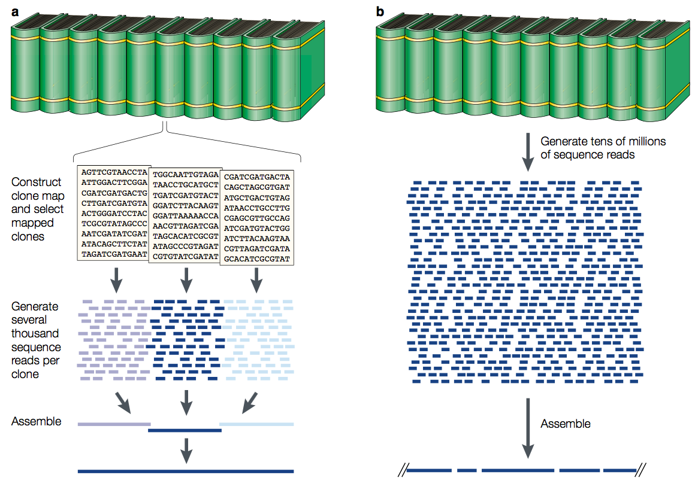</center>

<div style="font-size: small;"> https://www.nature.com/nrg/journal/v2/n8/full/nrg0801_573a.html
</div>
-->
<!--a | Schematic overview of clone-by-clone shotgun sequencing. A representation of a genome is made by analogy to an encyclopaedia set, with each volume corresponding to an individual chromosome. The construction of clone-based physical maps produces overlapping series of clones (that is, contigs), each of which spans a large, contiguous region of the source genome. Each clone (for example, a bacterial artificial chromosome (BAC)) can be thought of as containing the DNA represented by one page of a volume. For shotgun sequencing, individual mapped clones are subcloned into smaller-insert libraries, from which sequence reads are randomly derived. In the case of BACs, this typically requires the generation of several thousand sequence reads per clone. The resulting sequence data set is then used to assemble the complete sequence of that clone (see Figs 3,4). b | Schematic overview of whole-genome shotgun sequencing. In this case, the mapping phase is skipped and shotgun sequencing proceeds using subclone libraries prepared from the entire genome. Typically, tens of millions of sequence reads are generated and these in turn are subjected to computer-based assembly to generate contiguous sequences of various sizes.-->

---
## The competing human genome projects

<center></center>

---
## A first map of the human genome

<center></center>

<div style="font-size: small;"> http://www.nature.com/nature/journal/v409/n6822/full/409860a0.html
</div>

---
## Human genome is sequenced!

<center>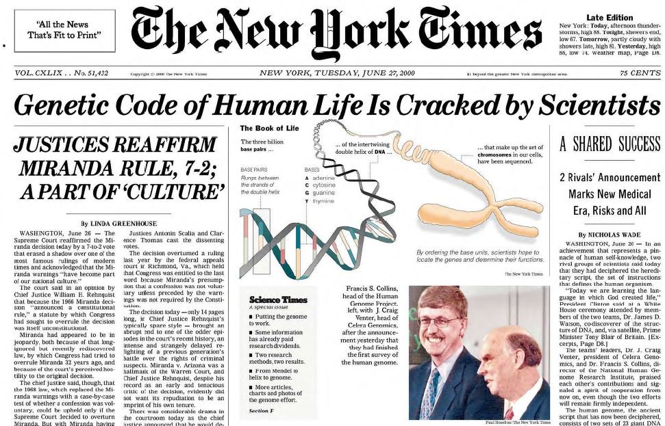</center>

---
## The Human Genome roadmap

<center>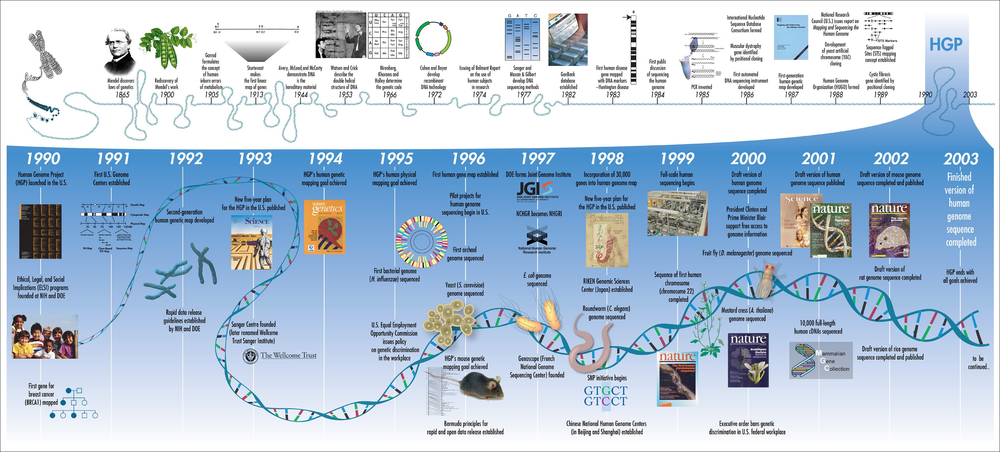</center>
&nbsp;

<div style="font-size: small;"> https://www.davidstreams.com/mis-apuntes/human-genome-project/
</div>

<!--
## Sanger sequencing: technological advances

- 1977: Fred Sanger
    - 1 hardworking technician = 700 bases per day = 118,000 years to sequence the human genome
- 1985: ABI 370 (first automated sequencer)
    - 5000 bases per day= 16,000 years
- 1995: ABI 377 (Bigger gels, better chemistry & optics, more sensitive dyes, faster computers)
    - 19,000 bases per day = 4,400 years
- 1999: ABI 3700 (96 capillaries, 96 well plates, fluid handling robots)
    - 400,000 bases per day = 205 years
-->

---
## Evolution of sequencing technologies

- "Massively parallel" sequencing

- "High-throughput" sequencing

- "Ultra high-throughput" sequencing

- "Next generation" sequencing (NGS)

- "Second generation" sequencing

---
## Evolution of sequencing technologies

- 2005: 454 (Roche)

- 2006: Solexa (Illumina)

- 2007: ABI/SOLiD (Life Technologies)

- 2010: Complete Genomics

- 2011: Pacific Biosciences

- 2010: Ion Torrent (Life Technologies)

- 2015: Oxford Nanopore Technologies

---
## Sequencing in a nutshell

- Cut the long DNA into smaller segments (several hundreds to several thousand bases)

- Sequence each segment: start from one end and sequence along the chain, base by base

- The process stops after a while because the noise level is too high

- Results from sequencing are many sequence pieces. The lengths vary, usually a few thousands from Sanger, and several hundreds from NGS

- The sequence pieces are called "reads" for NGS data

<!--
## 454 pyrosequencing

<center>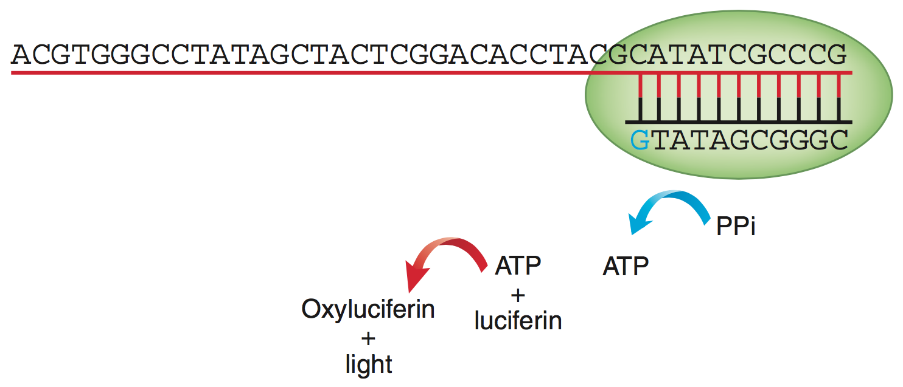</center>

1) Hybridize sequencing primer

2) Add DNA polymerase, ATP sulfurylase, luciferase, apyrase & substrates (adenosine 5' phosphosulfate (APS) and luciferin)

3) Nucleotide incorporation catalyzes chain reaction that results in light

4) Add bases sequentially: add A, take a picture - did it flash? :: wash :: add T - did it flash? :: wash :: add G - did it flash? :: wash :: add C - did it flash? :: wash. Repeat ~500 times

<div style="font-size: small;"> https://www.nature.com/nbt/journal/v26/n10/full/nbt1485.html
</div>

## 454 pyrosequencing

1) Fragment DNA

2) Bind to beads, emulsion PCR amplification

3) Remove emultion, place beads in wells

4) Solid phase pyrophosphate sequencing reaction

5) Scanning electron micrograph

<center></center>

<div style="font-size: small;"> https://www.nature.com/nbt/journal/v26/n10/full/nbt1485.html
</div>

## 454 sequencing: summary

- First post-Sanger technology (2005)
- Used to sequence many microorganisms & Jim Watson’s genome (for $2M in 2007)
- Longer reads than Illumina, but much lower yield (~500bp)
- Rapidly outpaced by other technologies - now essentially obsolete
-->

---
## Solexa (Illumina) sequencing (2006)

- PCR amplify DNA fragments

- Immobilize fragments on a solid surface, amplify

- Reversible terminator sequencing with 4 color dye-labelled nucleotides

.small[ Video of Illumina sequencing, http://www.youtube.com/watch?v=77r5p8IBwJk (1.5m), https://www.youtube.com/watch?v=fCd6B5HRaZ8 (5m) ]

<!--
## Solexa (Illumina) sequencing (2006)

<center>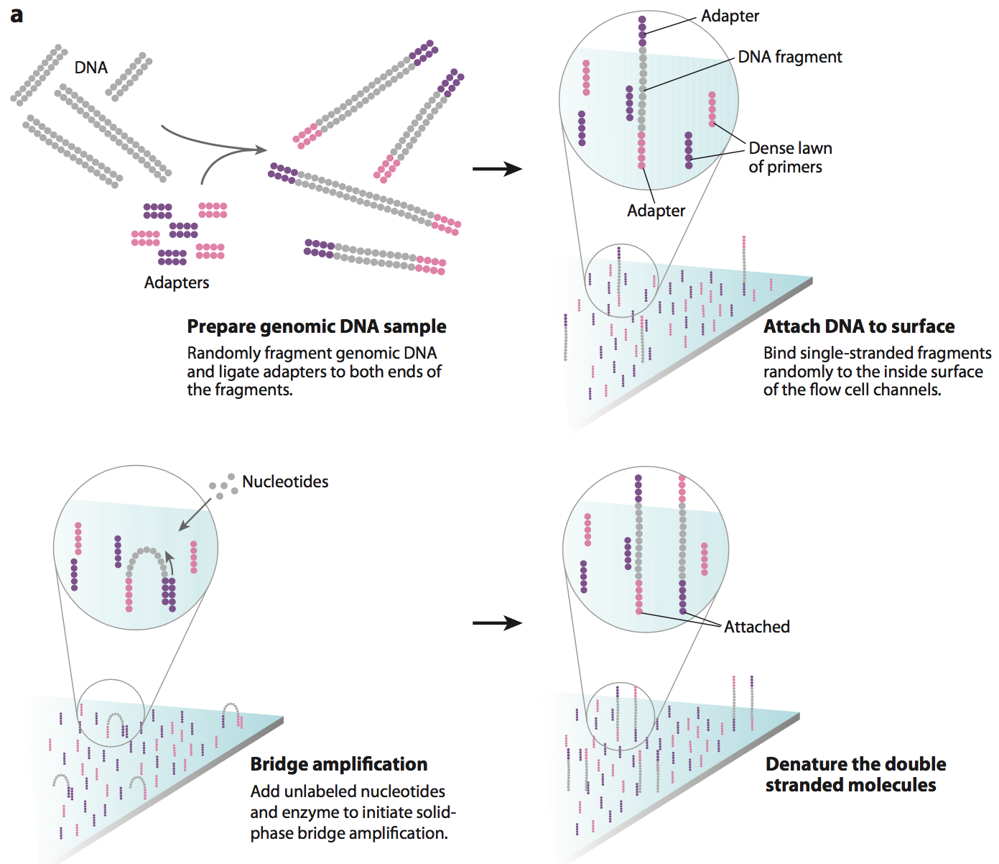</center>

<div style="font-size: small;"> http://www.annualreviews.org/doi/abs/10.1146/annurev.genom.9.081307.164359
</div>
-->

---
##  Cluster amplification by "bridge" PCR

<center>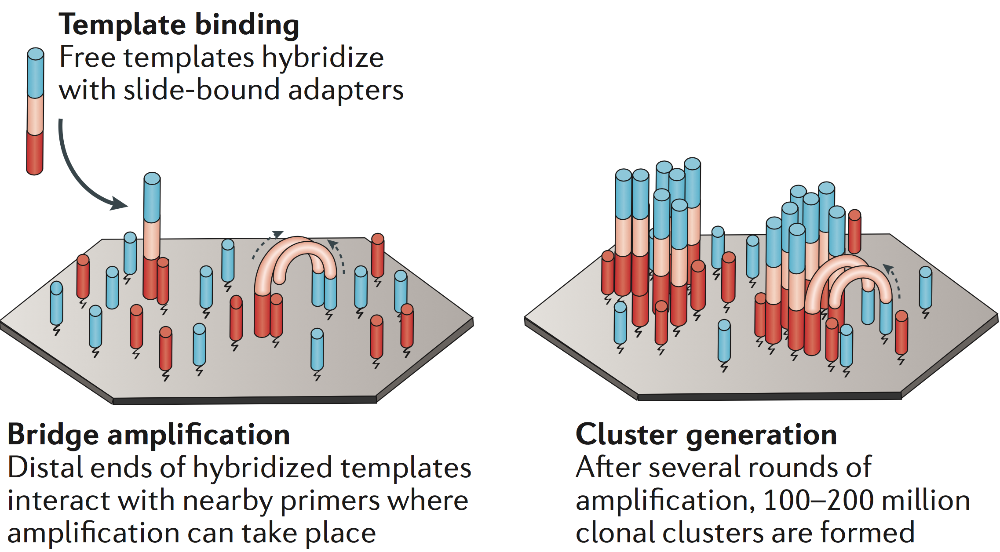</center>

<div style="font-size: small;"> https://binf.snipcademy.com/lessons/ngs-techniques/bridge-pcr
</div>

---
## Clonal amplification

<center>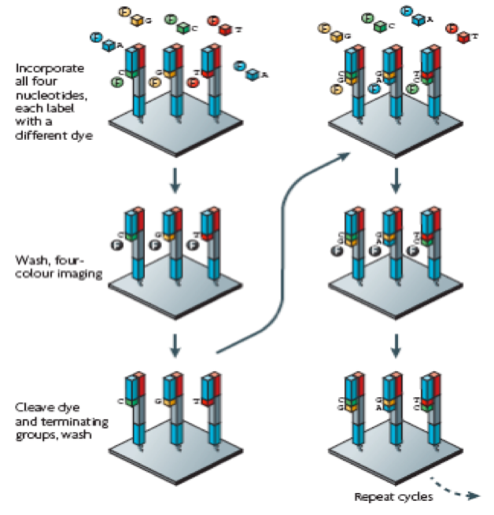</center>

---
## Base calling

- 6 cycles with base-calling

<center>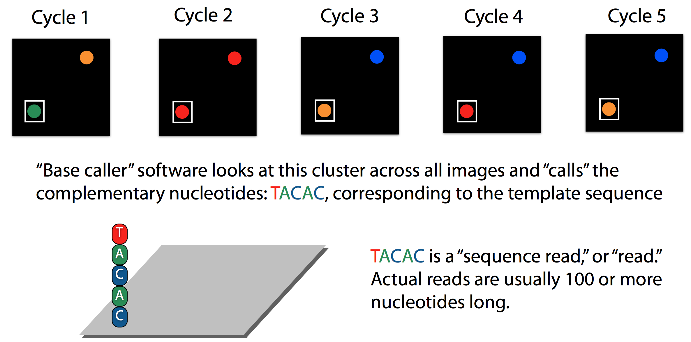</center>

<div style="font-size: small;"> https://www.youtube.com/watch?v=IzXQVwWYFv4

https://www.youtube.com/watch?time_continue=65&v=tuD-ST5B3QA
</div>

<!--
## Illumina sequencers

<center></center>

- **Illumina HiSeq**: ~3 billion paired 100bp reads, ~600Gb, $10K, 8 days (or "rapid run" ~90Gb in 1-2 days)
- **Illumina X Ten**: ~6 billion paired 150bp reads, 1.8Tb, <3 days, ~1000 / genome(\$\$), (or "rapid run" ~90Gb in 1-2 days)
- **Illumina NextSeq series**: One human genome in <30 hours

<div style="font-size: small;"> http://www.businesswire.com/news/home/20150112006333/en/Illumina-Expands-World%E2%80%99s-Comprehensive-Next-Generation-Sequencing-Portfolio
</div>
-->

---
## Illumina sequencers

<center>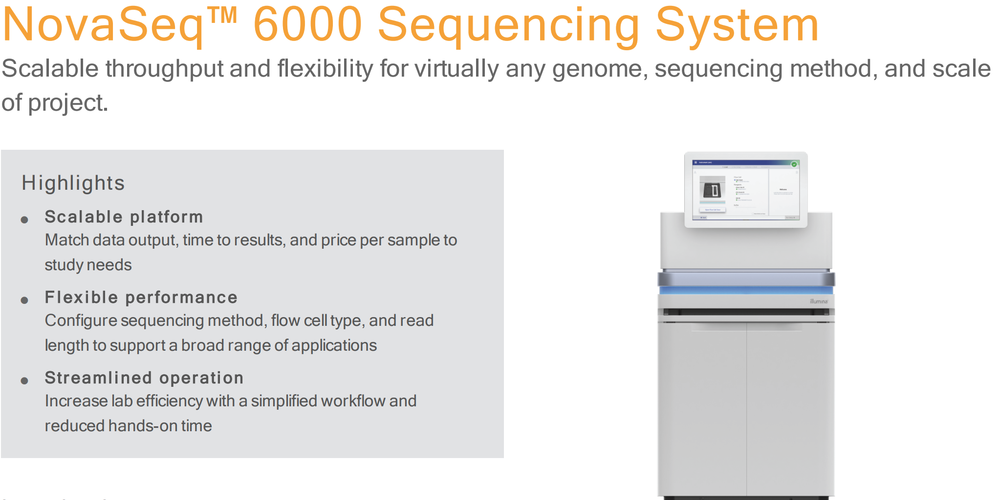</center>

- Massive improvement of the cluster density - higher output
- Less expensive than the previous sequencers, Faster runs

<div style="font-size: small;">
https://www.illumina.com/systems/sequencing-platforms.html

https://blog.genohub.com/2017/01/10/illumina-unveils-novaseq-5000-and-6000/

http://www.mrdnalab.com/illumina-novaseq.html
</div>

<!-- http://www.opiniomics.org/hiseq-move-over-here-comes-nova-a-first-look-at-illumina-novaseq/ -->

---
## Solexa (Illumina) sequencing: summary

Advantages:

- Best throughput, accuracy and read length for any 2nd gen. sequencer
- Fast & robust library preparation

Disadvantages:

- Inherent limits to read length (practically, 150bp)
- Some runs are error prone

<div style="font-size: small;"> Video of Illumina sequencing https://www.youtube.com/watch?v=womKfikWlxM (5m)
</div>

---
## Single-end vs. paired-end sequencing

- Single-end sequencing: sequence one end of the DNA segment.

- Paired-end sequencing: sequence both ends of a DNA segments.
    - Result reads are "paired", separated by certain length (the length of the DNA segments, usually a few hundred bps).
    - Paired-end data can be used as single-end, but contain extra information which is useful in some cases, e.g., detecting structural variations in the genome.
    - Modeling technique is more complicated.

---
## Paired-end sequencing - a workaround to sequence longer fragments

- Read one end of the molecule, flip, and read the other end
- Generate pair of reads separated by up to 500bp with inward orientation

<center>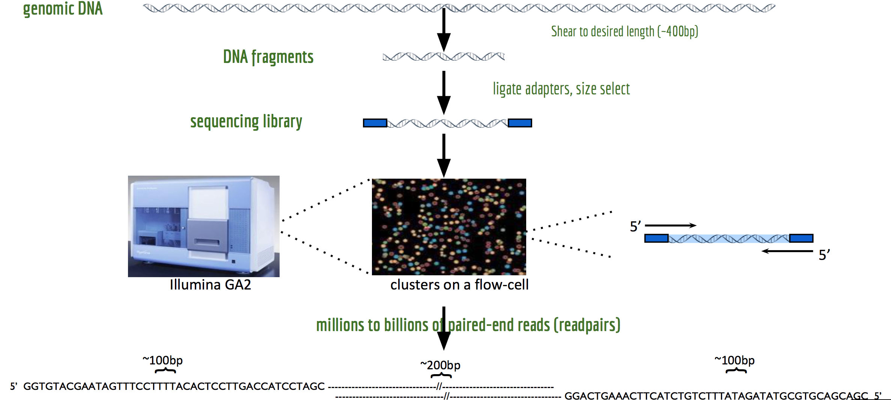</center>

<!--
## Templates and segments

- Template – DNA/RNA molecule which was subjected to sequencing
    – "Insert size" - template length
    - "Segment" – part of the template which was "read" by a sequencing machine (represented by a "sequencing read")

<center></center>

## Advantages of paired-end sequencing

- Alignment of the read pair to the reference genome gives coordinates describing where in the human genome the read pair came from

<center>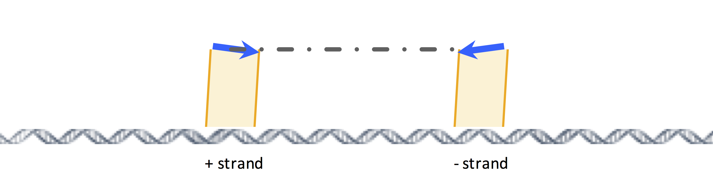</center>
-->

---
## Sequencing applications

NGS has a wide range of applications

- DNA-seq: sequence genomic DNA

- RNA-seq: sequence RNA products

- ChIP-seq: detect protein-DNA interaction sites

- Bisulfite sequencing (BS-seq): measure DNA methylation strengths

- A lot of others

Basically replaced microarrays with better data: greater dynamic range and higher signal-to-noise ratios.

---
## DNA-seq (Whole-Genome sequencing)

- Sequence the untreated genomic DNA.
    - Obtain DNA from cells, cut into small pieces then sequence the segments.

- Goals: Compare with the reference genome and look for genetic variants
    
- Single nucleotide polymorphisms (SNPs)
- Insertions/deletions (indels),
- Copy number variations (CNVs)
- Other structural variations (gene fusion, etc.).
    - _De novo_ assembly of a new genome.

---
## Variations of DNA-seq

- Targeted sequencing, e.g., exome sequencing
    - Sequence the genomic DNA at targeted genomic regions
    - Cheaper than whole genome DNA-seq, so that money can be spent to get bigger sample size (more individuals)
    - The targeted genomic regions need to be "captured" first using technologies like microarrays

- Metagenomic sequencing
    - Sequence the DNA of a mixture of species, mostly microbes, in order to understand the microbial environments
    - The goal is to determine number of species, their genome and proportions in the population
    - _De novo_ assembly is required. But the number and proportions of species are unknown, so it poses challenge to assembly

---
## RNA-seq

Sequence the "transcriptome": the set of RNA molecules

Goals
    
- Catalogue RNA products
- Determine transcriptional structures: alternative splicing, gene fusion, etc.

- Quantify gene expression: the sequencing version of gene expression microarray

<!--
## Sequencing vs. microarray

- Very good agreement
- More information

<center>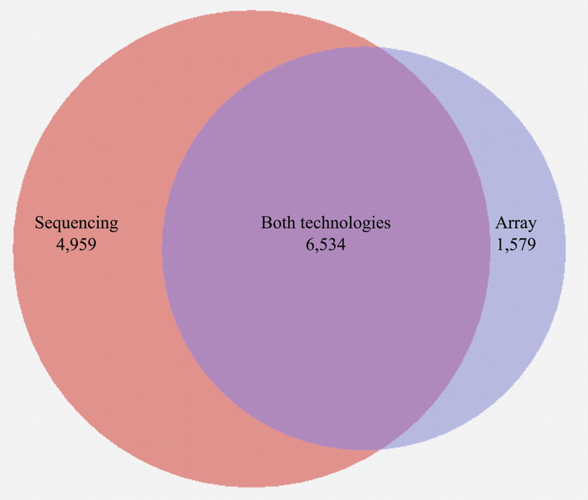</center>

<div style="font-size: small;"> https://www.ncbi.nlm.nih.gov/pubmed/18550803
</div>
-->

---
## ChIP-seq

- Chromatin-Immunoprecipitation (ChIP) followed by sequencing (seq): sequencing version of ChIP-chip

- Used to detect locations of certain "events" on the genome:
    - Transcription factor binding
    - DNA methylations and histone modifications

- A type of "captured" sequencing. ChIP step is to capture genomic regions of interest

---
## What matters is what you feed into the sequencing machine

<center>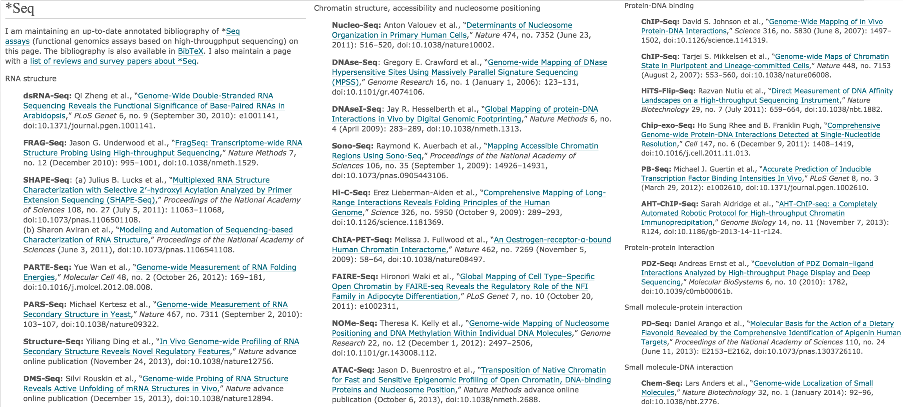</center>

<div style="font-size: small;"> https://liorpachter.wordpress.com/seq/
</div>

<!--
## Evolution of sequencing technologies

<center></center>

## Developments in next generation sequencing: instruments, read lengths, throughput.

<center>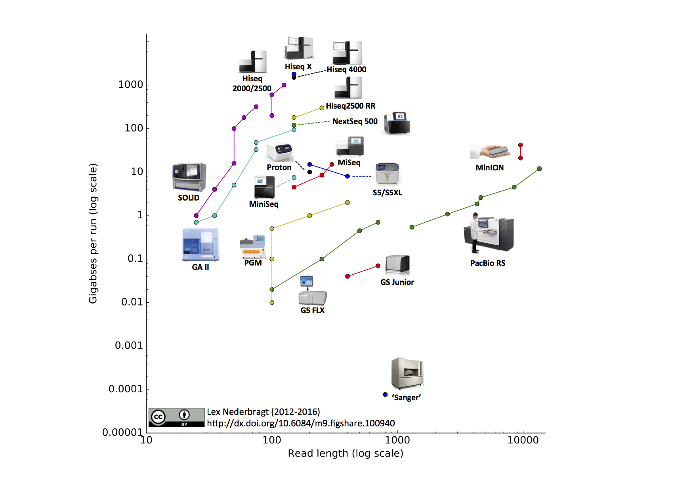</center>

<div style="font-size: small;"> https://github.com/lexnederbragt/developments-in-next-generation-sequencing
</div>
-->

---
class: center, middle

# Extra

---
## GENCODE – Annotation Gene Features

- ~21,000 protein coding genes

- PolyA+
    - Almost completely spliced before nuclear export
      – co-trascriptional splicing "first transcribed – first spliced"
    - Most have at least 2 dominate splice forms
    - Show allele specific expression – potential imprinting

- PolyA-
    - Many are lncRNAs
    - Also shows allele specific expression

https://www.gencodegenes.org/

---
## GENCODE – Annotation Gene Features

- Most (62%) of the genome is transcribed
    - <5% can be identified as exons

- ~12,000 pseudogenes – results of duplications
    - 876 are transcribed – can have regulatory function as decoys
    - Infrequently spliced

- ~10,000 lncRNA = noncoding RNAs >200bp
    - 92% are not translated
    - Show tissue-specific expression – more than protein coding genes
    - 33% are primate specific but few are human specific – most new genes are in this category
    - Poorly spliced – most are two exon transcripts

---
## GENCODE – Annotation Gene Features

- ~9000 small RNAs - many of the lncRNA transcripts are processed into stable small RNAs
    - tRNA, miRNA, siRNA, snRNA, snoRNA

- ~82,000 – 128,000 transcription start sites - depending on detection method
    - ~44% are near annotated transcripts

- ~5,000 RNA edits occur post transcription
    - Mostly A to G(I) conversions (APOBEC pathway)
    - 94% are in transcribed repeat elements
        - Remaining are mostly in introns, 3’UTRs
        - Very few (123) in protein coding sequences

---
## ION Torrent-pH Sensing of Base Incorporation

<center></center>

---
## Platforms: Ion Torrent

<center></center>

- Low substitution error rate, in/dels problematic, no paired end reads
- Inexpensive and fast turn-around for data production
- Improved computational workflows for analysis

---
##  Pacific Biosciences: Long reads

<center>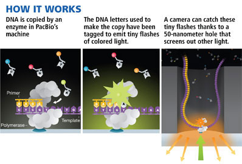</center>

- Structural variant discovery
- _De novo_ genome assembly

.small[ https://www.forbes.com/forbes/2009/1005/revolutionaries-science-genomics-gene-machine.html ]

---
## Pacific Biosciences: summary

Key Points:

- 1 DNA molecule and 1 polymerase in each well (zero-mode waveguide)
- 4 colors flash in real time as polymerase acts
- Methylated cytosine has distinct pattern
- No _theoretical_ limit to DNA fragment length

Caveats:

- Higher error rate (1-2%), but they are random
- Lower throughput, roughly 5 gigabases per run

---
## Nanopore sequencing

- Nearly 30-years old technology

<center></center>

<div style="font-size: small;"> http://www2.technologyreview.com/news/427677/nanopore-sequencing/
</div>

---
## Nanopore sequencing

- Nanopore sequencing with ONT is accurate and relatively reliable
- Current yield per run: ~5 Gbp, 97% identity (i.e., 3% error rate)

<center>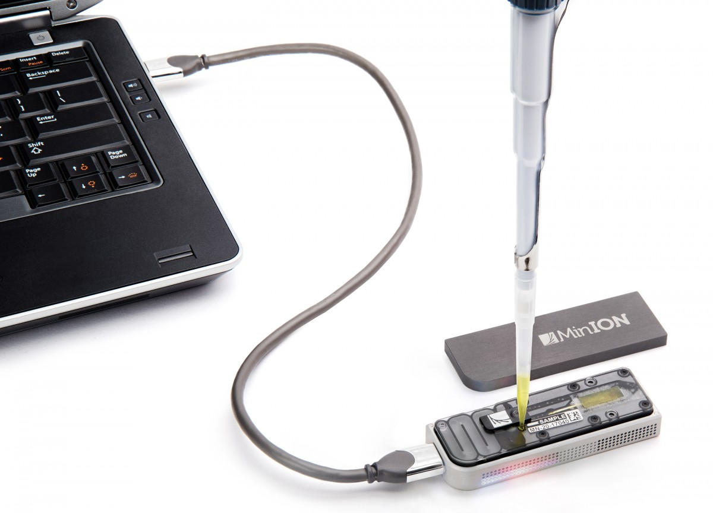</center>

<div style="font-size: small;"> https://www.technologyreview.com/s/600887/with-patent-suit-illumina-looks-to-tame-emerging-british-rival-oxford-nanopore/

Video of Ion Torrent chemistry, http://www.youtube.com/watch?v=yVf2295JqUg (2.5m)
</div>

---
## Nanopore sequencing

- Key advantage - portability

<center>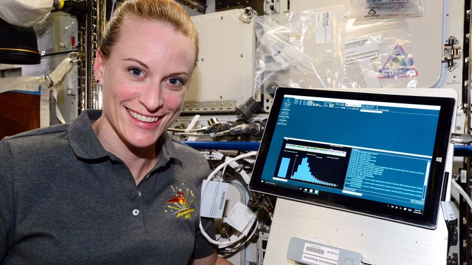</center>

<!--
<center>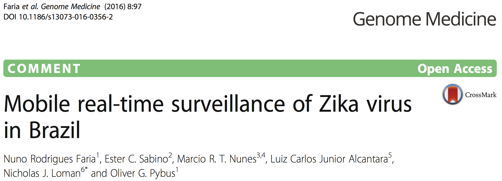</center>
-->

<div style="font-size: small;"> Video of Nanopore DNA sequencint technology https://www.youtube.com/watch?v=CE4dW64x3Ts (4.5m)

https://phys.org/news/2016-08-nasa-dna-sequencing-space-success.html
</div>

---
## Nanopore for human genome sequencing

<center></center>

- Closes 12 gaps
- Phased the entire major histocompatibility complex (MHC) region, one of the most gene-dense and highly variable regions of the genome

<div style="font-size: small;"> Jain, Miten, Sergey Koren, Karen H Miga, Josh Quick, Arthur C Rand, Thomas A Sasani, John R Tyson, et al. “Nanopore Sequencing and Assembly of a Human Genome with Ultra-Long Reads.” Nature Biotechnology, January 29, 2018. https://doi.org/10.1038/nbt.4060.

https://www.genengnews.com/gen-exclusives/first-nanopore-sequencing-of-human-genome/77901044
</div>

---
## Nanopore technology

- Nanopore sequencing yields raw signals reflecting modulation of the ionic current at each pore by a DNA molecule.
- The resulting time-series of nanopore translocation, ‘events’, are base-called by proprietary software running as a cloud service.

<center></center>

<div style="font-size: small;"> https://academic.oup.com/bioinformatics/article-lookup/doi/10.1093/bioinformatics/btu555
</div>

---
## Nanopore base callers

- Proper base calling is a paramount, as it defines whether the technology is good or bad.
- `Nanonet`, `Albacore`, `Scrappie`
- Most modern basecallers use neural networks.

<center></center>

<div style="font-size: small;"> https://github.com/rrwick/Basecalling-comparison
</div>

---
## Nanopore analysis

- The resulting files for each sequenced read are stored in ‘FAST5’ format, an application of the HDF5 format.
- `poretools` - a toolkit for analyzing nanopore sequence data.

<center></center>

<div style="font-size: small;"> https://github.com/arq5x/poretools

https://academic.oup.com/bioinformatics/article-lookup/doi/10.1093/bioinformatics/btu555
</div>

---
## PacBio vs. Oxford Nanopore sequencing

<center></center>

<div style="font-size: small;"> https://blog.genohub.com/2017/06/16/pacbio-vs-oxford-nanopore-sequencing/
</div>
