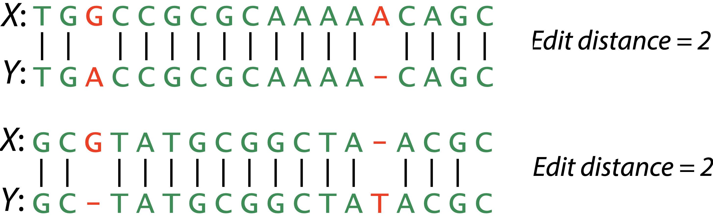

```{r xaringan-themer, include = FALSE}
library(xaringanthemer)
mono_light(
  base_color = "midnightblue",
  header_font_google = google_font("Josefin Sans"),
  text_font_google   = google_font("Montserrat", "500", "500i"),
  code_font_google   = google_font("Droid Mono"),
  link_color = "#8B1A1A", #firebrick4, "deepskyblue1"
  text_font_size = "28px",
  code_font_size = "26px"
)
```

## Alignment

**Measures of Sequence Similarity**

- For two sequences s1 and s2, we need to define their distance d(s1, s2)

- The greater the distance, the less similar between these two sequences.
    - d(s,s) = 0 for fully similar sequences
    
---
## Hamming distance

For X and Y, where |X|=|Y|, _hamming distance_ = minimum number of substitutions needed to turn one into the other

<center></center>

---
## Edit distance

aka Levenshtein distance

For X and Y, _edit distance_ = minimum number edits (substitutions, insertions, deletions) needed to turn one into the other

<center></center>

---
## Example of a simple scoring matrix

```
   A  G  C  T
A  1 -1 -1 -1
G -1  1 -1 -1
C -1 -1  1 -1
T -1 -1 -1  1
```

Matches are score as 1, mismatches - as -1

---
## Example of penalty matrix

Suppose your empirically defined matrix is

```
   A  G  C  T 
A 10 -1 -3 -4 
G -1  7 -5 -3 
C -3 -5  9  0 
T -4 -3  0  8 
```
with gap penalty= -5

Apply it to the secong sequence:

```
Read: AGACTAGTTAC
Ref:  CGA---GACGT
```
-3+7+10+(3)(-5)+7-4+0-1+0 = 1

---
## Scoring Schemes

For applications to molecular biology, recognize that certain changes are more likely to occur naturally than others

For example, amino acid substitutions tend to be conservative: the replacement of one amino acid by another with similar size or physicochemical properties is more likely to have occurred than its replacement by another amino acid with greater difference in their properties. Or, the deletion of a succession of contiguous bases or amino acids is a more probable event than the independent
deletion of the same number of bases or amino acids at noncontiguous positions in the sequences

We may wish to assign variable weights to different edit operations.

---
## Scoring Schemes in real life

- Transition mutations (a-g and t-c) are more common than transversions ((a, g)-(t, c))

- A substitution matrix that reflects this:

<center></center>

---
## Pioneer of Comp. Biology - Margeret Dayhoff

.pull-left[

- Trained in math and quantum chemistry

- Associate director of the newly-formed National Biomedical Research Foundation

- Wrote seminal FORTRAN programs to derive amino acids sequences by using partial overlaps of fragmented amino acid sequences

- PAM (Point accepted mutation) matrices

- Realized the applications to nucleic acids and gene sequences

]
.pull-right[
<center></center>
]

---
## PAM250 

- The similarity matrix is frequently used to score aligned peptide sequences to determine the similarity of those sequences

- Derived from comparing aligned sequences of proteins with known homology and determining the "point accepted mutations" (PAM) observed

- The frequencies of these mutations are in this table as a "log odds-matrix" where: $M_{ij} = 10(log_{10}R_{ij})$, where $M_{ij}$ is the matrix element and $R_{ij}$ is the probability of that substitution as observed in the database, divided by the normalized frequency of occurence for amino acid $i$. 

---
## PAM250 

<center></center>

---
## BLOSUM- BLOcks Substitution Matrix

Steven Henikoff and Jorja Henikoff developed the family of BLOSUM matrices for scoring substitutions in amino acid sequence comparisons. Their goal was to replace the Dayhoff matrix with one that would perform best in identifying distant relationships, making use of the much larger amount of data that had become available since Dayhoff's work

The BLOSUM matrices are based on the BLOCKS database of aligned protein sequences; hence the name BLOcks SUbstitution Matrix. From regions of closely-related proteins alignable without gaps, Henikoff calculated the ratio, of the number of observed pairs of amino acids at any position, to the number of pairs expected from the overall amino acid frequencies. As in the Dayhoff matrix, the results are expressed as log-odds

In order to avoid overweighting closely-related sequences, the Henikoffs replaced groups of proteins that have sequence identities higher than a threshold by either a single representative or a weighted average. The threshold 62% produces the commonly used BLOSUM62 substitution matrix. This is offered by all programs as an option and is the default in most

---
## BLOSUM- BLOcks Substitution Matrix

Based on conserved blocks bounded in similarity (at least X% identical)

Matrices for divergent proteins are derived using appropriate X%

- BLOSUM62 - sequences having at least 62% identity are merged together 
- BLOSUM30 - sequences having at least 30% identity are merged together 
- BLOSUM90 - sequences having at least 90% identity are merged together


