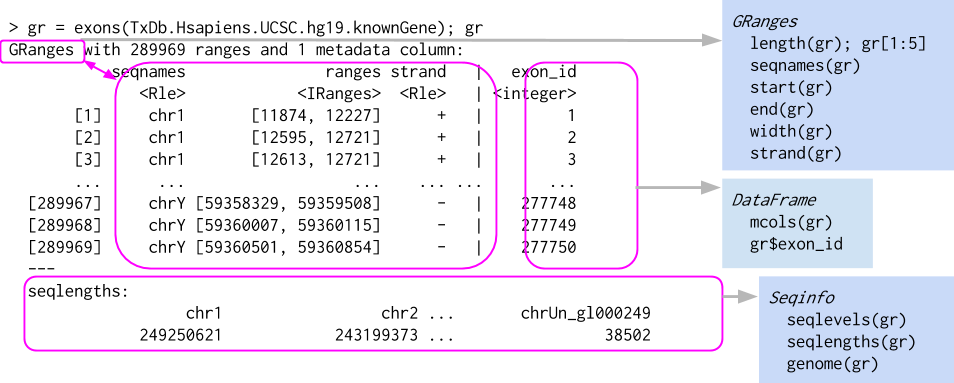

```{r xaringan-themer, include = FALSE}
library(xaringanthemer)
mono_light(
  base_color = "midnightblue",
  header_font_google = google_font("Josefin Sans"),
  text_font_google   = google_font("Montserrat", "500", "500i"),
  code_font_google   = google_font("Droid Mono"),
  link_color = "#8B1A1A", #firebrick4, "deepskyblue1"
  text_font_size = "28px",
  code_font_size = "26px"
)
```

class: center, middle

# Data representation in R / Bioconductor

---
## Ranges overview

.center[  ]

---
## Ranges in Bioconductor

- IRanges
    - `start()` / `end()` / `width()`
    - List-like -- `length()`, subset, etc.
    - 'metadata', `mcols()`

- GRanges
    - 'seqnames' (chromosome), 'strand'
    - `Seqinfo`, including `seqlevels` and `seqlengths`

---
## Range methods

- Intra-range methods: See `?"intra-range-methods"`
    - Independent of other ranges in the same object
    - `shift()`, `narrow()`, `flank()`, `promoters()`, `resize()`, `trim()`

- Inter-range methods: See `?"inter-range-methods"`
    - Depends on other ranges in the same object
    - `range()`, `reduce()`, `gaps()`, `disjoin()`, `coverage()`

- Between-range methods
    - Functions of two (or more) range objects
    - `findOverlaps()`, `countOverlaps()`, `summarizeOverlaps()`, ..., `%over%`, `%within%`, `%outside%`, `union()`, `intersect()`, `setdiff()`, `punion()`, `pintersect()`, `psetdiff()`

---
## IRanges

- The `IRanges` package defines an important class for specifying integer ranges

- There are many interesting operations to be performed on ranges, e.g, `flank()` identifies adjacent ranges 

- `IRanges` extends the `Ranges` class

---
## Genomic Ranges

The `GenomicRanges` package extends the notion of ranges to include features relevant to application of ranges in sequence analysis, particularly the ability to associate a range with a sequence name (e.g., chromosome) and a strand.

.center[  ]

---
## GenomicRanges

- Data (e.g., aligned reads, called peaks, copy number)

- Annotations (e.g., genes, exons, transcripts)

- Close relation to BED files (see `rtracklayer::import.bed()` and `HelloRanges`)

- Also vector interface – `length()`, `[`, etc.

---
## Lists of Genomic Ranges

- List definition - all elements of the same type 

- E.g., lists of exons-within-transcripts, alignments-within-reads

- Many *List-aware methods, but a common ‘trick’: apply a vectorized function to the unlisted representaion, then re-list

.small[ Lawrence M, Huber W, Pag&egrave;s H, Aboyoun P, Carlson M, et al. (2013) [Software for Computing and Annotating Genomic Ranges](https://doi.org/10.1371/journal.pcbi.1003118). PLoS Comput Biol ]

---
## Lists of Genomic Ranges

.center[  ]

