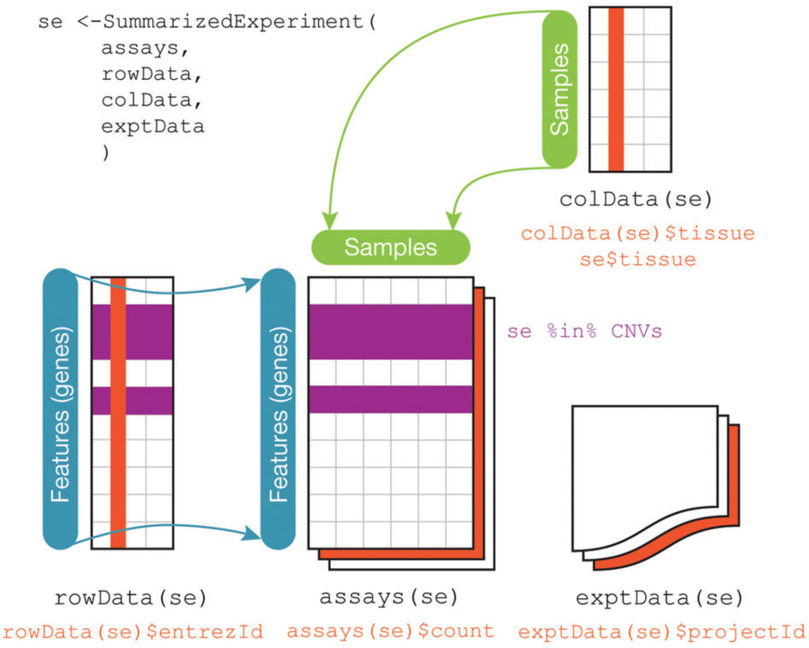
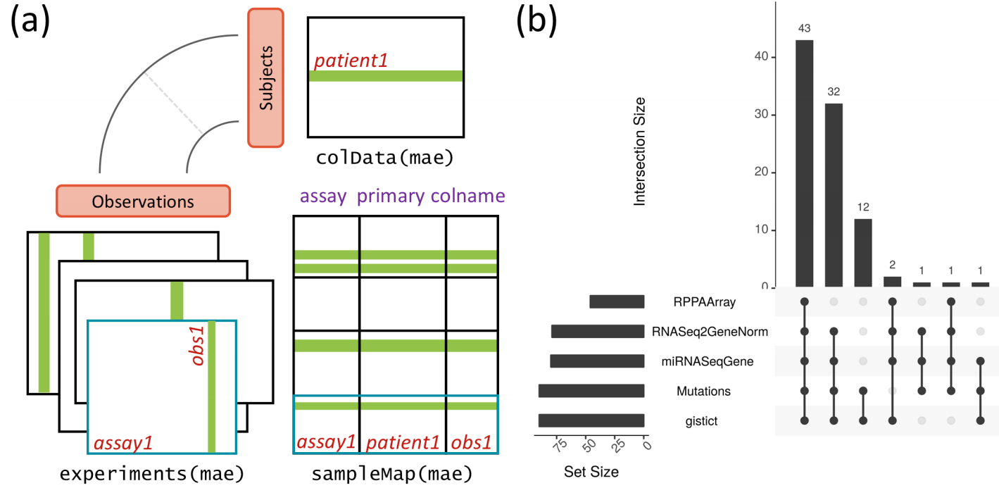
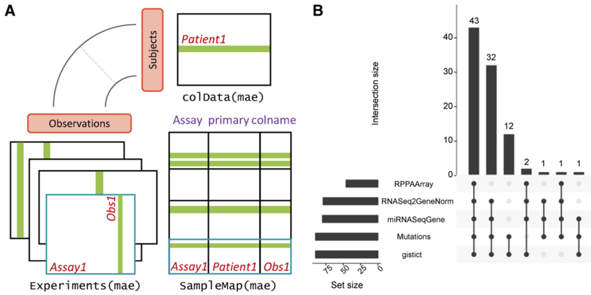

```{r xaringan-themer, include = FALSE}
library(xaringanthemer)
mono_light(
  base_color = "midnightblue",
  header_font_google = google_font("Josefin Sans"),
  text_font_google   = google_font("Montserrat", "500", "500i"),
  code_font_google   = google_font("Droid Mono"),
  link_color = "#8B1A1A", #firebrick4, "deepskyblue1"
  text_font_size = "28px",
  code_font_size = "26px"
)
```

## Summarized Experiments

`SummarizedExperiment` - Rows are indexed by a dataframe of _features_. Accessible with `rowData()`

.center[  ]

.small[ https://bioconductor.org/packages/SummarizedExperiment/ ]

<!--SummarizedExperiment.png-->

---
## RangedSummarizedExperiment

- `RangedSummarizedExperiment` - Rows are indexed by _genomic ranges_. Accessble with `rowRanges()`


---
## SingleCellExperiment

`SingleCellExperiment` - an extension of `RangedSummarizedExperiment` with several internal slots

- Has a slot for spike-in measures

- Can store reduced dimensionality representation of the data

.small[ https://bioconductor.org/packages/SingleCellExperiment/ ]

---
## MultiAssayExperiment

Bioconductor package for management of multi-assay data. Especially useful for integrating TCGA datasets.

.center[  ]

.small[ https://bioconductor.org/packages/MultiAssayExperiment/ ]

<!--(a) The MultiAssayExperiment object schematic shows the design of the infrastructure class. The colData provides data about the patients, cell lines, or other biological units, with one row per unit and one column per variable. The experiments are a list of assay datasets of arbitrary class, with one column per observation. The sampleMap links a single table of patient data (colData) to a list of experiments via a simple but powerful table of experiment:patient edges (relationships), that can be created automatically in simple cases or in a spreadsheet if assay-specific sample identifiers are used. sampleMap relates each column (observation) in the assays (experiments) to exactly one row (biological unit) in colData; however, one row of colData may map to zero, one, or more columns per assay, allowing for missing and replicate assays. Green stripes indicate a mapping of one subject to multiple observations across experiments. (b) The UpSetR graphic represents a complex Venn diagram of assay availability for patients in a MultiAssayExperiment. This Glioblastoma object has been subset to only four of its original 12 assays. The barplot on the left shows sample size of each experiment; links to its right indicate combinations of 1 to 4 experiments, with bars above showing the number of patients having exactly those data types. -->

---
## MultiAssayExperiment

.center[  ]

.small[ Ramos, Marcel, Lucas Schiffer, Angela Re, Rimsha Azhar, Azfar Basunia, Carmen Rodriguez Cabrera, Tiffany Chan, et al. “[Software For The Integration Of Multi-Omics Experiments In Bioconductor](https://doi.org/10.1158/0008-5472.CAN-17-0344),” Cancer Research, October 31, 2017 ]


<!--
## Domain-specific packages

- Important packages for analysis of **differential expression** include `edgeR` and `DESeq2`; both have excellent vignettes for exploration. 

.small[ http://bioconductor.org/packages/edgeR

http://bioconductor.org/packages/DESeq2 ]

- Popular **ChIP-seq** packages include `DiffBind` and `csaw` for comparison of peaks across samples, `ChIPQC` for quality assessment, and `ChIPpeakAnno` and `ChIPseeker` for annotating results (e.g., discovering nearby genes).

.small[  http://bioconductor.org/packages/ChIPpeakAnno

http://bioconductor.org/packages/ChIPseeker

http://bioconductor.org/packages/DiffBind

http://bioconductor.org/packages/csaw

http://bioconductor.org/packages/ChIPQC ]

## Domain-specific packages

- Working with called variants (VCF files) is facilitated by packages such as `VariantAnnotation`, `VariantFiltering` and `ensemblVEP`

- Packages for calling variants include, e.g., `h5vc` and `VariantTools`.

.small[ https://bioconductor.org/packages/release/bioc/html/VariantAnnotation.html

http://bioconductor.org/packages/VariantFiltering.html

https://bioconductor.org/packages/release/bioc/html/ensemblVEP.html

https://bioconductor.org/packages/release/bioc/html/h5vc.html

https://bioconductor.org/packages/release/bioc/html/VariantTools.html ]

## Domain-specific packages

- **Single-cell 'omics'** are increasingly important. From the `biocView` page, enter 'single cell' in the 'search table' field.
- Several packages identify **copy number variants** from sequence data, including `cn.mops`. The `CNTools` package provides some useful facilities for comparison of segments across samples.
- **Microbiome and metagenomic** analysis is facilitated by packages such as `phyloseq` and `metagenomeSeq`.
- **Metabolomics, chemoinformatics, image analysis**, and many other high-throughput analysis domains are also represented in _Bioconductor_; explore these via `biocViews` and title searches.

.small[ https://bioconductor.org/packages/release/BiocViews.html#___Software

https://bioconductor.org/packages/release/bioc/html/cn.mops.html

http://bioconductor.org/packages/CNTools

http://bioconductor.org/packages/phyloseq

http://bioconductor.org/packages/metagenomeSeq ]

## Visiualization
  
A number of _Bioconductor_ packages help with visualization and reporting, in addition to functions provided by individual packages.

- `Gviz` provides a track-like visualization of genomic regions.
- `ComplexHeatmap` does an amazing job of all sorts of heatmaps, including OncoPrint-style summaries.
- `ReportingTools` provides a flexible way to generate static and dynamic HTML-based reports.

.small[ http://bioconductor.org/packages/Gviz

http://bioconductor.org/packages/ComplexHeatmap

http://bioconductor.org/packages/ReportingTools ]

## Working with big data

- Much Bioinformatic data is very large and often cannot fit into memory
- Several general strategies for working with large data

**Restriction to specific genomic regions**

- e.g., `ScanBamParam()` limits input to desired data at specific genomic ranges

**Iteration over pieces of genomic data**

- e.g., `yieldSize` argument of `BamFile()`, or `FastqStreamer()` allows iteration through large files.

## Working with big data

**Compression**

- Genomic vectors represented as `Rle` (run-length encoding) class
- Lists e.g., `GRangesList` are efficiently maintain the illusion that vector elements are grouped.

**Parallel processing**

- e.g., via `BiocParallel` package

.small[ https://bioconductor.org/packages/BiocParallel/

Lawrence, M and Morgan, M. [Scalable Genomic Computing and Visualization with _R_ and _Bioconductor_]((http://arxiv.org/abs/1409.2864)). Statistical Science (2014) ]

## Code optimization

- `aprof` - Amdahl's Profiler, Directed Optimization Made Easy

- `profvis` - Visualize R profiling data

- `microbenchmark` - Accurate Timing Functions

.small[ http://cran.r-project.org/web/packages/aprof/index.html

https://rstudio.github.io/profvis. Examples: https://rpubs.com/wch/123888

http://cran.r-project.org/web/packages/microbenchmark/index.html ]
-->

---
## Summary

- _Bioconductor_ is a large collection of R packages for the analysis and comprehension of high-throughput genomic data

- _Bioconductor_ relies on formal classes to represent genomic data, so it is important
to develop a rudimentary comfort with classes, including seeking help
for classes and methods

- _Bioconductor_ uses vignettes to augment traditional help pages; these can be very valuable in illustrating overall package use


