```{r setup, include=FALSE}
# Use 'verbatim = TRUE' as chunk option to show chunk code as is
require(knitr)
hook_source_def = knit_hooks$get('source')
knit_hooks$set(source = function(x, options){
  if (!is.null(options$verbatim) && options$verbatim){
    opts = gsub(",\\s*verbatim\\s*=\\s*TRUE\\s*", "", options$params.src)
    bef = sprintf('\n\n    ```{r %s}\n', opts, "\n")
    stringr::str_c(bef, paste(knitr:::indent_block(x, "    "), collapse = '\n'), "\n    ```\n")
  } else {
     hook_source_def(x, options)
  }
})
```

## Machine learning

- **Supervised Learning**: given examples of inputs and corresponding desired outputs, predict outputs on future inputs.
    - Ex: classification, regression, time series prediction

- **Unsupervised Learning**: given only inputs, automatically discover representations, features, structure, etc.
    - Ex: clustering, outlier detection, compression

- **Rule Learning**: given multiple measurements, discover very common joint settings of subsets of measurements.

- **Reinforcement Learning**: given sequences of inputs, actions from a fixed set, and scalar rewards/punishments, learn to select action sequences in a way that maximizes expected reward.

## What is clustering

- Partitioning of genes or experiments into groups with similar behavior, assuming they are functionally related
- A cluster is a group of relatively homogeneous cases or observations

<center></center>

## What is clustering {.larger}

Given $n$ objects, assign them to $k$ groups (clusters) based on their similarity

 - Do not explicitly model the underlying biology
 - Clusters are mutually exclusive, while in reality a gene may be a part of multiple biological processes

## Clustering algorithm

<center>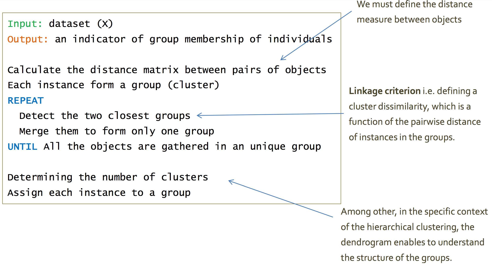</center>

## Clustering example

<center></center>

- The cluster dendrogram is very important to describe the step-by-step merging process.
- We can also evaluate the closeness of the groups each other.


## Clustering impossible {.larger}

- **Scale-invariance** - meters vs. inches
- **Richness** - all partitions as possible solutions
- **Consistency** - increasing distances between clusters and decreasing distances within clusters should yield the same solution

**No function exists that satisfies all three.**

J. Kleinberg. "**An Impossibility Theorem for Clustering. Advances in Neural Information Processing Systems**" (NIPS) 15, 2002. https://www.cs.cornell.edu/home/kleinber/nips15.pdf

## Clustering utopia

<center>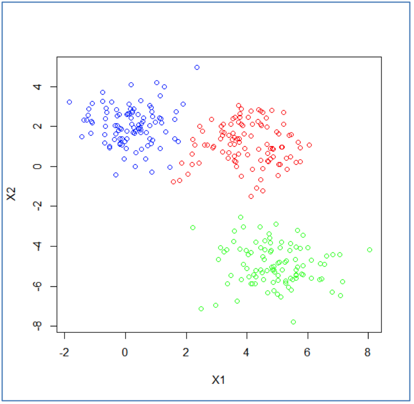</center>

## Clustering reality

<center>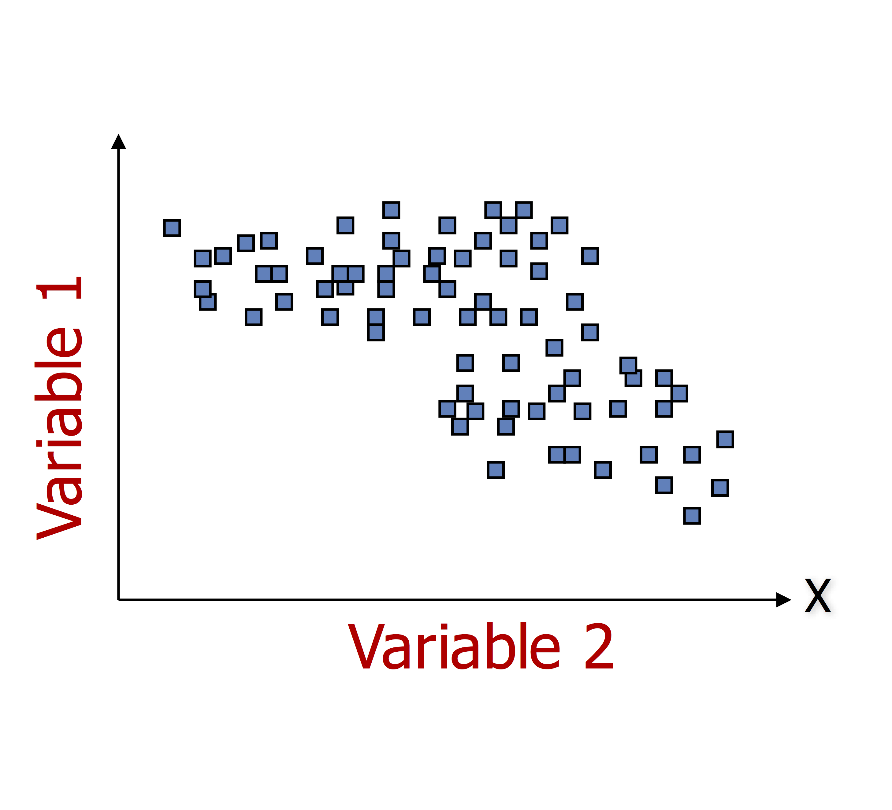</center>

## Conducting Cluster Analysis

<center>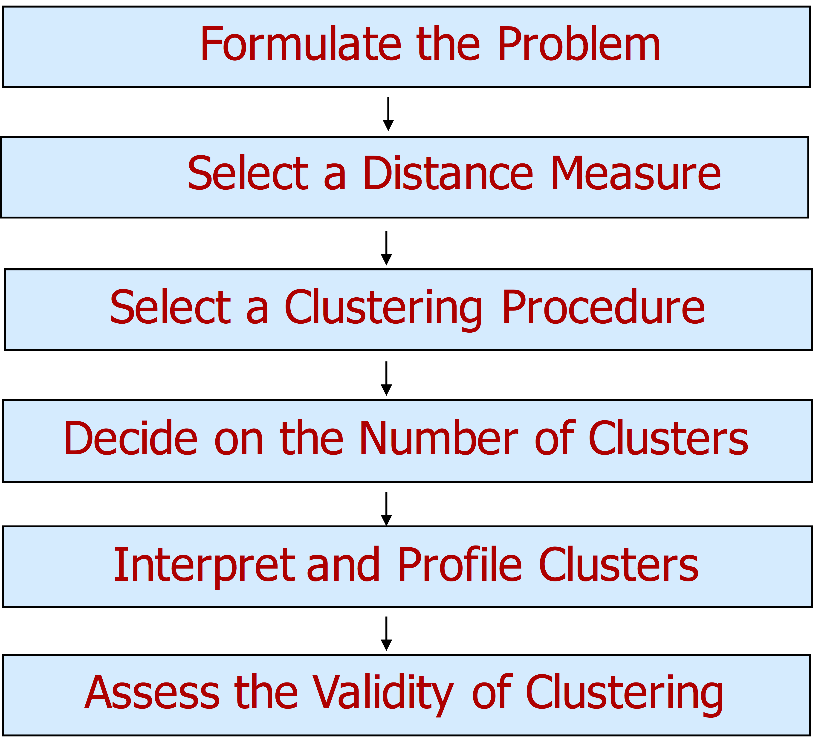</center>

## Types of clustering algorithms {.larger}

- Two categories:
    - Heuristic algorithms
        - No probabilistic model
        - Optimizing a certain target function or iteratively agglomerating (or dividing) nodes to form bottom-up (top-down) trees
        - Examples: K-means, hierarchical clustering
    - Model-based analyses
        - Probabilistic assumptions about the data
        - Expectation Maximization algorithm

## Types of clustering algorithms {.larger}

- Partitioning methods
- Hierarchical methods
- Model based methods
- Density-based methods
- Grid-based methods

# Clustering gene expression

## Gene expression matrix

<center>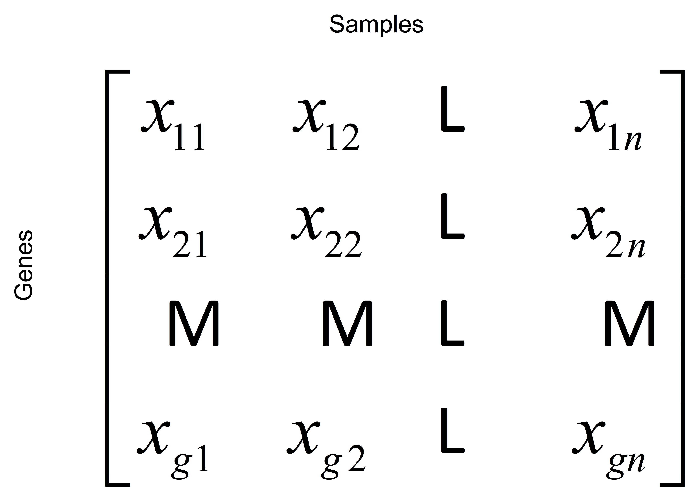</center>

## Formulating the Problem  {.larger}

- Most important is **selecting the variables** on which the clustering is based.  

- Inclusion of even one or two irrelevant variables may distort a clustering solution.  

- Variables selected should describe the similarity between objects in terms that are relevant to the marketing research problem.  

- Should be selected based on past research, theory, or a consideration of the hypotheses being tested.  

## Filtering {.larger}

- Non-informative genes contribute random terms in the calculation of distances

- The resulting effect is that they hide the useful information provided by other genes

- Therefore, assign non-informative genes zero weight, i.e., exclude them from the cluster analysis

## Filtering examples {.larger} 

- **% Present >= X** - remove all genes that have missing values in greater than (100-X) percent of the columns

- **SD (Gene Vector) >= X** - remove all genes that have standard deviations of observed values less than X

- **At least X Observations with abs(Val) >= Y** - remove all genes that do not have at least X observations with absolute values greater than Y

- **MaxVal-MinVal >= X** - remove all genes whose maximum minus minimum values are less than X

<!--
## Clustering noise

<center>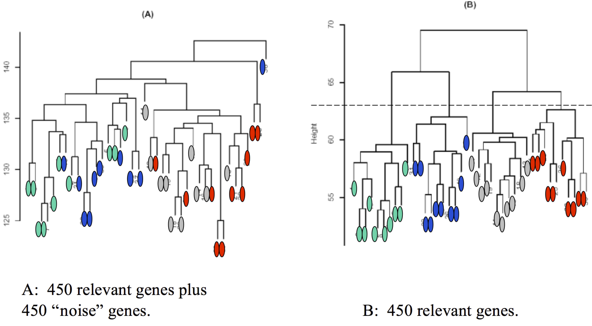</center>
-->

## Cluster the right data {.larger}

Clustering works as expected when the data to be clustered is processed correctly

- **Log Transform Data** - replace all data values x by log2 (x). Why?

- **Center genes [mean or median]** - subtract the row-wise mean or median from the values in each row of data, so that the mean or median value of each row is 0.

- **Center samples [mean or median]** - subtract the column-wise mean or median from the values in each column of data, so that the mean or median value of each column is 0.

## Cluster the right data {.larger}

Clustering works as expected when the data to be clustered is processed correctly

- **Normalize genes** - multiply all values in each row of data by a scale factor S so that the sum of the squares of the values in each row is 1.0 (a separate S is computed for each row).

- **Normalize samples** - multiply all values in each column of data by a scale factor S so that the sum of the squares of the values in each column is 1.0 (a separate S is computed for each column).

## Standartization

In many cases, we are not interested in the absolute amplitudes of gene expression, but in the relative changes. Then, we standardize:

$$g_s=(g-\hat{g})/\sigma(g)$$

Standardized gene expression vectors have a mean value of zero and a standard deviation of one.

<center>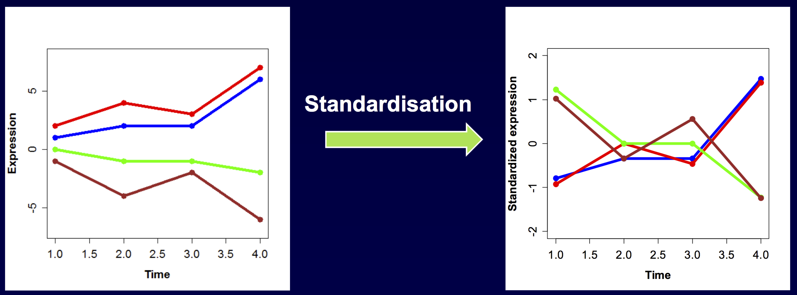</center>

## Cluster the right data {.larger}

- Preprocessing (centering, normalization, scaling, $log_2$-transformation) is critical for the interpretable clustering

- Preprocessing operations are not associative, so the order in which these operations is applied is very important

- Log transforming centered genes are not the same as centering log transformed genes.

# How to define (dis)similarity among objects

## Distance {.larger} 

- Clustering organizes things that are close into groups 

- What does it mean for two genes to be close? 

- What does it mean for two samples to be close? 

- Once we know this, how do we define groups? 

## Distance {.larger}

- We need a mathematical definition of distance between two points 

- What are points? 

- If each gene is a point, what is the mathematical definition of a point? 

## Points

$Gene_1= (E_{11}, E_{12}, ..., E_{1N})$ 

$Gene_2= (E_{21}, E_{22}, ..., E_{2N})$ 

&nbsp;

$Sample_1= (E_{11}, E_{21}, ..., E_{G1})$

$Sample_2= (E_{12}, E_{22}, ..., E_{G2})$

&nbsp;

$E_{gi}=expression \; gene \; g, \; sample \; i$ 

## Distance definition {.larger}

For all objects $i$, $j$, and $h$

<center>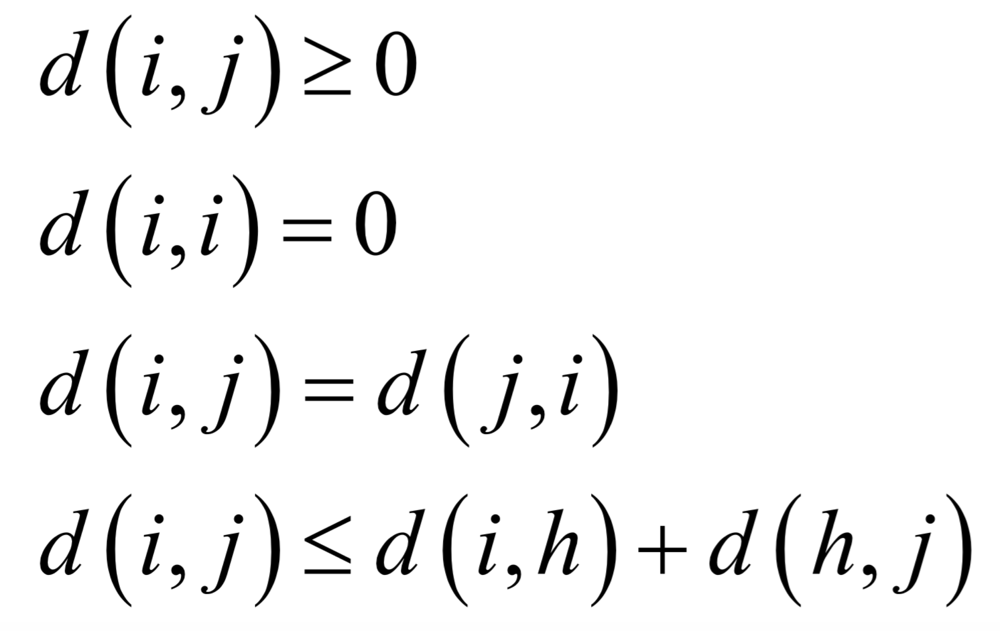</center>

## Most famous distance

**Euclidean distance**

Example distance between gene 1 and 2: 

– Sqrt of Sum of $(E_{1i} - E_{2i})^2$, $i=1,...,N$

- When N is 2, this is distance as we know it: 

<center>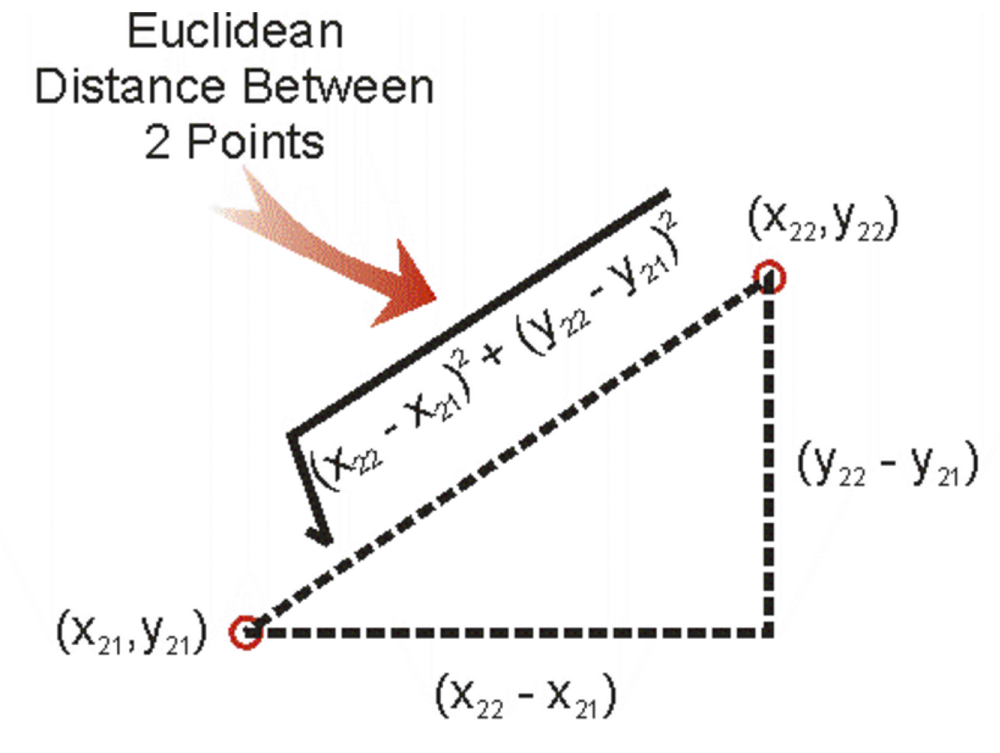</center>

- When N is 20,000 you have to think abstractly 

## Distance measures {.larger}

<center>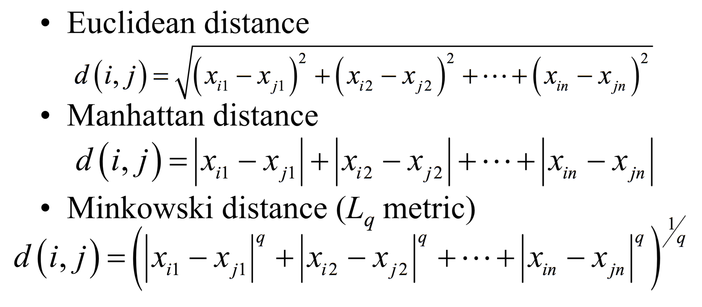</center>

- Disadvantages: not scale invariant, not for negative correlations

## Distance measures {.larger}

- When deciding on an appropriate value of $q$, the investigator must decide whether emphasis should be placed on large differences. 

- Larger values of $q$ give relatively more emphasis to larger differences.

## Distance measures {.larger}

- Canberra distance

<center>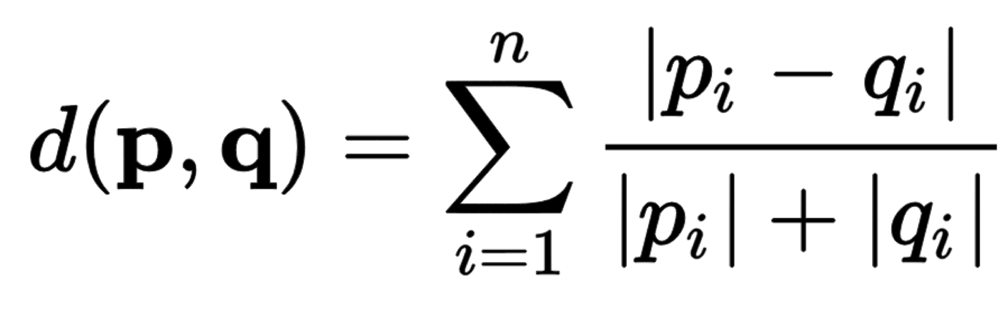</center>

- A weighted version of Manhattan distance

- Maximum distance between two vectors of $p=(p_1,p_2,...,p_n)$ and $q=(q_1,q_2,...,q_n)$

## Similarity definition {.larger}

- For all objects $i$, $j$

<center>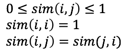</center>

## Similarity measures {.larger}

- Gene expression profiles represent comparative expression measures

- Euclidean distance may not be meaningful

- Need distance measure that score based on similarity

- The more objects $i$ and $j$ are alike (or close) the larger $s(i,j)$ becomes

## Cosine similarity {.larger}

- Measures similarity between two _non-zero_ vectors. 

- Works best when the outcome is within $[0,1]$ interval

- Frequently used in text mining

- Does not conform with the definition of distance - does not have the triangle inequality property.

## Cosine similarity {.larger} 

From Euclidean dot product

$$a \cdot b = \left\lVert a \right\rVert_2 \left\lVert b \right\rVert_2 cos\theta$$
$$similarity = cos\theta = \frac{a \cdot b}{\left\lVert a \right\rVert_2 \left\lVert b \right\rVert_2} = \frac{\sum_{i=1}^n{a_ib_i}}{\sqrt{\sum_{i=1}^n{a_i^2}} \sqrt{\sum_{i=1}^n{b_i^2}}}$$

- $cos\theta$ ranges from -1 to 1. 0 indicates orthogonality (decorrelation)
- $cos(0^o) = 1$ - perfect similarity. Measures _orientation_
- Other options - angular distance

## Similarity measures {.larger}

Pearson correlation coefficient [-1, 1]

Vectors are normalized to the vector’s means

<center>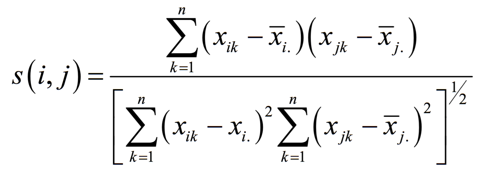</center>

How to convert to dissimilarity [0, 1]

$$d(i,j)=(1-s(i,j))/2$$

## Distances between gene expression profiles

<center>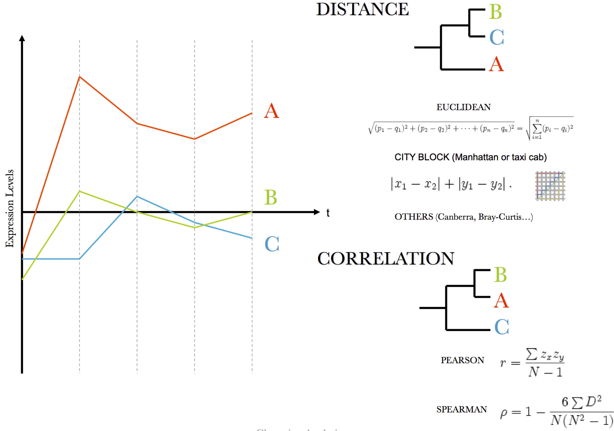</center>

<!--
## Convert correlation to dissmilarity {.larger}

$$d(X_i,X_j)=\frac{1-Cor(X_i, X_j)}{2}$$
-->

## Association versus correlation.

<center>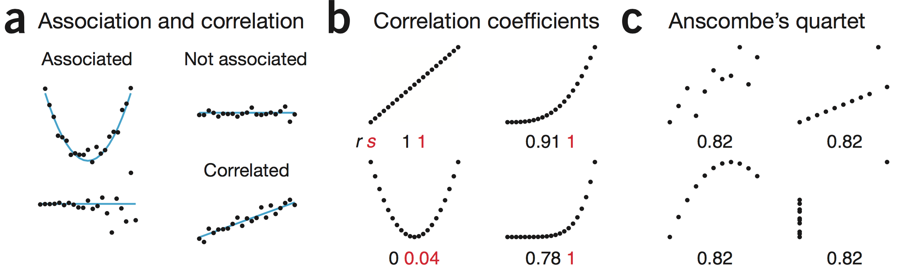</center>

- Correlation is a type of association and measures increasing or decreasing trends quantified using correlation coefficients. 

<!--
- (a) Scatter plots of associated (but not correlated), non-associated and correlated variables. In the lower association example, variance in y is increasing with x. 
- (b) The Pearson correlation coefficient (r, black) measures linear trends, and the Spearman correlation coefficient (s, red) measures increasing or decreasing trends. 
- (c) Very different data sets may have similar r values. Descriptors such as curvature or the presence of outliers can be more specific.
-->

- Altman, Naomi, and Martin Krzywinski. “Points of Significance: Association, Correlation and Causation.” Nature Methods 12, no. 10 (September 29, 2015): 899–900. https://doi.org/10.1038/nmeth.3587. https://www.nature.com/nmeth/journal/v12/n10/full/nmeth.3587.html

## The (dis-)similarity matrixes

<center>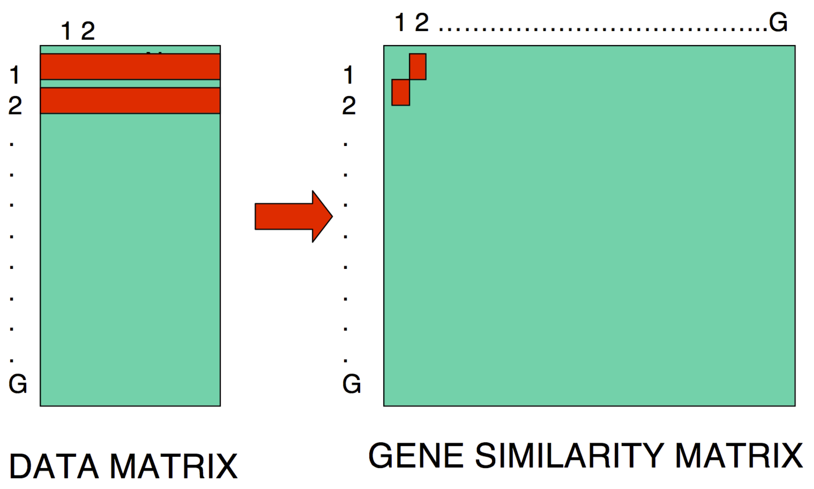</center>

## The (dis-)similarity matrixes

<center>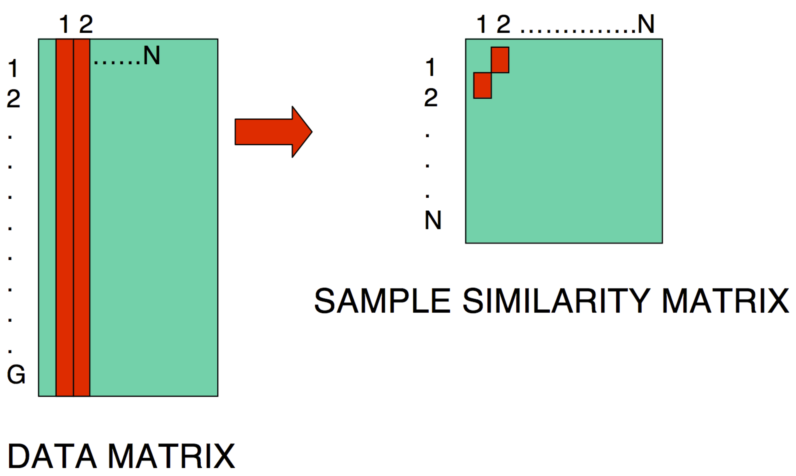</center>

## Distance measures between binary 0/1 vectors {.larger}

- Jaccard distance

<center>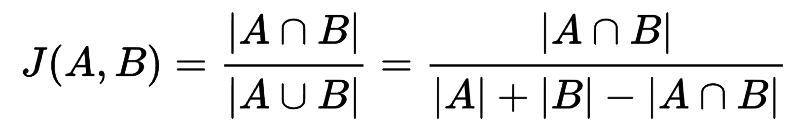</center>

- Overlap coefficient 

$$C = \frac{ \lvert A \cap B \rvert}{min(\lvert A \rvert, \lvert B \rvert)}$$

Both lie in the range $[0, 1]$. $J, C = 0$ indicating no overlaps between binary vectors. A Jaccard-index $J = 1$ indicates two identical vectors, whereas the overlap coefficient $C = 1$ when one vector is a complete subset of the other. 

## Clustering binary data {.larger}

- Two columns with binary data, encoded $0$ and $1$
- $a$ - number of rows where both columns are 1
- $b$ - number of rows where this and not the other column is 1
- $c$ - number of rows where the other and not this column is 1
- $d$ - number of rows where both columns are 0

**Jaccard distance**

$$\frac{a}{a+b+c}$$

## Clustering binary data {.larger}

- Two columns with binary data, encoded $0$ and $1$
- $a$ - number of rows where both columns are 1
- $b$ - number of rows where this and not the other column is 1
- $c$ - number of rows where the other and not this column is 1
- $d$ - number of rows where both columns are 0

**Tanimoto distance**

$$\frac{a+d}{a+d+2(b+c)}$$

## Clustering categorical data

<center>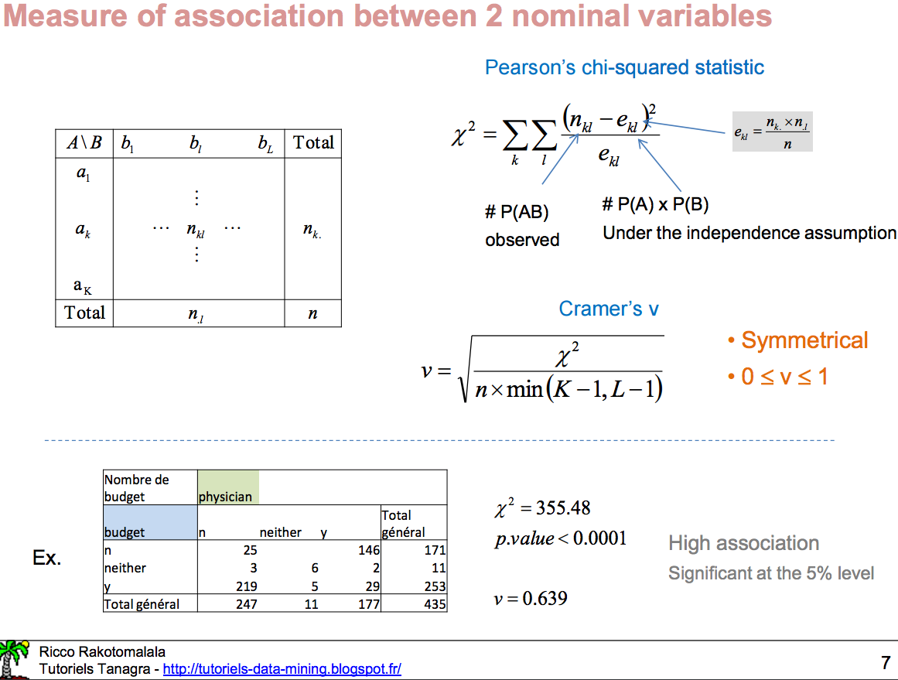</center>

## Clustering mixed data {.larger}

**Gower distance**

J. C. Gower "**A General Coefficient of Similarity and Some of Its Properties**" Biometrics 1971 http://venus.unive.it/romanaz/modstat_ba/gowdis.pdf

- Idea: Use distance measure between 0 and 1 for each pair of variables: $d_{ij}^{(f)}$
- Aggregate: $d(i,j)=\frac{1}{p}\sum_{i=1}^p{d_{ij}^{(f)}}$

## Gower distance {.larger}

How to calculate distance measure for each pair of variables

- **Quantitative**: interval-scaled distance $d_{ij}^{(f)}=\frac{|x_{if} - x_{jf}|}{R_f}$, where $x_{if}$ is the value for object $i$ in variable $f$, and $R_f$ is the range of variable $f$ for all objects

- **Categorical**: use "1" when $x_{if}$ and $x_{jf}$ agree, and "0" otherwise

- **Ordinal**: Use normalized ranks, then like interval-scaled based on range

## Choose (dis-)similarity metric {.larger}

- Think hard about this step! 
- Remember: garbage in - garbage out 
- The metric that you pick should be a valid measure of the distance/similarity of genes. 

**Examples**

- Applying correlation to highly skewed data will provide misleading results. 
- Applying Euclidean distance to data measured on categorical scale will be invalid. 

## Distances in R {.larger}

| Function                       | Package          | Distances                                   |
|--------------------------------|------------------|---------------------------------------------|
| dist                           | stats            | Euclidean, Manhattan, Canberra, max, binary |
| daisy                          | cluster, bioDist | Euclidean, Manhattan                        |
| distancematrix, distancevector | hopach           | Euclidean, cor, cosine-angle (abs versions) |
| vegdist                        | vegan            | Jaccard, Gower, many others                 |

&nbsp;

Other packages: `cclust`, `e1071`, `flexmix`, `fpc`, `mclust`, `Mfuzz`, `class`

# Assembling objects into clusters

## Assembling objects into clusters {.larger}

- The number of ways to partition a set of $n$ objects into $k$ non-empty classes

<center>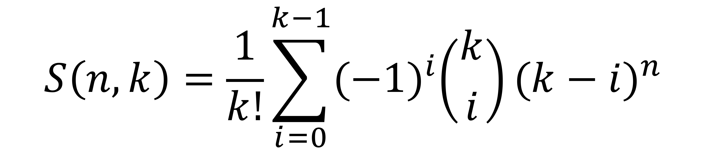</center>

- $S(n,1)=1$ - one way to partition $n$ object in to 1 group, or $n$ disjoint groups

- $S(n,2)=2^{n-1}-1$ - number of ways to partition $n$ objects into two non-empty groups

## Classification of Clustering Procedures

<center>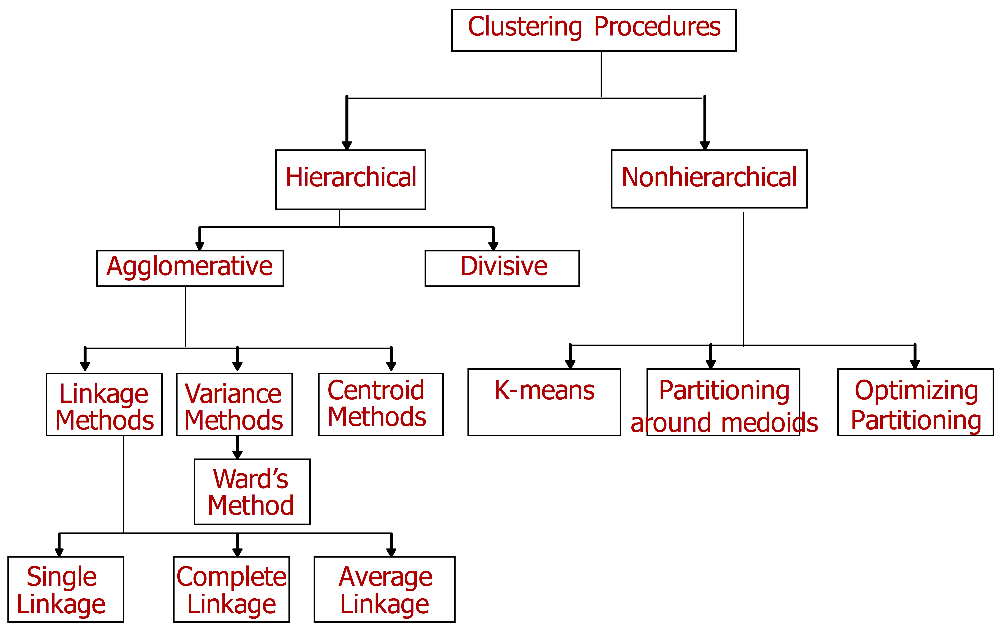</center>

## Hierarchical Clustering {.larger}

- Allows organization of the clustering data to be represented in a tree (dendrogram)

- **Agglomerative** (Bottom Up): each observation starts as own cluster. Clusters are merged based on similarities

- **Divisive** (Top Down):  all observations start in one cluster, and splits are performed recursively as one moves down the hierarchy. 

## Agglomerative clustering (bottom-up) {.larger}

- Idea: ensure nearby points end up in the same cluster

- Starts with as each gene in its own cluster

- Joins the two most similar clusters

- Then, joins next two most similar clusters

- Continues until all genes are in one cluster

## Divisive clustering (top-down) {.larger}

- Starts with all genes in one cluster

- Choose split so that genes in the two clusters are most similar (maximize “distance” between clusters)

- Find next split in same manner

- Continue until all genes are in single gene clusters

## Dendrograms

- We can then make dendrograms showing divisions 
- The y-axis represents the distance between the groups divided at that point 

<center>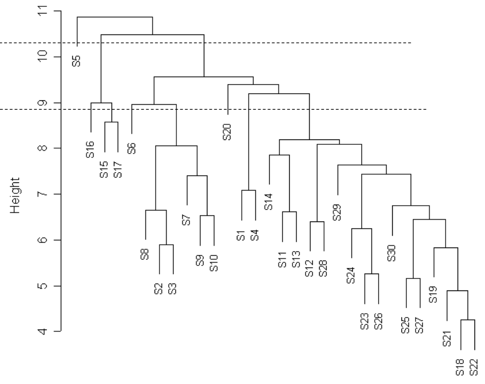</center>

## Dendrograms

- Note: Left and right is assigned arbitrarily. Vertical distance is what's matter
- Look at the height of division to find out distance. For example, S5 and S16 are very far.
 
<center></center>

## Which to use? {.larger}

- Both agglomerative and divisive are only ‘step-wise’ optimal: at each step the optimal split or merge is performed 

- Outliers will irreversibly change clustering structure

## Which to use? {.larger}

**Agglomerative/Bottom-Up**

– Computationally simpler, and more available. 

– More "precision" at bottom of tree 

– When looking for small clusters and/or many clusters, use 
agglomerative 

## Which to use? {.larger}

**Divisive/Top-Down** 

– More "precision" at top of tree. 

– When looking for large and/or few clusters, use divisive 

**Results ARE sensitive to choice!**

## Which to use?
 
<center>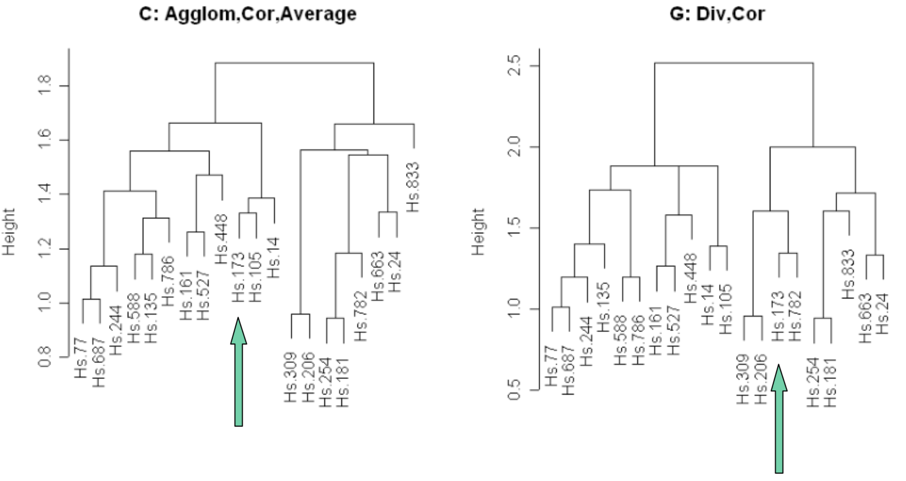</center>

# Linking objects based on the distance between them

## Linkage between clusters {.larger}

- **Single Linkage** - join clusters whose distance between closest genes is smallest (elliptical) 

- **Complete Linkage** - join clusters whose distance between furthest genes is smallest (spherical) 

- **Average Linkage** - join clusters whose average distance is the smallest. 

## Linkage between clusters

<center>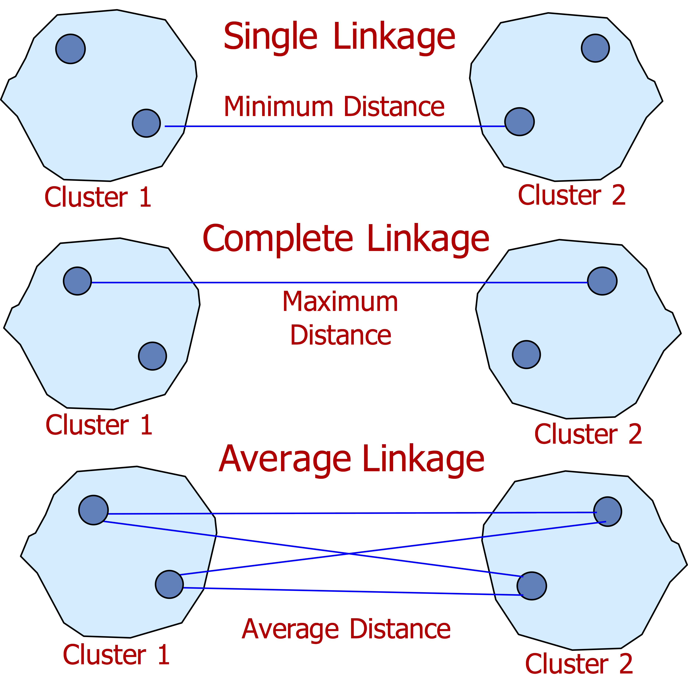</center>

## Single linkage

<center>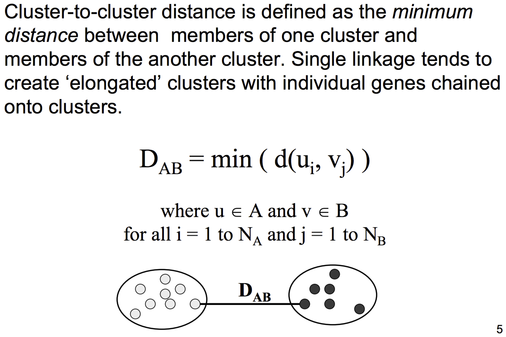</center>

## Complete linkage

<center>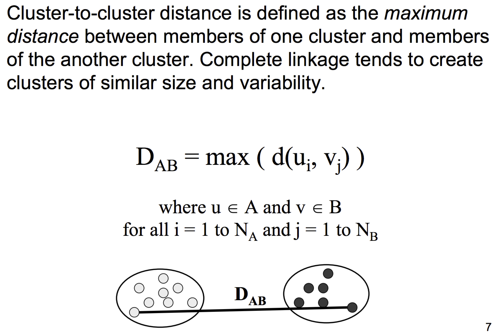</center>

## Average linkage

<center></center>

<!--
## UPGMC (Unweighted Pair Group Method using Centroids) {.larger}

$$centroid = \hat{Y} = \frac{1}{N_Y}\sum_{i \in Y}{X_{i,j}}$$

Define distance between clusters as distance between centroids $\delta_{Y,Z} = d_{\hat(Y), \hat{Z}}$ 

## UPGMA (Unweighted Pair Group Method with Arithmetic Mean) 

Average of pairwise distances between objects $\delta_{Y,Z} = \frac{1}{N_Y * N_Z}\sum_{i \in Y}\sum_{j \in Z}{d_{i,j}}$
-->

## Ward’s method

- **Ward's procedure** is commonly used. For each cluster, the sum of squares is calculated.  The two clusters with the smallest increase in the overall sum of squares within cluster distances are combined.  

<center>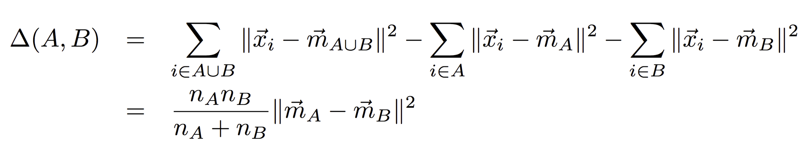</center>

- $\Delta$ - Merging cost of combining the clusters $A$ and $B$. $m_j$ is the center of cluster $j$, and $n_j$ is the number of points in it.
- The sum of squares starts at 0 (each point is in its own cluster), and grows as clusters are merged. Ward’s method keep this growth to minimum.

Ward, J. H., Jr. (1963), "**Hierarchical Grouping to Optimize an Objective Function**", Journal of the American Statistical Association http://iv.slis.indiana.edu/sw/data/ward.pdf

## Ward’s method

- The distance $d$ between two clusters $C_i$ and $C_j$ is defined as the loss of information (or: the increase in error) in merging two clusters.

- The error of a cluster $C$ is measured as the sum of distances between the objects in the cluster and the cluster centroid $cenC$.

- When merging two clusters, the error of the merged cluster is larger than the sum or errors of the two individual clusters, and therefore represents a loss of information. 

- The merging is performed on those clusters which are most homogeneous, to unify clusters such that the variation inside the merged clusters increases as little as possible.

- Ward’s method tends to create compact clusters of small size. It is a least squares method, so implicitly assumes a Gaussian model.

## Ward’s method {.larger}

An important issue though is the form of input that is necessary to give Ward’s method. For an input data matrix, $x$, in R’s `hclust` function the following command is required: `hclust(dist(x)^2, method="ward")` although this is not mentioned in the function’s documentation file.

Fionn Murtagh "**Ward’s Hierarchical Agglomerative Clustering Method: Which Algorithms Implement Ward’s Criterion?**" Journal of Classification 2014 https://link.springer.com/article/10.1007/s00357-014-9161-z

## How many clusters?

- A method proposed by Han et al. assumes that each cluster for a dataset has about $\sqrt{2n}$ points for a dataset of $n$ points, and the number of clusters can be estimated using $K = \sqrt{\frac{n}{2}}$
- Jiawei Han. “Data Mining Concepts and Techniques, Elsevier Publications.” 2012.

- The elbow method chooses the number of clusters, $K$, such that increasing the number of clusters results in no significant change in the within-cluster variance. 

<center>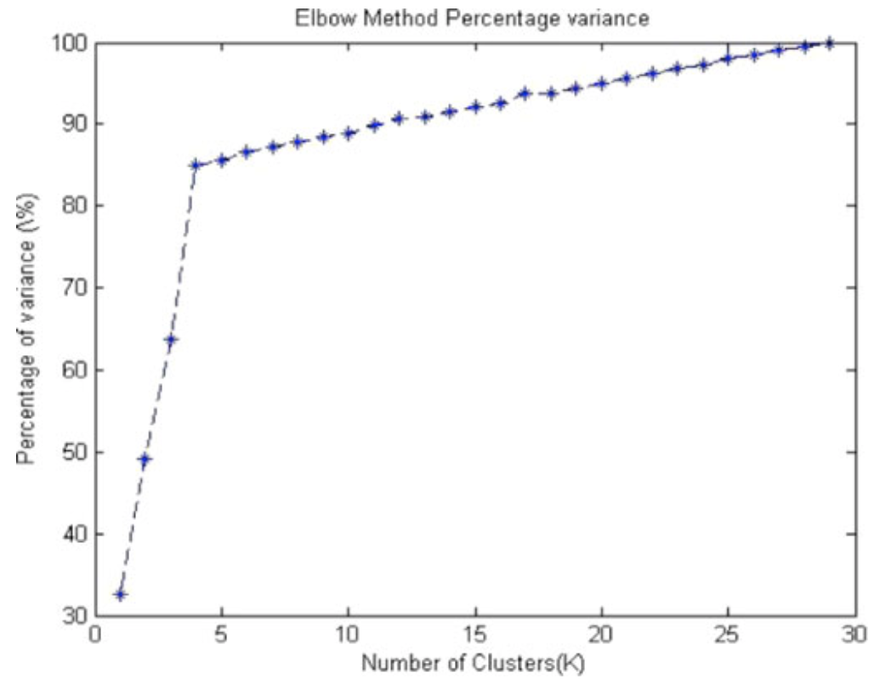</center>

