```{r setup, include=FALSE}
# Use 'verbatim = TRUE' as chunk option to show chunk code as is
require(knitr)
hook_source_def = knit_hooks$get('source')
knit_hooks$set(source = function(x, options){
  if (!is.null(options$verbatim) && options$verbatim){
    opts = gsub(",\\s*verbatim\\s*=\\s*TRUE\\s*", "", options$params.src)
    bef = sprintf('\n\n    ```{r %s}\n', opts, "\n")
    stringr::str_c(bef, paste(knitr:::indent_block(x, "    "), collapse = '\n'), "\n    ```\n")
  } else {
     hook_source_def(x, options)
  }
})
```

## K-means clustering {.larger}

- k-means clustering is a method of cluster analysis which aims to partition $n$ observations into $k$ clusters in which each observation belongs to the cluster with the nearest mean. 
- It is similar to the expectation-maximization algorithm for mixtures of Gaussians in that they both attempt to find the centers of natural clusters in the data.

## How does K-Means work?

- We would like to partition that data set into $K$ clusters $C_1, ..., C_K$
- Each observation belong to at least one of the $K$ clusters
- The clusters are non-overlapping, i.e. no observation belongs to more than one cluster
- The objective is to have a minimal “within-cluster-variation”, i.e. the elements within a cluster should be as similar as possible
- One way of achieving this is to minimize the sum of all the pair-wise squared Euclidean distances between the observations in each cluster. 

$$minimize_{C_1, ..., C_K}\{\sum_{k=1}^K\frac{1}{\lvert C_k \rvert}\sum_{i,i' \in C_k}\sum_{j=1}^p(x_{ij}-x_{i',j})^2\}$$


## K-means clustering algorithm {.larger}

- Initialize: choose $k$ points as cluster means

- Repeat until convergence:  
    - Assignment: place each point $X_i$ in the cluster with the closest mean.
    - Update: recalculate the mean for each cluster

- K-means always converges.  
    - The assignment and update steps always either reduce the objective function or leave it unchanged.

## K-means clustering algorithm

<center>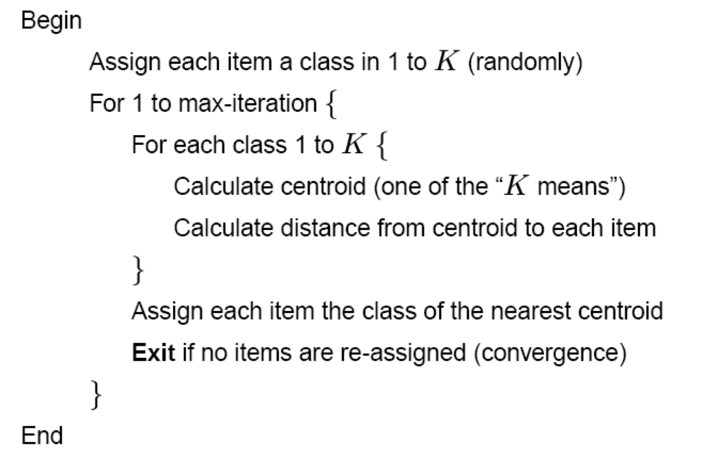</center>

J. B. MacQueen "**Some Methods for classification and Analysis of Multivariate Observations**" 1967 https://projecteuclid.org/euclid.bsmsp/1200512992

## K-means clustering {.larger}

- Advantage: gives sharp partitions of the data
- Disadvantage: need to specify the number of clusters (K).
- Goal: find a set of $k$ clusters that minimizes the distances of each point in the cluster to the cluster mean:

$$centroid_j = \hat{Y_j} = \frac{1}{N_{Y_j}}\sum_{i \in Y_j}{X_i}$$

$$argmin_C \sum_{i=1}^k \sum_{j \in C(i)} {|X_j - \hat{Y_i}|^2}$$

## K-means steps

- Simplified example  
- Expression for two genes for 14 samples  
- Some structure can be seen  

<center>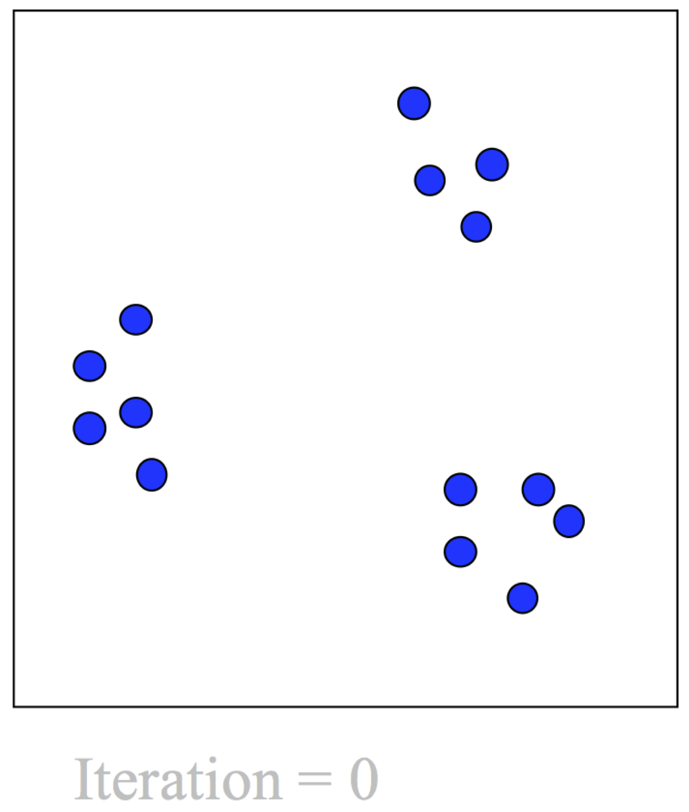</center>

## K-means steps

- Choose $K$ centroids 
- These are starting values that the user picks. 
- There are some data driven ways to do it 

<center>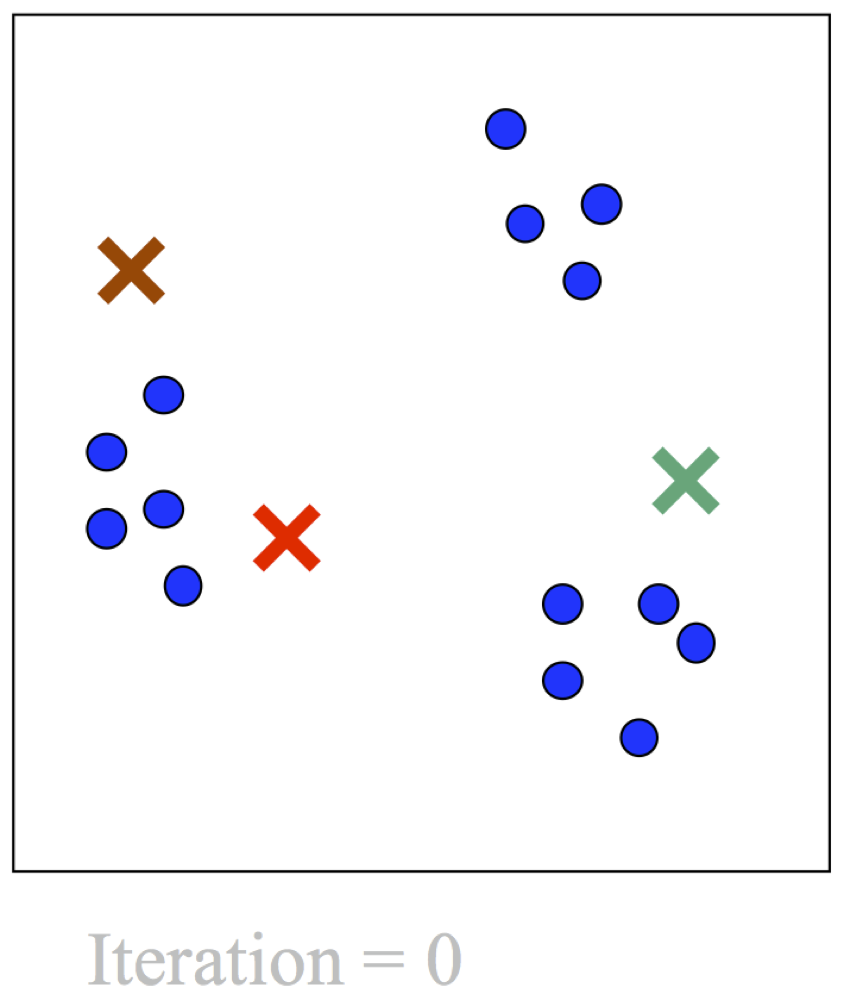</center>

## K-means steps

- Find the closest centroid for each point  
- This is where distance is used  
- This is "first partition" into $K$ clusters  

<center>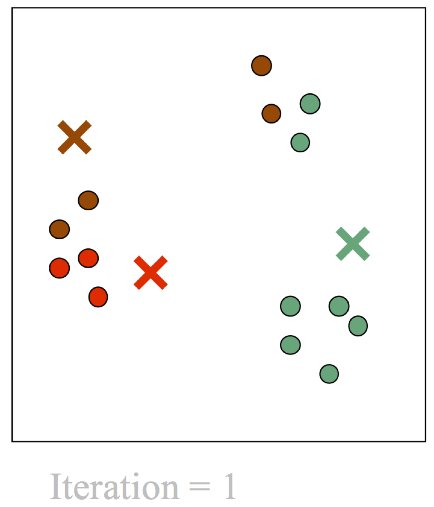</center>

## K-means steps

- Take the middle of each cluster  
- Re-compute centroids in relation to the middle  
- Use the new centroids to calculate distance  

<center>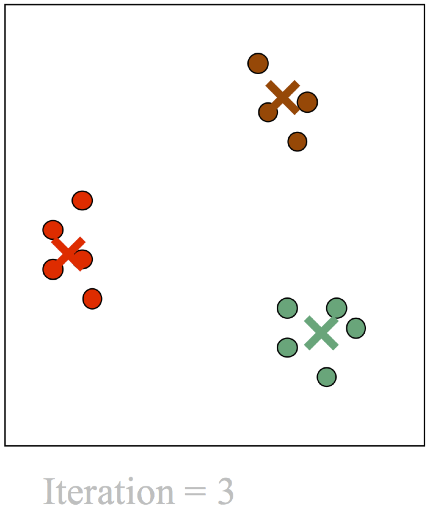</center>

## K-means steps

- Expression for two genes for 14 samples 

<center></center>

## PAM (K-medoids)

- **Centroid** - The average of the samples within a cluster 
- **Medoid** - The “representative object” within a cluster
- Initializing requires choosing medoids at random. 

<center>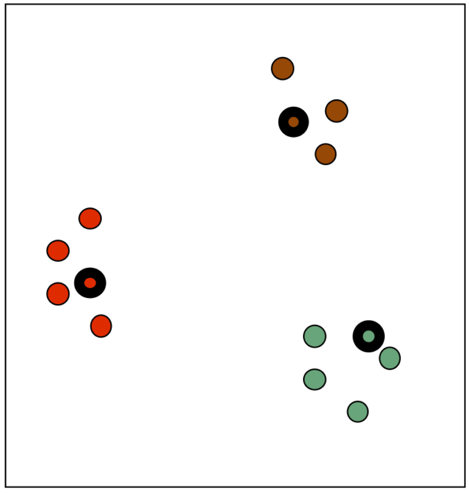</center>

## K-means limitations {.larger}

- Final results depend on starting values 
- How do we chose $K$? There are methods but not much theory saying what is best. 
- Where are the pretty pictures? 

## Alternatives

**K-means**

- Initialize: choose $k$ points as cluster means
- Repeat until convergence: 
    - Assignment: place each point $X_i$ in the cluster with the closest mean.
    - Update: recalculate the mean for each cluster

**Fuzzy k-means**

- Initialize: choose $k$ points as cluster means
- Repeat until convergence:  
    - Assignment: calculate probability of each point belonging to each cluster.
    - Update: recalculate the mean for each cluster using these probabilities

## Alternatives

<center>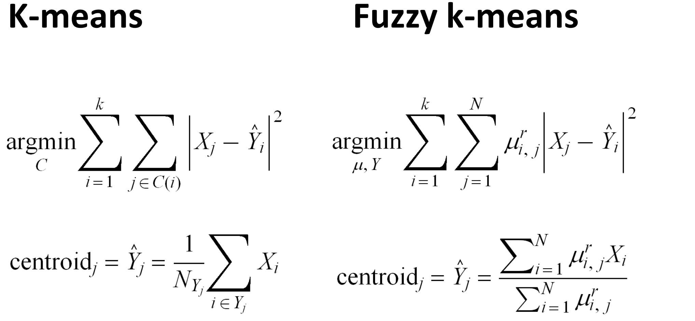</center>

- $\mu_{i,j}^r$ is the degree of membership of $x_i$ in the cluster $j$. Larger values of $r$ make the clusters more fuzzy.
- Relationship to EM and Gaussian mixture models

https://home.deib.polimi.it/matteucc/Clustering/tutorial_html/cmeans.html

## Limits of K-means

K-means uses Euclidean distance

$$centroid_j = \hat{Y_j} = \frac{1}{N_{Y_j}}\sum_{i \in Y_j}{X_i}$$

$$argmin_C \sum_{i=1}^k \sum_{j \in C(i)} {|X_j - \hat{Y_i}|^2}$$

- Gives most weight to largest differences
- Can’t be used if data are qualitative
- Centroid usually does not represent any datum

## Self-organizing (Kohonen) maps {.larger}

- Self organizing map (SOM) is a learning method which produces low dimension data (e.g. $2D$) from high dimension data ($nD$) through the use of self-organizing neural networks
- E.g. an apple is different from a banana in more then two ways but they can be differentiated based on their size and color only. 

<center></center>

<!--
## Self-organizing (Kohonen) maps

If we present apples and bananas with points and similarity with lines then

- Two points connected by a shorter line are of same kind
- Two points connected by a longer line are of different kind
- Threshold $t$ is chosen to decide if the line is longer/shorter

<center>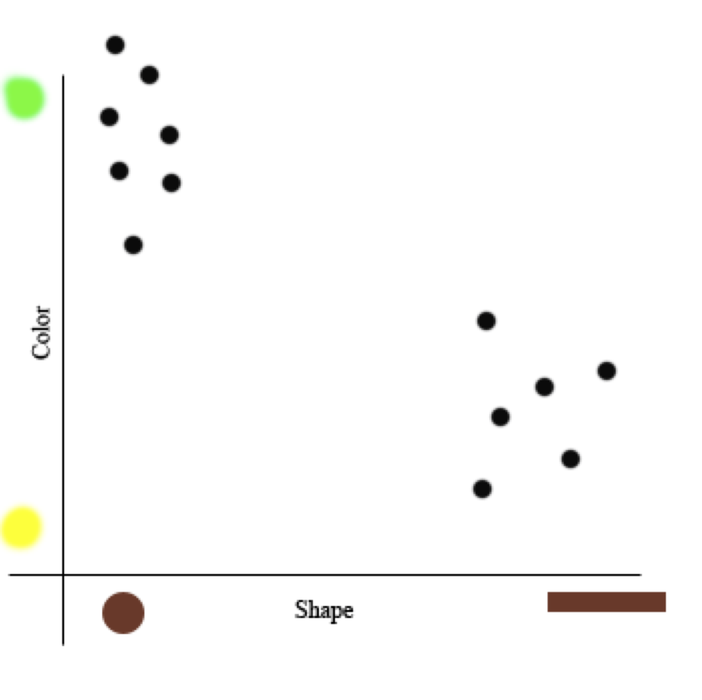</center>

## Self-organizing (Kohonen) maps

- We just created a map to differentiate an apple from banana based on two traits only.
- We have successfully “trained” the SOM, now anyone can use to “map” apples from banana and vice versa

<center>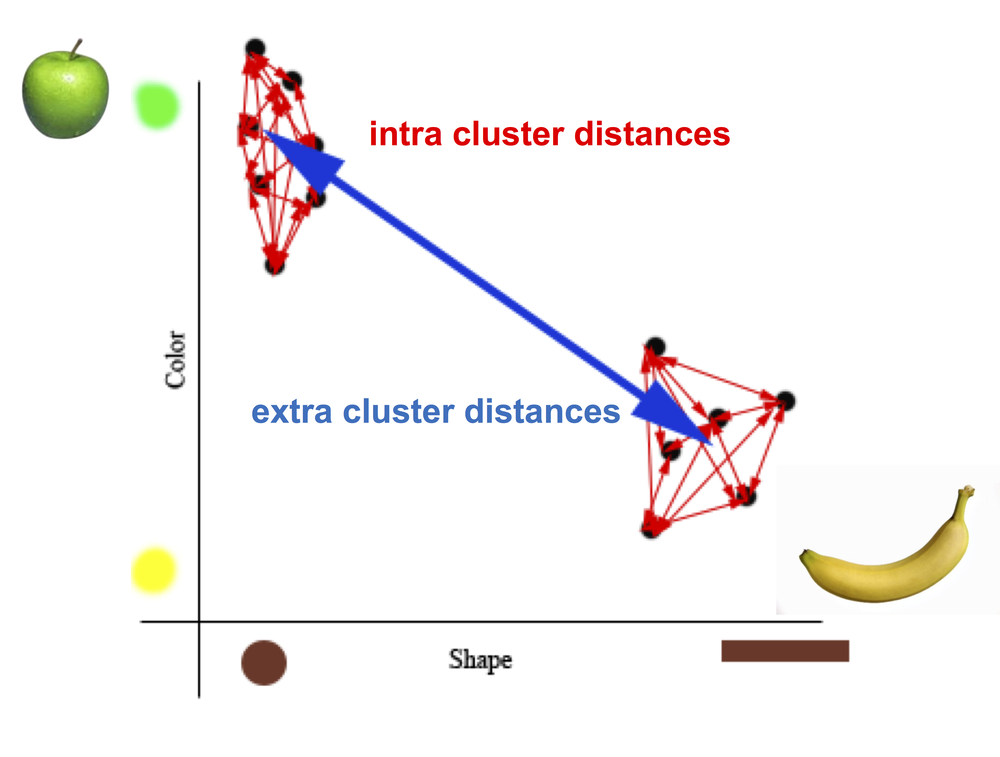</center>

## SOM in gene expression studies

<center>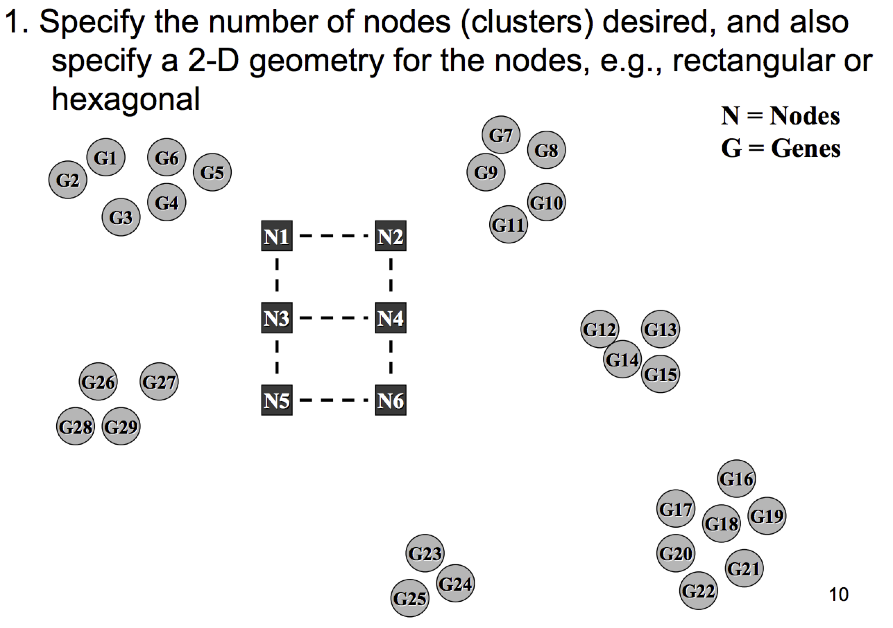</center>

## SOM example

<center>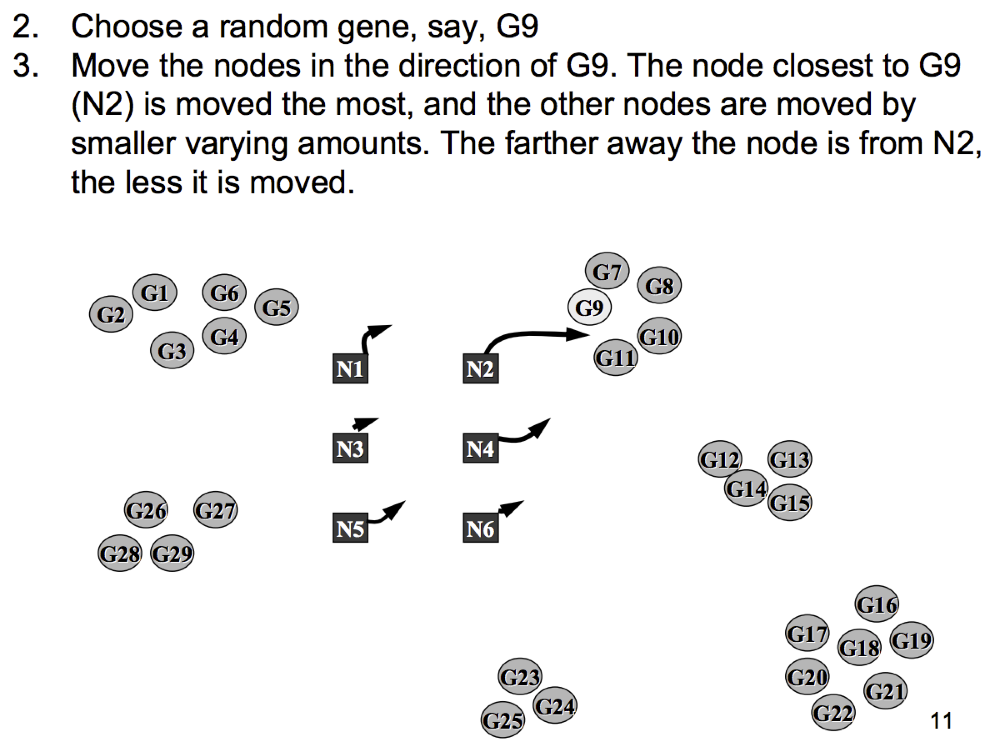</center>

## SOM example

<center>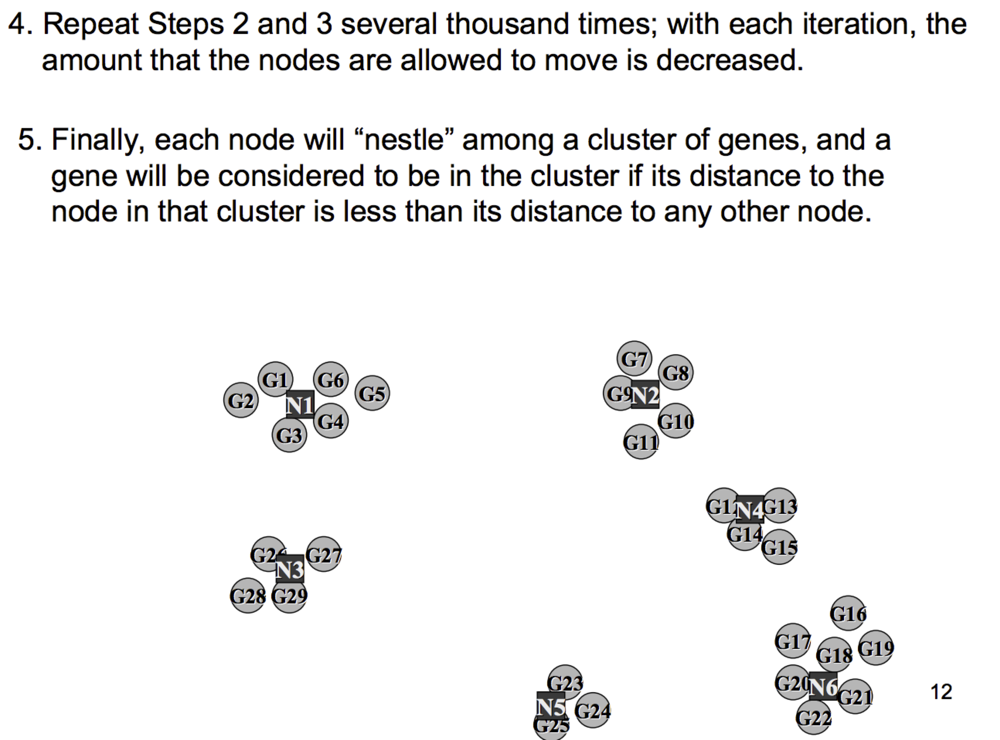</center>

## Application of SOM

**Genome Clustering**

- Goal: trying to understand the phylogenetic relationship between different genomes.
- Compute: bootstrap support of individual genomes for different phylogentic tree topologies, then cluster based on the topology support.

**Clustering Proteins based on the architecture of their activation loops**

- Align the proteins under investigation
- Extract the functional centers
- Turn 3D representation into 1D feature vectors
- Cluster based on the feature vectors
-->

# Dimensionality reduction methods

## Big picture

In general, most dimensionality reduction methods can be placed into one of two categories: **feature-mapping** approaches versus **distance-preserving** approaches. 

**Feature mapping** approaches directly find a mapping function from the original, high-dimensional space to a low-dimensional space, subject to some optimization goal. A commonly used feature mapping technique is principal component analysis (PCA), which aims to find a linear transformation of a given set of features while preserving, as much as possible, the variance of the original data. 

**Distance preserving** approaches project the data points to a low-dimensional space in which the original pairwise distances (or similarities) between pairs of data objects is preserved. Multi-dimensional scaling (MDS, Kruskal and Wish, 1977) is a canonical example of a distance-preserving approach.

## Dimensionality reduction overview {.larger}

- Dimensionality Reduction (DR) essentially aims to find low dimensional representations of data while preserving their key properties
- DR methods can be modeled after physical models with attracting and repelling forces (Force Directed Methods), projections onto low dimensional planes (PCA, ICA), divergence of statistical distributions (SNE family), the reconstruction of local spaces or points by their neighbors (LLE)

\tiny Guido Kraemer, Markus Reichstein, and Miguel D. Mahecha, “DimRed and CoRanking Unifying Dimensionality Reduction in R,” The R Journal, 2018, https://journal.r-project.org/archive/2018/RJ-2018-039/index.html.

## Dimensionality reduction overview

<center>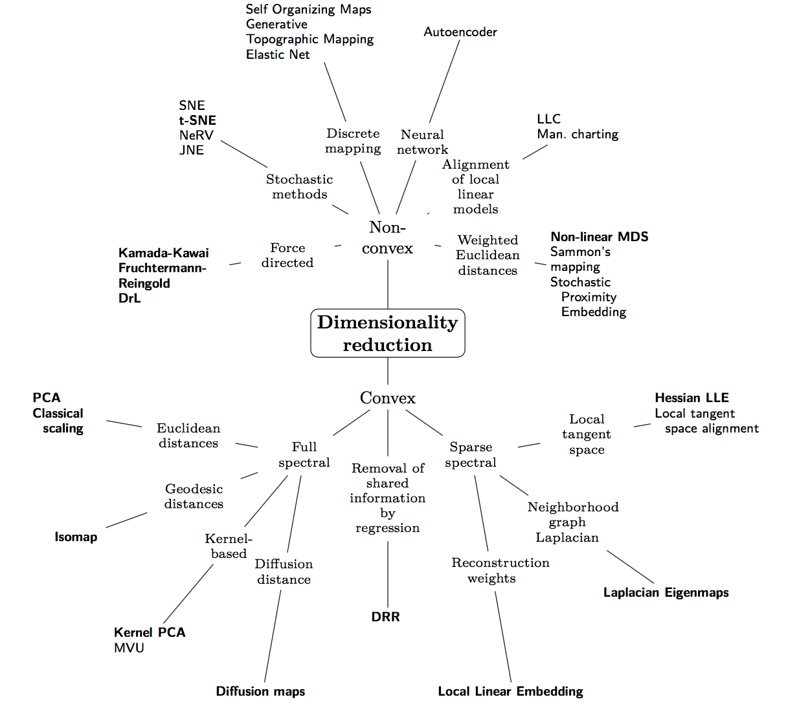</center>

\tiny Guido Kraemer, Markus Reichstein, and Miguel D. Mahecha, “DimRed and CoRanking Unifying Dimensionality Reduction in R,” The R Journal, 2018, https://journal.r-project.org/archive/2018/RJ-2018-039/index.html.

## Projection methods (PCA) {.larger}

- Linearly decompose the dataset into components that have a desired property. 
- There are largely two kinds of projection methods: principal component analysis (PCA) and independent component analysis (ICA). 

- PCA produces a low-dimensisonal representation of a dataset.
- Each successive principal component is selected to be orthonormal to the previous ones, and to capture the maximum information that is not already present in the previous components. 
- Components are linear combinations of the original data
- PCA also serves as a tool for data visualization

## Why dimensionality reduction {.larger}

- Start with many measurements (high dimensional).
- Want to reduce to few features (lower-dimensional space).
- One way is to extract features based on capturing groups of variance.
- Another could be to preferentially select some of the current features most representative of the data.

## Intuition behind dimensionality reduction

<center>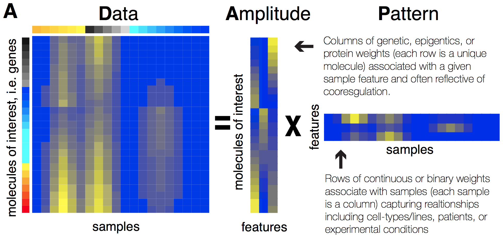</center>

https://www.biorxiv.org/content/early/2017/10/02/196915.1

## Intuition behind dimensionality reduction

<center>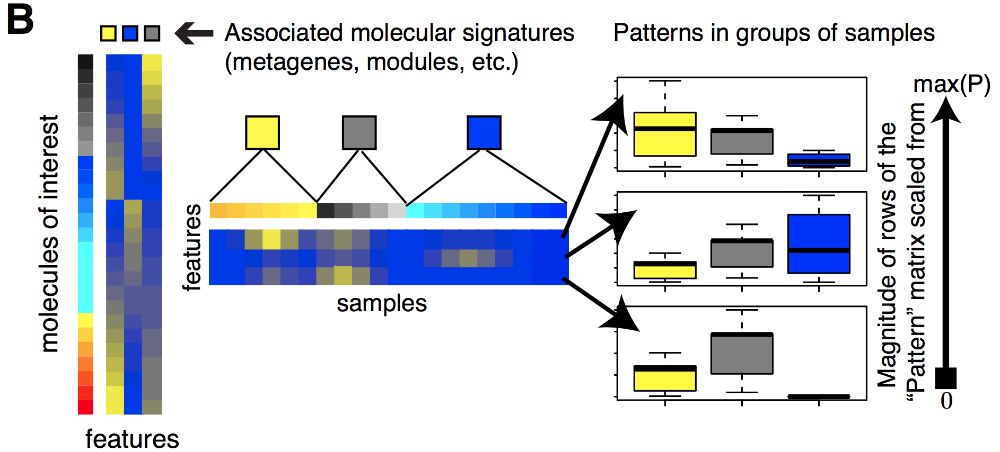</center>

https://www.biorxiv.org/content/early/2017/10/02/196915.1

## PCA: quick theory {.larger}

- Eigenvectors of covariance matrix.  
- Find orthogonal groups of variance.  
- Order from most to least variance.  
- Components of variation.  
- Linear combinations explaining the variance.  

<center>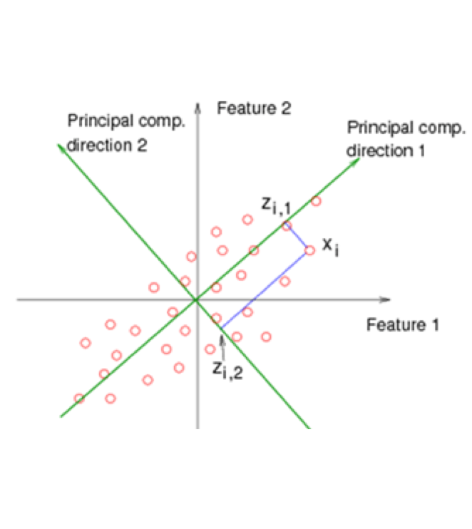</center>


http://setosa.io/ev/principal-component-analysis/


## Principal Components Analysis {.larger}

- Performs a rotation of the data that maximizes the variance in the new axes
- Projects high dimensional data into a low dimensional sub-space (visualized in 2-3 dims)
- Often captures much of the total data variation in a few dimensions (< 5)
- Exact solutions require a fully determined system (matrix with full rank), i.e. a “square” matrix with independent rows

<!--
## Notations

- $V$ is the $FxN$ data matrix. 
  - $F$ features (rows)
  - $N$ observation/examples/veature vectors (columns)
- $V_n = (v_{1n}, ..., v_{Fn})^T$ - the $n$-th _feature vector_ observation among a collection of $N$ observations $v_1, ..., v_N$
- $W$ is the $FxK$ dictionary matrix
  - $w_{fk}$ is one of its coefficients
  - $w_k$ is a dictionary/basis vector among $K$ diagonal-elements
- $H$ is the $KxN$ activation/expansion matrix
  - $h_n$ is the column vector of activation coefficients for observation $v_n$
$$v_n \approx \sum_{k=1}^K{h_{kn}w_k}$$
  - $h_k$ is the row vector of activation coefficients relating to basis vector $w_k$

## PCA

- Assuming the data is real-valued ($v_n \in R^F$) and centered ($E[v] = 0$)
- PCA returns a dictionary $W_{PCA} \in R^{FxK}$ such that the **least square error** is minimized:
$$W_{PCA} = min_W \frac{1}{N} \sum_n \Vert v_n - \hat{v_n} \Vert_2^2 = \frac{1}{N} \Vert V - WW^TV \Vert_F^2$$
- A solution is given by 
$$W_{PCA} = E_{1:K}$$
where $E_{1:K}$ denotes the $K$ dominant **eigenvectors** ov $C_v$
$$C_v = E[vv^T] \approx \frac{1}{N}\sum_nv_nv_n$$
-->

## Principal Components Analysis: details {.larger}

- The first principal component of a set of features $X_1, X_2,...,X_p$ is the normalized linear combination of the features

$$Z_1 = \phi_{11}X_1 + \phi_{21}X_2 + ... + \phi_{p1}X_p$$

that has the largest variance. Note "normalized" - $\sum_{j=1}^p\phi_{j1}^2=1$

- The elements $\phi_{11}, \phi_{21},... \phi_{p1}$ are the **loadings** of the first principal component. Together, them make up the principal component loading vector $\phi_1 = (\phi_{11}, \phi_{21},... \phi_{p1})^T$
- The loadings are constrained so that their sum of squares is equal to one, since othewise setting these elements to be arbitrary large in absolute value could result in an arbitrary large variance.

## Computation of Principal Components {.larger}

- Input: a $n \times p$ data set $X$. Since we are only interested in variance, we assume that each of the variables in $X$ has been centered to have mean zero (that is, the column means of $X$ are zero).
- We then look for the linear combination of the sample feature falues of the form

$$z_{i1} = \phi_{11}x_{i1} + \phi_{21}x_{i2} + ... + \phi_{p1}x_{ip}$$

for $i=1,...,n$ that has largest sample variance under the constraint that $\sum_{j=1}^p\phi_{j1}^2=1$

- Since each of the $x_{ij}$ has mean zero, so does $z_{i1}$<!-- (for any values of $\phi_{j1}$)-->. 
- Hence the sample variance of the $z_{i1}$ can be written as $\frac{1}{n}\sum_{i=1}^n z_{i1}^2$

## Computation of Principal Components {.larger}

- Plugging in the sample variance equation the first principal component loading vector solves the optimization problem

$$maximize_{\phi_{11},...\phi_{p1}}\frac{1}{n}\sum_{i=1}^n(\sum_{j=1}^p\phi_{j1}x_{ij})^2$$

subject to $\sum_{j=1}^p\phi_{j1}^2=1$

- The problem can be solved via a singular value decomposition of the matrix $X$
- $Z_1$ is the first principal component with values $z_{11}, ... z_{n1}$

## Geometry of PCA {.larger}

- The loading vector $\phi_1$ with elements $\phi_{11}, \phi_{21},... \phi_{p1}$ defines a direction in feature space along which the data vary the most

- If we project the $n$ data points $x_1,..., x_n$ onto this direction, the projected values (the new coordinates) are the principal component scores $z_{11}, ... z_{n1}$ themselves

## Further principal components {.larger}

- The second principal component is the linear combination of $X_1, ...X_p$ that has maximal variance among all linear combinations that are _uncorrelated_ with $Z_1$
- The second principal component scores $z_{12}, ... z_{n2}$ take the form

$$z_{i1} = \phi_{12}x_{i1} + \phi_{22}x_{i2} + ... + \phi_{p2}x_{ip}$$

where $\phi_2$ is the second principal component loading vector, with elements $\phi_{12}, \phi_{22},... \phi_{p2}$

## Further principal components {.larger}


- Constraining $Z_2$ to be uncorrelated with $Z_1$ is equivalent to constraining the direction $\phi_2$ to be orthogonal to the direction $\phi_1$. And so on for the other components

- The principal component directions $\phi_1, \phi_2, \phi_3,...$ are the ordered sequence of right singular vectors of the matrix $X$
- The variances of the components are the $\frac{1}{n}$ times the squares of the singular values
- There are at most $min(n-1, p)$ principal components

## Singular Value Decomposition

<center>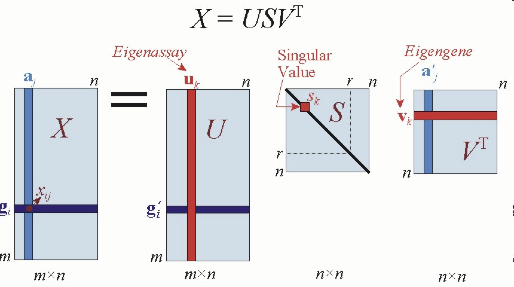</center>

https://research.fb.com/fast-randomized-svd/

## PCA for gene expression {.larger}

- Given a gene-by-sample matrix $X$ we decompose (centered and scaled) $X$ as $USV^T$ 
- We don’t usually care about total expression level and the dynamic range which may be dependent on technical factors 
- $U$, $V$ are orthonormal 
- $S$ diagonal-elements are eigenvalues = variance explained 

## PCA for gene expression {.larger}

- Columns of $V$ are 
    - Principle components
    - Eigengenes/metagenes that span the space of the gene transcriptional responses 

- Columns of $U$ are 
    - The “loadings”, or the correlation between the column and the component 
    - Eigenarrays/metaarrays - span the space of the gene transcriptional responses 

- Truncating $U$, $V$, $D$ to the first $k$ dimensions gives the best $k$-rank approximation of $X$ 

## Principal Components Analysis

<center>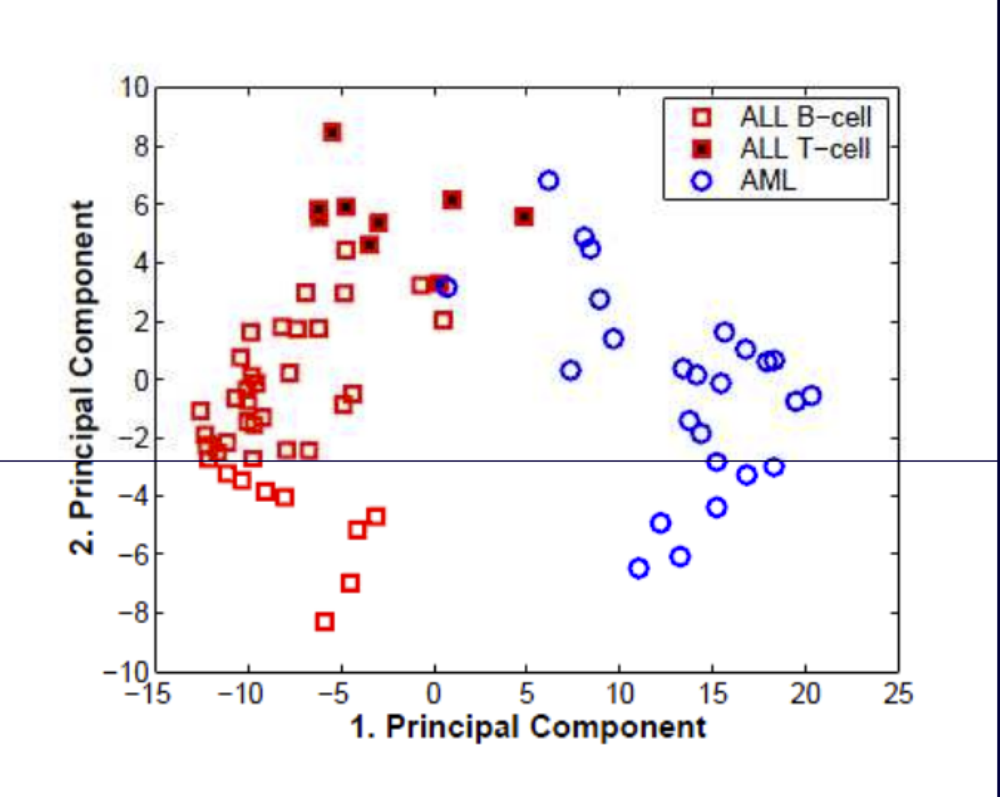</center>

Example: Leukemia data sets by Golub et al.: Classification of ALL and AML

## PCA applied to cell cycle data 

<center></center>

## How many components? {.larger}

- Kaiser's criterion: eigenvalue $\ge$ 1

- Cattell's scree test: The number of components to retain corresponds to the point where the graph of eigenvalues of successive components vs. the component number begins to level off

## ICA - Independent Component Analysis {.larger}

- PCA assumes multivariate normally distributed data - gene expression data are super-Gaussian
- ICA models observations as a linear combination of latent feature variables, or components, which are chosen to be as _statistically independent_ as possible. Think about a number of sound sources mixed together, ICA tries to "un-mix" them
- ICA is a linear rotation of the data just as PCA but instead of recovering the maximum variance, it recovers statistically independent components
- For microarray data, observations consist of microarray gene expression measurements, and independent components are interpreted to be transcriptional modules that often correspond to specific biological processes

http://www.sciencedirect.com/science/article/pii/S1532046410001000

## ICA - Independent Component Analysis {.larger}

- $X$ - an $m \times n$ matrix of $n$ genes and $m$ experiments
- ICA models this expression matrix as a linear combination of intependent biological processes by decomposing $X$ as:
$$X = AS$$
- $S$ is a $k \times n$ source matrix
- $A$ is a $m \times k$ mixing matrix
- $k$ is a user supplied parameter $\leq min(m,n)$

Same preprocessing as for PCA - filter, center, scale

## ICA - Independent Component Analysis {.larger}

- $S$ is a $k \times n$ source matrix

- The components, or rows of $S$, are independent in the sense that the gene weights in each component reflect samplings of independent random variables. 
- In the context of gene expression, this suggests that the sets of genes comprising the groups strongly contributing to each component have independent compositions.
- Columns of $A$ are the distribution of the component's expression in arrays (rows of $S$) 

`fastICA` R package, https://cran.r-project.org/web/packages/fastICA/index.html

http://www.sciencedirect.com/science/article/pii/S1532046410001000

## Independent component analysis {.larger}

- The source matrix $S$ is used to biologically interpret the components by studying their contributing genes
- The matrix $A$ is used to associate the component with sample features by studying the distribution of the samples on the components according to their characteristics (e.g clinical or molecular variables).

- `MineICA` - Analysis of an ICA decomposition obtained on genomics data https://bioconductor.org/packages/release/bioc/html/MineICA.html


## Other decomposition techniques

- Non-negative matrix factorization
- $a_{.j}=\sum_{k=1}^Kw_{.k}h_{kj},\ or\ A=WH$ ($A$, $W$, $H$ are non-negative)
- A linear, non-negative approximation of the data
- By not allowing negative entries in $W$ and $H$, NMF enables a non-subtractive combination of parts to form a whole

<center></center>

Jean-Philippe Brunet et al. PNAS 2004;101:4164-4169


## Non-negative matrix factorization (NMF) {.larger}

- $a_{.j}=\sum_{k=1}^Kw_{.k}h_{kj},\ or\ A=WH$ ($A$, $W$, $H$ are non-negative)
- $A$ is an $M \times N$ matrix, input gene expression by samples matrix
- $W$ is an $M \times K$ matrix, contains $K$ basis vectors
- $H$ is a $K \times N$ matrix, contains the coefficient vectors
- $H$ defines a meta-gene space: similar to eigengenes
- Classification can be done in the meta-gene space

## Non-negative matrix factorization (NMF) {.larger}

- A key feature of NMF is the ability to identify nonsubtractive patterns that together explain the data as a linear combination of its basis vectors. 
- $A=WH$ ($A$, $W$, $H$ are non-negative)
- $A$ is an $M \times N$ matrix, input gene expression by samples matrix
- $W$ is an $M \times K$ matrix, contains $K$ basis vectors
- $H$ is a $K \times N$ matrix, contains the coefficient vectors
- The $K$ basis vectors in $W$ can be regarded as the ‘building blocks’ of the data
- The $K$ coefficient vectors describe how strongly each ‘building block’ is present in the data


## NMF, general formulation

<center>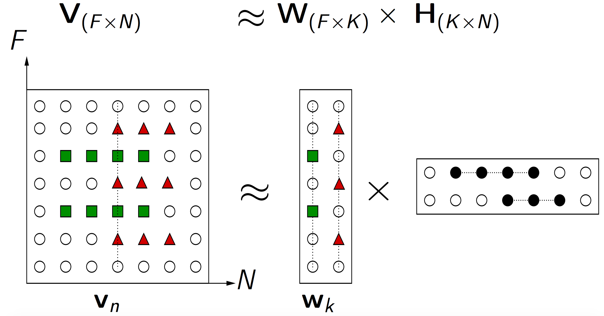</center>

## Why nonnegativity {.larger}

NMF is more than 30-year old!  

- previous variants referred to as:  
    - nonnegative rank fatorization (Jeter and Pye, 1981; Chen, 1984);  
    - positive matrix factorization (Paatero and Tapper, 1994);  

- popularized by Lee and Seung (1999) for "learning the parts of objects".  

Since then, widely used in various research areas for diverse applications

## NMF for clustering {.larger}

NMF can handle overlapping clusters and provides soft cluster membership indications.

<center>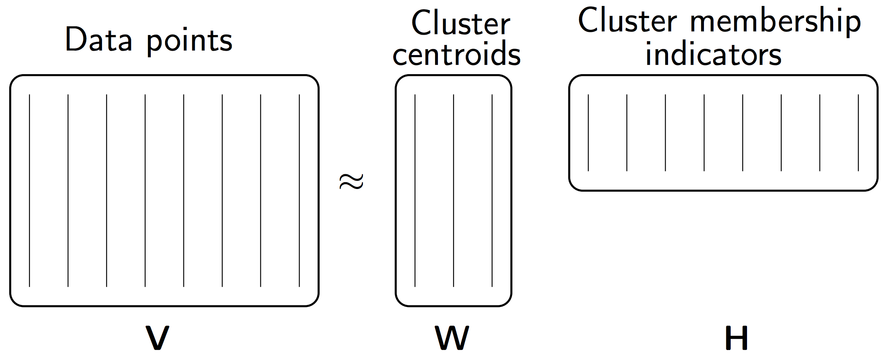</center>

## NMF {.larger}

- Many computational methods
    - Cost function $|A-WH|$
    - The squared Euclidean error function: $F(W,H)=\parallel A - WH \parallel_F^2$
    - Kullback–Leibler divergence $D_{KL}(A \parallel \hat{A}) = \sum_{ij}(A_{ij}log\frac{A_{ij}}{\hat{A_{ij}}})$, where $\hat{A}=WH$

- Optimization procedure
    - Most use stochastic initialization, and the results don’t always converge to the same answer

\tiny Lee, Daniel D., and H. Sebastian Seung. “Algorithms for Non-Negative Matrix Factorization.” In Advances in Neural Information Processing Systems 13, edited by T. K. Leen, T. G. Dietterich, and V. Tresp, 556–62. MIT Press, 2001. http://papers.nips.cc/paper/1861-algorithms-for-non-negative-matrix-factorization.pdf.


## NMF {.larger}

- $A=WH$ : Toy Biological interpretation
- Assume $k=2$
- We have 2 transcription factors that activate gene signatures $W1$ and $W2$
- $H$ represents the activity of each factor in each sample
- TF effects are additive 

## NMF {.larger}

- NMF operates in the original non-negative measurement space
- Highly expressed genes matter more 
- Positivity constraint is advantageous: positive correlation among genes is more likely to be biologically meaningful 
- NMF may more accurately capture the data generating process 

## NMF vs. PCA

<center>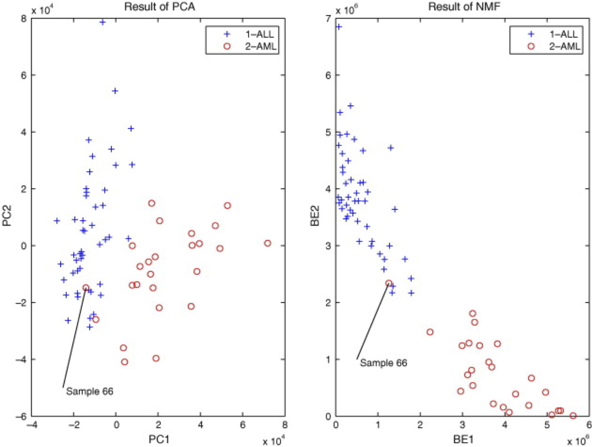</center>

- Results of PCA vs NMF for reducing the leukemia data with 72 samples in visualization. Sample 66 is mislabeled. However in 2-D display, the reduced data by NMF can clearly show this mistake while that by PCA cannot demonstrate the wrong. ‘PC’ stands  for principal component and ‘BE’ means basis experiment.

Weixiang Liu, Kehong Yuan, Datian Ye “**Reducing microarray data via nonnegative matrix factorization for visualization and clustering analysis**” Journal of Biomedical Informatic 2008,

## Multidimensional scaling {.larger}

MDS attempts to

- Identify abstract variables which have generated the inter-object similarity measures
- Reduce the dimension of the data in a non-linear fashion 
- Reproduce non-linear higher-dimensional structures on a lower-dimensional display

## Kruskal’s stress {.larger}

$$stress=\sqrt{\frac{\sum{(d_{ij} - \hat{d_{ij}})^2}}{\sum{d_{ij}^2}}}$$

- Goodness-of-fit - Measures degree of correspondence between distances among points on the MDS map and the matrix input. 
- Start with distances $d_{ij}$
- Fit decreasing numbers $\hat{d_{ij}}$
- Subtract, square, sum
- Take a square root  
- Divide by a scaling factor

## MDS Basic Algorithm {.larger}

- Obtain and order the $M$ pairs of similarities
- Try a configuration in $q$ dimensions
    - Determine inter-item distances and reference numbers
    - Minimize Kruskal’s stress

- Move the points around to obtain an improved configuration
- Repeat until minimum stress is obtained

## Comparison Between PCA, MDS {.larger}

- **PCA** tries to preserve the covariance of the original data

- **MDS** tries to preserve the metric (ordering relations) of the original space

<!--- **SOM** tries to preserve the topology (local neighborhood relations), items projected to nearby locations are similar-->

## t-SNE: Nonlinear Dimensional Reduction

<center>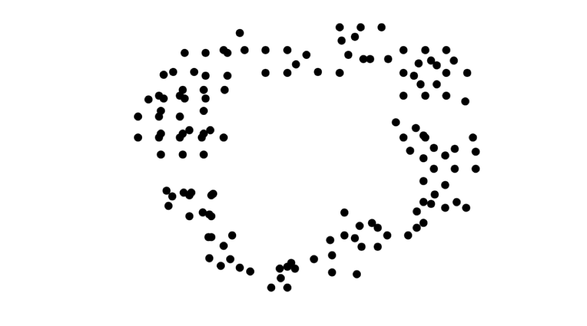</center>

- Maaten, Laurens van der, and Geoffrey Hinton. “Visualizing Data Using T-SNE.” The Journal of Machine Learning Research 9, no. 2579–2605 (2008): 85.
- t-SNE, https://www.youtube.com/watch?v=EMD106bB2vY
- t-SNE tutorial https://mark-borg.github.io//blog/2016/tsne/

## Stochastic Neighbor Embedding {.larger}

- Stochastic Neighbor Embedding (SNE) is a technique that minimizes the Kullback-Leibler divergence of scaled similarities of the points $i$ and $j$ in high dimensional space, $p_{ij}$, and low dimensional space, $q_{ij}$

$$KL(P||Q) = \sum_{i \ne j}p_{ij}log\frac{p_{ij}}{q_{ij}}$$

- SNE uses a Gaussian kernel ($exp(-\frac{||x_i - x_j||^2}{2\sigma^2})$) to compute similarities in high and low dimensional space. $\sigma$ is a length scale parameter accounting for the width of the kernel

## t-Distributed Stochastic Neighborhood Embedding (t-SNE) {.larger}

- Improves on SNE by using a t-Distribution as a kernel in low dimensional space
- Because of the heavy-tailed t-distribution, t-SNE maintains local neighborhoods of the data better and penalizes wrong embeddings of dissimilar points. This property makes it especially suitable to represent clustered data and complex structures in few dimensions
- t-SNE has one parameter, perplexity, to tune which determines the neighborhood size of the kernels used.


## t-Distributed Stochastic Neighborhood Embedding (t-SNE)

- The t-SNE algorithm maps points from high-dimensional space to low-dimensional space by minimizing the difference in all pairwise similarities between points in high-and low-dimensional spaces. 
- The axes of the low-dimensional spaces are given in arbitrary units. 
- First, the pairwise distance matrix is calculated in high-dimensional space. 
- Next, the distance matrix is transformed to a similarity matrix using a varying Gaussian kernel, so that the similarity between points $X_i$ and $X_j$ represents the joint probability that $X_i$ will choose $X_j$ as its neighbor or vice versa (based on their Euclidean distance and local density). 
- Then, a random low-dimensional mapping is rendered and pairwise similarities are computed for points in the low-dimensional map. However, the low-dimensional similarities are computed using Student’s t-distribution rather than a Gaussian distribution. 
- Finally, gradient descent is used to minimize the Kullback-Leibler divergence between the two probability distributions, leading to the final low-dimensional map.

\tiny Amir, El-ad David, Kara L Davis, Michelle D Tadmor, Erin F Simonds, Jacob H Levine, Sean C Bendall, Daniel K Shenfeld, Smita Krishnaswamy, Garry P Nolan, and Dana Pe’er. “ViSNE Enables Visualization of High Dimensional Single-Cell Data and Reveals Phenotypic Heterogeneity of Leukemia.” Nature Biotechnology 31, no. 6 (June 2013): 545–52. https://doi.org/10.1038/nbt.2594.

<!-- The optimization step may be interpreted as a set of springs. Each pair of points Yi and Yj is connected by a spring, which repels or attracts the points from each other depending on whether the similarity between the points in the projection is lower or greater than the similarity in the high-dimensional space. The gradient reduces each point’s springs into a single force. The heavy tailed t-distribution helps alleviate the “crowding problem” by exerting more force when pushing distant points further apart. -->

## t-SNE: Collapsing the Visualization to 2D

<center>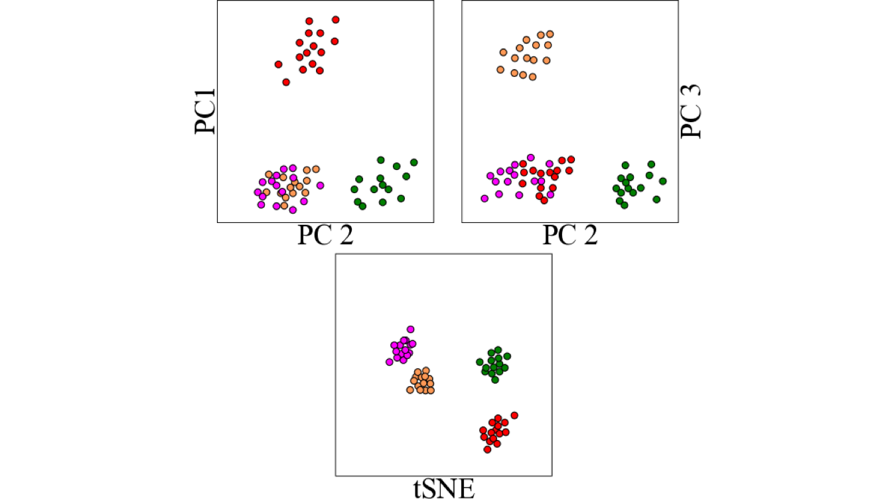</center>

## t-SNE: How it works.

<center>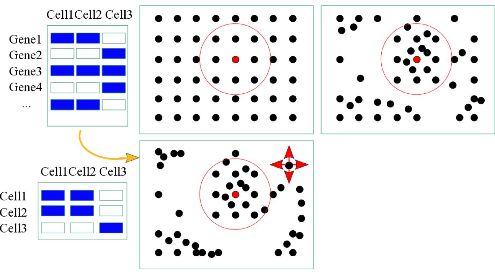</center>

## PCA and t-SNE Together {.larger}

- Often t-SNE is performed on PCA components
- Liberal number of components.
- Removes mild signal (assumption of noise).
- Faster, on less data but, hopefully the same signal.

## Learn More About t-SNE {.larger}

- Awesome Blog on t-SNE parameterization: http://distill.pub/2016/misread-tsne  
- Publication: https://lvdmaaten.github.io/publications/papers/JMLR_2008.pdf  
- Another YouTube Video: https://www.youtube.com/watch?v=RJVL80Gg3lA  
- Code: https://lvdmaaten.github.io/tsne/  
- Interactive Tensor flow: http://projector.tensorflow.org/

## Other approaches

- **Bi-clustering** - cluster both the genes and the experiments simultaneously to find appropriate context for clustering  
    - R packages: `iBBiG`, `FABIA`, `biclust`
    - Stand-alone: `BicAT` (Biclustering Analysis Toolbox))

<center>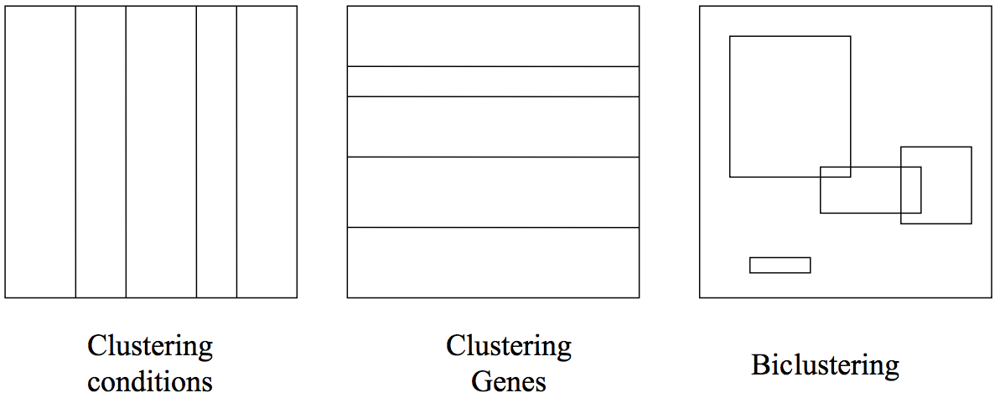</center>

## Summary

<center>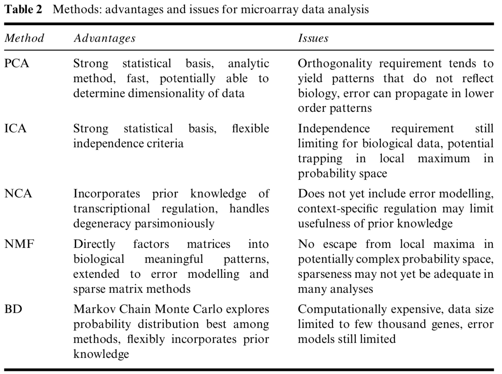</center>

\tiny Kossenkov, Andrew V., and Michael F. Ochs. “Matrix Factorisation Methods Applied in Microarray Data Analysis.” International Journal of Data Mining and Bioinformatics 4, no. 1 (2010): 72. https://doi.org/10.1504/IJDMB.2010.030968.

