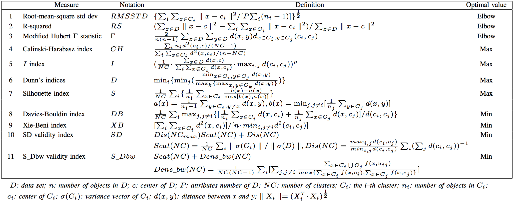

```{r setup, include=FALSE}
# Use 'verbatim = TRUE' as chunk option to show chunk code as is
require(knitr)
hook_source_def = knit_hooks$get('source')
knit_hooks$set(source = function(x, options){
  if (!is.null(options$verbatim) && options$verbatim){
    opts = gsub(",\\s*verbatim\\s*=\\s*TRUE\\s*", "", options$params.src)
    bef = sprintf('\n\n    ```{r %s}\n', opts, "\n")
    stringr::str_c(bef, paste(knitr:::indent_block(x, "    "), collapse = '\n'), "\n    ```\n")
  } else {
     hook_source_def(x, options)
  }
})
```

## Clustering validation {.larger}

- Clustering validation, which evaluates the goodness of clustering results, is essential to the success of clustering applications
- Two main clustering validation approaches: **external** and **internal**. 
    - **External** approach uses external information, e.g. given class labels estimate "purity" of clusters using entropy
    - Since the “true” clustering is known in advance, external approach is mainly used for choosing an optimal clustering algorithm on a specific data set.
    - **Internal** approach only relies on information in the data
    - Internal validation measures can be used to choose the best clustering algorithm as well as the optimal cluster number without any additional information.

## Clustering validation {.larger}

As the goal of clustering is to make objects within the same cluster similar and objects in different clusters distinct, internal validation measures are often based on the following two criteria:

- **Compactness** - measures how closely related the objects in a cluster are. Example metrics: variance, average pairwise distance within a cluster
- **Separation** - It measures how distinct or well-separated a cluster is from other clusters. Example metrics: average pairwise distances between cluster centers

## General clustering validation procedure {.larger}

1. Initialize a list of clustering algorithms which will be applied to the data set.
2. For each clustering algorithm, use different combinations of parameters to get different clustering results.
3. Compute the corresponding **internal validation index** of each partition obtained in step 2.
4. Choose the best partition and the optimal cluster number according to the criteria.

## Assess cluster fit and stability {.larger}

- Most often ignored. 
- Cluster structure is treated as reliable and precise 
- BUT! Clustering is generally VERY sensitive to noise and to outliers 
- Measure cluster quality based on how “tight” the clusters are.
- Do genes in a cluster appear more similar to each other than genes in other clusters?

## Clustering evaluation methods {.larger}

- Sum of squares
- Homogeneity and Separation 
- Cluster Silhouettes and Silhouette coefficient: how similar genes within a cluster are to genes in other clusters
- Rand index
- Gap statistics
- Cross-validation

## Sum of squares {.larger}

- A good clustering yields clusters where genes have small within-cluster sum-of-squares (and high between-cluster sum-of-squares).

## Homogeneity {.larger}

- **Homogeneity** is calculated as the average distance between each gene expression profile and the center of
the cluster it belongs to

$$H_{k}=\frac{1}{N_g} \sum_{i \in k} d(X_i,C(X_i))$$

$N_g$ - total number of genes in the cluster

## Separation {.larger} 

- **Separation** is calculated as the weighted average distance between cluster centers

$$S_{ave}=\frac{1}{\sum_{k \neq l}{N_kN_l}} \sum_{k \neq l}{N_kN_ld(C_k,C_l)}$$

## Homogeneity and Separation {.larger}

- Homogeneity reflects the compactness of the clusters while Separation reflects the overall distance between clusters  

- Decreasing Homogeneity or increasing Separation suggest an improvement in the clustering results  

## Variance Ratio Criterion (VCR) {.larger}

$$VRC_k=(SS_B/(K-1))/(SS_W/(N-K))$$

- $SS_B$ – between-cluster variation
- $SS_W$ – within-cluster variation

The goal is to maximize $VRC_k$ over the clusters

$$\kappa_k=(VRC_{k+1} - VRC_k) - (VRC_k - VRC_{k-1})$$

- Select $K$ to minimize the value of $kappa_k$
- Calinski & Harabasz (1974) http://www.tandfonline.com/doi/abs/10.1080/03610927408827101

## Silhouette

- Good clusters are those where the genes are close to each other compared to their next closest cluster.

$$s(i)=\frac{b(i)-a(i)}{max(a(i),b(i))}$$

- $b(i) = min(AVGD_{BETWEEN}(i,k))$
- $a(i) = AVGD_{WITHIN}(i)$
- How well observation $i$ matches the cluster assignment. Ranges $-1 < s(i) < 1$
- Overall silhouette: $SC=\frac{1}{N_g}\sum_{i=1}^{N_g}{s(i)}$
- Rousseeuw, Peter J. “**Silhouettes: A Graphical Aid to the Interpretation and Validation of Cluster Analysis.**” Journal of Computational and Applied Mathematics 1987 http://www.sciencedirect.com/science/article/pii/0377042787901257


## Silhouette plot

- The silhouette plot displays a measure of how close each point in one cluster is to points in the neighboring clusters. 
- Silhouette width near +1 indicates points that are very distant from neighboring clusters
- Silhouette width near 0 indicate points that are not distinctly in one cluster or another
- Negative width indicates points are probably assigned to the wrong cluster.

<center></center>

## Rand index

Cluster multiple times

- Clustering A: 1, 2, 2, 1, 1
- Clustering B: 2, 1, 2, 1, 1

Compare pairs

- $a: \; = \; and \; =$, the number of pairs assigned to the same cluster in A and in B
- $b: \; \neq \; and \; \neq$, ... different clusters in A and in B
- $c: \; \neq \; and \; =$, ... same in A, different in B
- $d: \; = \; and \; \neq$, ... same in B, different in A

## Rand index {.larger}

$$R=\frac{a+b}{a+b+c+d}$$

- Adjust the Rand index to make it vary between -1 and 1 (negative if less than expected)

- $AdjRand = (Rand – expect(Rand)) / (max(Rand) – expect(Rand))$ 

## Rand index {.larger}

$$RI = (a + b) / \binom{N}{2}$$
where $a$ is the number of pairs that belong to the same true subtype and are clustered together, $b$ is the number of pairs that belong to different true subtypes and are not clustered together, and  $N$  is the number of possible pairs that can be formed from the $N$ samples. 

Intuitively, $RI$ is the fraction of pairs that are grouped in the same way (either together or not) in the two partitions compared (e.g. 0.9 means 90% of pairs are grouped in the same way). 

## Rand index {.larger}

The Adjusted Rand Index (ARI) is the corrected-for-chance version of the Rand Index. The ARI takes values from -1 to 1, with the ARI expected to be 0 for a random subtyping.

- Rand index and adjusted Rand index, https://davetang.org/muse/2017/09/21/the-rand-index/, https://davetang.org/muse/2017/09/21/adjusted-rand-index/

## Gap statistics {.larger}

- Cluster the observed data, varying the total number of clusters $k=1, 2, ... K$
- For each cluster, calculate the sum of the pairwise distances for all points

$$D_r=\sum_{i,i' \in C_r}{d_{ii'}}$$

- Calculate within-cluster dispersion measures

$$W_k=\sum_{r=1}^k{\frac{1}{2n_r}D_r}$$

## Gap statistics

<center></center>

## Cross-validation approaches {.larger}

- Cluster while leave-out $k$ experiments (or genes) 

- Measure how well cluster groups are preserved in left out experiment(s) 

- Or, measure agreement between test and training set

## Clustering validity {.larger}

- Hypothesis: if the clustering is valid, the linking of objects in the cluster tree should have a strong correlation with the distances between objects in the distance vector

<center></center>

## WADP - robustness of clustering {.larger}

- If the input data deviate slightly from their current value, will we get the same clustering?  
- Important in Microarray expression data analysis because of constant noise 

Bittner M. et.al. "**Molecular classification of cutaneous malignant melanoma by gene expression profiling**" Nature 2000  http://www.nature.com/nature/journal/v406/n6795/full/406536A0.html

## WADP - robustness of clustering {.larger}

- Perturb each original gene expression profile by $N(0, 0.01)$
- Re-normalize the data, cluster
- Cluster-specific discrepancy rate: $D/M$. That is, for the $M$ pairs of genes in an original cluster, count the number of gene pairs, $D$, that do not remain together in the clustering of the perturbed data, and take their ratio.
- The overall discrepancy ratio is the weighted average of the cluster-specific discrepancy rates.

## WADP - robustness of clustering {.larger}

- If there were originally $m_j$ genes in the cluster $j$, then there are $M_j=m_j(m_j-1)/2$ pairs of genes
- In the new clustering, identify how many of these paris ($D_j$) still remain in the cluster
- Calculate $D_j/M_j$

$$WADP=\frac{\sum_{j=1}^k{m_jD_j/M_j}}{\sum_{j=1}^k{m_j}}$$

## Other internal clustering validation measures

<center></center>

Liu, Yanchi, Zhongmou Li, Hui Xiong, Xuedong Gao, and Junjie Wu. “Understanding of Internal Clustering Validation Measures,” 911–16. IEEE, 2010. https://doi.org/10.1109/ICDM.2010.35.

## Clustering pitfalls {.larger}

- Any data – even noise – can be clustered

- It is quite possible for there to be several different classifications of the same set of objects.

- It should be clear that any clustering produced should be related to the features in which the investigator in interested.

